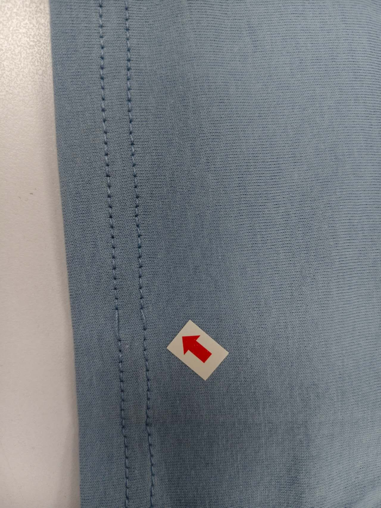
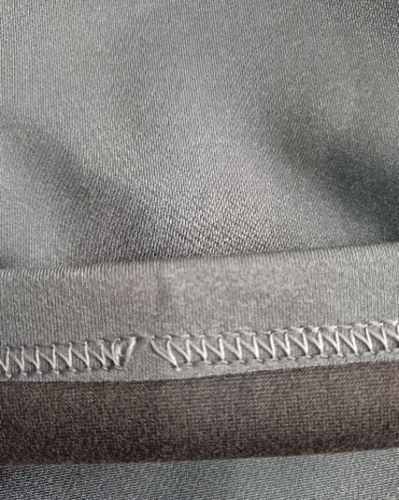
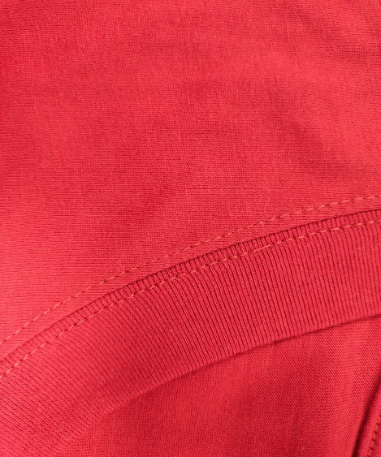
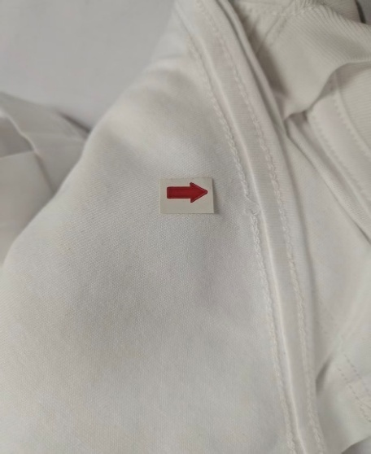
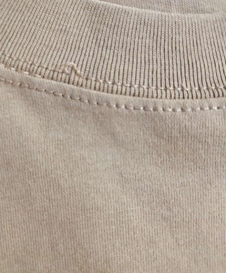
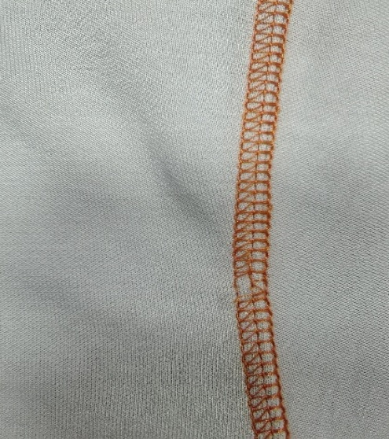

**10、跳線（針織圓領）**

**10.1疵點圖片**

      **N……**

**10.2問題原因及解決方案**

<table style="width:99%;">
<colgroup>
<col style="width: 8%" />
<col style="width: 8%" />
<col style="width: 18%" />
<col style="width: 18%" />
<col style="width: 21%" />
<col style="width: 23%" />
</colgroup>
<thead>
<tr>
<th style="text-align: center;"><strong>發生階段</strong></th>
<th style="text-align: center;"><strong>跳線類型</strong></th>
<th style="text-align: center;"><strong>可能來源/原因</strong></th>
<th style="text-align: center;"><strong>特征說明</strong></th>
<th style="text-align: center;"><strong>解決方法</strong></th>
<th style="text-align: center;"><strong>預防措施</strong></th>
</tr>
</thead>
<tbody>
<tr>
<td>A1)縫製階段：領口拼接縫製</td>
<td>
1.面線跳線（露底線）

2.底線跳線（露面線）
</td>
<td>
1.機針型號不匹配（過粗/過細），針尖磨損、鈍化或彎曲，無法正常鉤線.

2.旋梭梭床磨損、生鏽，鉤線機構與機針配合間隙不當.

3.面底線張力過大或過小，線材無法順利環繞鉤合.

4.領口面料彈性大，縫製時拉扯不勻，機針穿刺位置偏移.

5.穿線路徑錯誤或線材卡滯，送線不順暢
</td>
<td>
1.面線跳線：縫跡表面間斷性露出底線.

2.底線跳線：縫跡背面間斷性露面線，底線未與面線有效鉤合.

3.跳線多集中在領口彎曲弧度處，伴隨縫跡輕微歪斜，面料針孔易擴大

4.有規律性和無規律性跳線.
</td>
<td>
1.更換匹配針織面料的號圓頭機針（避免鉤刮面料），檢查針尖是否鋒利.

2.按設備手冊標準，重新調整針桿高度、旋梭勾線時機與間隙.

3.逐漸調整面底線張力，測試至縫跡平整、無跳線，彈性面料張力適當放鬆. 
4.檢查並校準送布牙與針板的同步
</td>
<td>
<strong>1.建立設備上線校準制度：</strong>換款或每日開機前，用生產面料測試並調整. 
2.實施針具管理：定時換針，記錄換針週期. 
3.培訓專職機修工進行精密調整

4.標準化針型對應面料（針織必用圓頭針）
</td>
</tr>
<tr>
<td>A2)縫製階段：領口包邊/鎖邊</td>
<td>1.包邊線跳線2.鎖邊機多線跳線（面線/底線）</td>
<td>
1.包邊機/鎖邊機機針磨損、型號不匹配，或針桿位置偏移.

2.鎖邊機刀頭磨損，面料切割不平整，導致走布不順、針位偏移.

3.多線張力不平衡，過緊影響線環形成（某一根線張力過大過小），無法有效鉤合.

4.送料牙磨損、壓腳壓力不當，面料走布打滑或偏移，機針穿刺位置不準.

5.包邊帶送料不順，與面料配合間隙過大，導致線跡鉤合失誤.

6.線材質量差（起毛、強力不均）或與面料包邊帶彈性不匹配

7. 操作不當<strong>：</strong>縫紉時過度拉扯面料.
</td>
<td>
1.包邊跳線：包邊帶與面料接縫處線跡間斷，邊緣露出毛邊，包邊帶易鬆動.

2.鎖邊多線跳線：領口邊緣線跡散亂，單根或多根線未參與鉤合，呈「散線」狀，嚴重時毛邊脫散.

3.多針連續未形成鎖式線跡.縫線鬆散易抽脫.拉開縫份可見明顯空針

4.線跡不規則脫落，位置不固定，常伴隨斷線、線跡收縮.
</td>
<td>
1.停機更換匹配的圓頭機針，調整針桿位置至標準高度，磨損刀頭立即更換.

2.逐根調整包邊鎖邊機各線路張力，測試至線跡平整、鉤合緊密，彈性面料適當放鬆張力.

3.打磨或更換磨損的送料牙，調整壓腳壓力（中低檔，适配針織面料），確保走布均勻.

4.理順包邊帶或螺紋帶條送料路徑，調整送料速度與面料走布速度匹配，接頭處剪平後重接.

5.更換高質量高彈線材，確保與面料、包邊帶彈性匹配

6.培訓操作工保持面料自然送入，避免人為拉伸
</td>
<td>
1.包邊機/鎖邊機機針、刀頭建立更換記錄.

2.每日開工前檢查多線張力，按標準參數調整，並進行試縫確認.

3.送料牙、壓腳每日清潔檢查，磨損及時更換，壓腳壓力按面料厚度標準設定.

4.包邊帶接頭處提前剪平，避免接頭過厚導致走布不順，送料速度與機台運行速度同步.

5.統一選用高彈滌綸線作為包邊/鎖邊線，入廠檢測線材質量，不合格品退回.

6.培訓員工拐角處慢車操作，並順勢調整面料位置，避免偏移
</td>
</tr>
<tr>
<td>A3)縫製階段：上領作業（領圈與衫身拼合）</td>
<td>彈性面料跳針</td>
<td>
1.使用非彈性縫線（如棉線）縫製高彈面料

2.未使用差動送布或差動比不當

3.手拉布過度造成張力波動
</td>
<td>跳針伴隨布面拉伸變形.縫線斷裂或線跡不均.領口波浪或緊繃</td>
<td>改用彈性縫線.啟用並調校差動送布.避免手拉布</td>
<td>選配專用「針織彈性縫製參數包」.操作員培訓「自然送布」技巧.使用輔助模板固定領圈</td>
</tr>
<tr>
<td>A4)縫製階段：縫製起始/結束處</td>
<td>起縫跳針</td>
<td>
1. 起縫時布料未完全進入壓腳下方

2. 回縫（打倒針）時針未完全穿透布層

3. 自動起縫裝置故障
</td>
<td>跳針集中在首3–5針.縫線易從端點抽脫.外觀似「缺針」</td>
<td>使用起縫夾具固定布料.確保回縫前布料到位.檢查氣動/電子起縫裝置/使用電腦衣車</td>
<td>加裝自動壓腳延遲功能.制定「起縫三確認」流程（布到位、壓腳落、慢速啟動）</td>
</tr>
<tr>
<td>A5)縫製階段：肩縫/側縫縫製</td>
<td>
1.單線跳線、

2.雙針跳線（其中一針跳線）

3間斷性跳線
</td>
<td>
1.機針磨損、彎曲，或雙針車兩根機針高度不一致、間距不標準.

2.旋梭梭床雜屑堆積、油污嚴重，導致鉤線機構運轉不順.

3.面底線張力不平衡，或雙針車其中一根線張力異常.

4.送料牙齒磨損、齒距不勻，面料走布打滑，尤其是厚接縫處走布不順.

5.壓腳壓力過大，壓緊面料導致機針穿刺阻力增大，或壓力過小面料偏移.

6.肩縫側縫拼接處面料過厚，機針穿刺困難，導致鉤線失誤

7.操作不當：縫紉時過度拉扯面料.
</td>
<td>
1.單線跳線：縫跡表面或背面間斷性露線，跳線處針腳鬆散.

2.雙針跳線：其中一根線的縫跡間斷跳線，兩根線的縫跡深淺不一、不平行.

3.間斷性跳線：厚接縫處、面料拼接處跳線頻發，平整部位基本無跳線，伴隨縫跡輕微歪斜
</td>
<td>
1.更換新的匹配機針，雙針車調整兩根機針高度、間距至標準值（間距按工藝要求設定）.

2.拆開旋梭梭床，徹底清潔雜屑和油污，添加潤滑油，磨損部件及時更換.

3.調整面/底線張力，雙針車分別核對兩根線的張力，確保平衡一致.

4.打磨或更換磨損的送料牙，調整壓腳壓力（厚料適當調高，薄料調至中低檔）.

5.對過厚的接縫處適當修剪面料（保留標準縫份），厚料處降低縫製速度，慢車通過.

6.培訓操作<strong>工</strong>保持面料自然送入，避免人為拉伸
</td>
<td>
1.每班檢查機針狀態，雙針車額外確認兩根機針的高度和間距，不符合標準立即調整或更換.

2.旋梭/梭床每日班前清潔潤滑，班中若出現運轉不順，及時停工檢查.

3.根據面料厚度和接縫情況，設定對應的張力和壓腳壓力參數，首件確認無誤後批量生產.

4.送料牙定期檢測磨損情況，及時更換，確保走布穩定.

5.規範面料縫份標準，肩縫側縫接縫處縫份統一，避免過厚堆積.

6.培訓員工厚接縫處慢車操作，雙手輔助面料平穩走布，不強拉或偏移

7.縫線入庫檢驗，確保其光滑、均勻、無結頭.
</td>
</tr>
<tr>
<td>A6)縫製階段：袖口/下擺折邊縫製</td>
<td><ol type="1">
<li>
折邊內側跳線
</li>
</ol>

2.折邊邊緣跳線

3．連續性跳線4.厚薄交界處跳針

5.轉角或拼接處跳線
</td>
<td>
1.機針針尖磨損、鈍化，無法順利穿刺折邊面料（多層疊加）.

2.面/底線張力過大，折邊面料彈性收縮時線材無法有效鉤合.

3.折邊不平整、過厚，或折邊時面料拉扯過緊，導致走布不順、針位偏移.

4.壓腳壓力不當，折邊處面料打滑或被壓緊變形，機針穿刺位置不準.

5.梭芯繞線不規範（線圈鬆散、重疊），底線送線不穩定.

6.折邊機送料部件磨損，送料速度與機台運行速度不匹配
</td>
<td>
1.折邊內側跳線：折邊縫跡內側間斷性露線，翻開折邊可見明顯跳針痕跡.

2.折邊邊緣跳線：邊緣線跡鬆散、跳線，易導致折邊翹起、不平整.

3.連續性跳線：整段折邊縫跡均有跳線，伴隨折邊面料皺褶、針孔擴大

4.跳針集中於厚薄過渡區.縫跡歪斜伴隨跳針.布面有壓痕不均

5.在縫合弧度部位或厚度變化處出現連續或單點的跳線
</td>
<td>
1.更換鋒利的圓頭機針（根據折邊厚度選10-11號），避免針尖鈍化導致穿刺失誤.

2.調低面底線張力，尤其是彈性面料折邊，確保線材與面料收縮匹配.

3.拆開不合格折邊，重新平整折邊，厚處預先打薄，避免過厚.對於厚度變化處，可考慮使用壓腳襯墊或模板以保持平整.

4.調整壓腳壓力至中低檔，確保折邊面料平穩走布，不打滑、不變形.更換送布牙.調整差動比

5.更換梭芯，按標準重新繞線（線圈緊密均勻，不鬆散、不重疊）.

6.檢查折邊機送料部件，磨損及時更換，調整送料速度與機台速度同步，重新縫製跳線區域

7.改用更適合彈性縫合的線跡（如三線、五線）
</td>
<td>
1.折邊縫製前統一檢查機針狀態，確保針尖鋒利.

2.設定折邊縫製標準張力，彈性面料適當放鬆，首件或首扎折邊後確認線跡無跳線.

3.規範折邊工藝，嚴格控制折邊厚度，不強拉定型.使用高低壓腳或滾輪壓腳.制定「厚薄交界縫製作業指引」

4.根據折邊面料厚度調整壓腳壓力，定期檢查壓腳磨損情況，及時更換.

5.統一規範梭芯繞線操作，安排專人負責繞線，確保線圈質量一致.

6.折邊機每日班前檢查送料部件，清潔雜屑、潤滑保養，確保送料平穩

<strong>7.</strong>設計工藝夾具、模具或模板，輔助車縫複雜部位.

對厚部位進行修邊或削薄處理. 
8.培訓專門工序的操作工，熟練掌握轉角縫紉技巧.
</td>
</tr>
<tr>
<td>A7)成衣全件縫製</td>
<td>
1.間歇性無規律跳線

2.跳線伴隨線材纏結
</td>
<td>
1.機台長時間未保養，傳動部件卡滯、潤滑不足，導致運轉不穩.

2.線材質量不合格（起毛、結節多）

3.操作員換線/接線時線材纏結，未理順即啟動機台，送線不順.

4. 操作員操作不規範（手勢偏移、強拉面料、走布速度不均）
</td>
<td>
1.間歇性無規律跳線：無固定跳線部位，時有時無，機台運轉聲音不穩時跳線頻發.

2.跳線伴線材纏結：跳線處線頭打結、纏繞在機針或旋梭上，線跡雜亂.
</td>
<td>
1.立即停機，對機台進行全面清潔、潤滑，檢查傳動部件，排除卡滯故障.

2.剪去纏結線材，更換合格的高彈線材

3.規範操作員手勢，要求雙手輔助面料平穩走布，避免強拉或偏移.
</td>
<td>
1.建立機台日常保養計劃，每日清潔潤滑，每周進行全面檢修，每月進行深度保養.

2.線材入廠嚴格檢測質量，儲存環境保持乾燥通風，避免受潮、油污污染，使用前核對線材狀態.

3.定期開展操作規範培訓，強化員工標準手勢和走布技巧，避免人為因素導致跳線

4.實施「首件檢驗」：每換款/換色/換機後首件或首扎全檢跳針
</td>
</tr>
</tbody>
</table>
