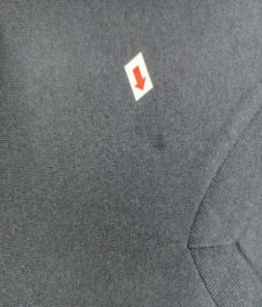
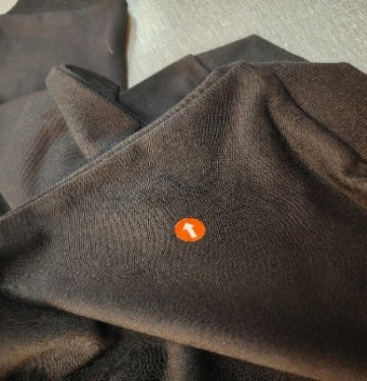
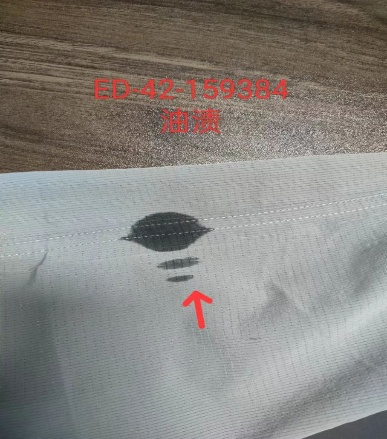
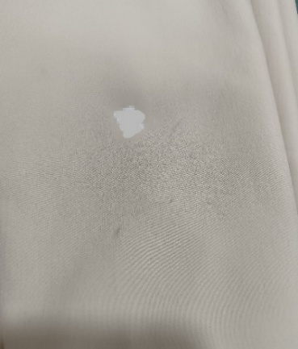
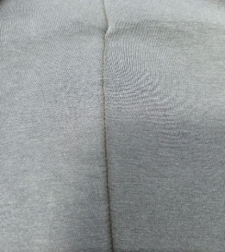
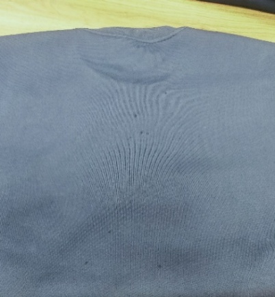

**2、污漬（針織圓領）**

2.1疵點圖片

      N……

2.2問題原因及解決方案

<table style="width:100%;">
<colgroup>
<col style="width: 8%" />
<col style="width: 8%" />
<col style="width: 18%" />
<col style="width: 18%" />
<col style="width: 19%" />
<col style="width: 26%" />
</colgroup>
<thead>
<tr>
<th style="text-align: center;"><strong>發生階段</strong></th>
<th style="text-align: center;"><strong>污漬問題類型</strong></th>
<th style="text-align: center;"><strong>可能來源/原因</strong></th>
<th style="text-align: center;"><strong>特征說明</strong></th>
<th style="text-align: center;"><strong>解決方法</strong></th>
<th style="text-align: center;"><strong>預防措施</strong></th>
</tr>
</thead>
<tbody>
<tr>
<td>A1)縫製階段：領圈拼接/包邊/與衣身拼接</td>
<td>
1. 機台/工具油污污漬.

2. 操作汗漬/指印污漬.

3. 輔料（粘標/包邊帶）膠漬.

4. 環境粉塵/雜物污漬
</td>
<td>
1. 包邊機/平車潤滑油泄漏、機台油污未及時清理.

2. 操作員未戴手套，手部汗漬、油污直接接觸.

3. 粘標殘膠、包邊帶攜帶油污/膠跡.

4. 車間粉塵多、工作台臟污，面料放置沾染.

5. 面料/輔料投產前未做清潔檢查
</td>
<td>
1. 油污：淺黃色/褐色油膩斑塊，触感黏膩，乾燥後顏色加深，不易擦拭.

2. 汗漬/指印：淺黃色指紋狀、片狀痕跡，集中在手持接觸部位.

3. 膠漬：透明/淡白色粘性殘留，部分粘連面料纖維.

4. 粉塵：表面附著細小灰塵顆粒，輕撣可去除部分
</td>
<td>
1. 輕度污漬：中性洗衣液兌30-40℃溫水，軟毛刷輕刷，清水沖淨晾乾.指印用濕毛巾蘸肥皂水擦拭.

2. 中度污漬：油污噴專用去油劑靜置5-10分鐘後刷洗.膠漬用酒精棉片輕擦.

3. 重度污漬：拆開污漬部位線跡，更換受污染面料，重新縫製.

4. 後處理：清理後蒸汽熨燙定型，檢查污漬殘留
</td>
<td>
1. 每日清理機台油污，定期保養潤滑系統，工作台鋪潔淨墊布.

2. 輔料投產前逐一檢查，清除污漬、殘膠.

3. 車間定期灑水降塵，面料放置在潔淨托盤上，遠離地面.

4. 領圈縫製前逐片檢查，有污漬及時處理

5. 習慣建立：每日下班需對所有成品用淺色布鋪蓋.

6. 翻洗搶水去污吹幹後需建立複查機制
</td>
</tr>
<tr>
<td>A2)縫製階段：肩縫/側縫/袖縫縫製</td>
<td>
1. 機台泄漏油污污漬.

2. 線頭/面料纖維殘留污漬.

3. 機台清理清潔劑殘留.

4. 金屬工具銹跡污漬
</td>
<td>
1. 平車/雙針車針桿、送料牙潤滑油泄漏，內部線頭/纖維堆積.

2. 清理機台後，清潔劑未擦拭乾淨，縫製時沾染面料.

3. 剪刀、頂針等工具銹蝕，接觸面料留下銹跡.

4. 面料裁剪後未除塵，表面附著纖維雜物.5. 機台日常清理、工具保養不到位
</td>
<td>
1. 機油污漬：接縫處呈深褐色/黑色細長條狀痕跡，乾燥後結痂，與線跡走向一致.

2. 線頭/纖維：接縫兩側附著雜亂白色/灰色線頭、纖維，部分嵌入線跡.

3. 清潔劑殘留：淺白色/淡藍色片狀印記，無粘性.

4. 銹跡：紅褐色/淺棕色細小斑點，滲入面料纖維，不易清理
</td>
<td>
1. 輕度污漬：線頭用粘毛器+小剪刀清理.淺層油污、清潔劑殘留用溫水+中性洗衣液擦拭.

2. 中度污漬：機油用去油劑處理，銹跡用針織面料專用除銹劑浸泡後沖洗.

3. 重度污漬：拆開接縫線，更換受污染面料，按標準對位重新縫製.

4. 對稱性處理：左右袖片、前後片污漬同步清理/更換
</td>
<td>
1. 每日開工前、收工後清理機台，清除油污、線頭堆積，定期檢查漏油情況.

2. 工具定期保養防銹，存放於潔淨工具盒，清理機台後徹底擦淨清潔劑.

3. 面料投產前用吸塵器除塵，去除表面纖維雜物.

4. 設立關鍵工序100%查驗，及時發現污漬並處理

5. 習慣建立：每日下班需對所有成品用淺色布鋪蓋.

6. 翻洗搶水去污吹幹後需建立複查機制
</td>
</tr>
<tr>
<td>A3)車縫階段：袖口/下擺折邊縫製</td>
<td>
1. 折邊機油污污漬.

2. 面料殘留（裁剪/運輸）污漬.

3. 固定用膠帶/標籤殘膠污漬.

4. 操作沾染雜物/液體污漬
</td>
<td>
1. 折邊機壓腳、送料部位油污泄漏，機台內部雜物堆積.

2. 袖口/下擺面料裁剪、運輸時沾染油污、灰塵，未經檢查投產.

3. 固定面料的膠帶/標籤殘留膠跡，或膠帶本身帶污漬.

4. 操作員將面料接觸地面/臟污工作台，或灑落飲料、清潔劑.

5. 面料運輸、存放防護不當，輔料未經檢查
</td>
<td>
1. 機油污漬：沿折邊線分佈的油膩痕跡，折邊內側更明顯.

2. 殘留污漬：零散灰塵斑、油污點，分佈無規律.

3. 殘膠污漬：透明/淡白色粘性殘留，粘連纖維形成雜亂痕跡.

4. 液體/雜物污漬：不規則片狀液體痕跡，或附著顆粒狀雜物
</td>
<td>
1. 輕度污漬：灰塵用粘毛器清理，淺層膠跡用酒精棉片輕擦.

2. 中度污漬：機油用去油劑噴塗刷洗，頑固殘膠用專用膠跡去除劑處理.

3. 重度污漬：拆開折邊線跡，更換受污染面料，重新按標準折邊高度縫製.

4. 後處理：清理後蒸汽熨燙，確保折邊平整、無污漬
</td>
<td>
1. 每日清理折邊機壓腳、送料部位油污，工作台鋪設可更換潔淨墊布.

2. 面料運輸用潔淨包裝袋包裹，存放於離地面30cm以上潔淨貨架.

3. 選用無殘膠潔淨膠帶/標籤，使用後即時清除殘留.

4. 工作區域禁止放置飲料、食品，面料輕拿輕放，避免接觸臟污.

5.習慣建立：每日下班需對所有成品用淺色布鋪蓋.

6. 翻洗搶水去污吹幹後需建立複查機制
</td>
</tr>
<tr>
<td>B1)後整定型/翻修/儲存</td>
<td>
1. 定型設備沾染污漬.

2. 儲存堆積沾色污漬.

3. 後整理雜物污漬

4. 搶水痕
</td>
<td>
1. 蒸汽定型設備內部油污、雜物未清理，定型板/導輥臟污.

2. 半成品/成品堆積時沾染地面、貨架污漬，不同產品混放沾色.

3. 後整理修剪線頭、檢驗時，接觸臟污工具/工作台.

4. 定型設備、儲存環境、後整理環節管控不到位

5.搶水去污未能及時吹幹
</td>
<td>
1. 定型沾染：整衣表面呈規律性污漬，與定型設備接觸部位對應，多為油污/灰塵斑塊.

2. 儲存沾染：產品底部、邊緣有灰黑色接觸性污漬，污漬邊緣不規則.

3. 後整理沾染：表面附著零散線頭、纖維，或有工具接觸痕跡

4. 表面局部染上其他顏色，尤其在濕態摩擦處
</td>
<td>
1. 輕度污漬：整衣用中性洗衣液溫水浸泡10-15分鐘後輕搓，線頭用吸塵器全面清理.

2. 中度污漬：定型油污用去油劑全面處理後清洗，翻修部位拆線清理後重新翻修.

3. 重度污漬：局部污染嚴重的拆線更換面料，整衣污染無法清理的按廢品處理.

4. 後處理：清洗晾乾後蒸汽熨燙，全面檢查污漬清除情況

5. 分色擺放或洗滌及成品入庫前覆蓋防塵罩

6.搶水去污後需立即吹幹避免出現黃斑水漬
</td>
<td>
1. 定期清理定型設備，定型前檢查設備清潔度，確保接觸面料部位無污漬.

3. 儲存環境保持整潔，貨架定期擦拭，產品堆積底部墊潔淨墊布，不同產品分開存放.

4. 後整理工作台、工具保持潔淨，修剪線頭後用吸塵器全面清理.

5. 建立定型後、入庫前三級檢查，逐件排查污漬

6. 深淺色衣物嚴格分開洗滌，衣首次單獨洗，確認是否掉色

7. 翻洗搶水去污吹幹後需建立複查機制

8. 習慣建立：每日下班需對所有成品用淺色布鋪蓋.
</td>
</tr>
<tr>
<td>B2)後整階段</td>
<td style="text-align: left;">壓折黃變</td>
<td>
1.成衣摺疊處殘留微量鹽分/有機物，在潮濕悶熱環境中氧化.

2.放置成品與窗邊陽光照射
</td>
<td>折痕處出現黃褐色條狀斑，尤其在棉質白色針織品上明顯</td>
<td>
1.嚴重氧化黃變難以完全去除，建議避免長期摺疊存放

2.白色或輕微者產品可用氧系漂白劑（過碳酸鈉）浸泡處理

3.彩色產品極難去除，通常無法修復
</td>
<td>
1.成衣儲存時控制濕度（&lt;60% RH）與通風

2.白色針織品優先採用掛裝而非摺疊包裝

3.減少堆壓時間，優先採用掛裝

4.包裝內放置乾燥劑或使用透氣PE袋.

5.避光放置成品

6.習慣建立：每日下班需用深色布對敏感色成品鋪蓋.
</td>
</tr>
<tr>
<td>B3)後整階段</td>
<td style="text-align: left;">油污</td>
<td>紡紗、織造或縫紉機械潤滑油、工人手部油污、汗漬、化妝品或未戴手套接觸布面</td>
<td>通常為透明至淡黃色油狀斑點，多出現在縫線、布邊或接觸機械部位</td>
<td>
1.使用洗潔精或專用去油劑局部搓洗

2.再以洗衣液正常清洗並及時吹乾避免出現水漬

3.嚴重者可送專業乾洗（視纖維成分）
</td>
<td>
1.定期保養設備，防止潤滑油滴漏

2.使用易乳化、低殘留縫紉油

3.操作員避免手部塗抹護手霜後接觸布面

4.安裝防護罩防止油污飛濺

5.翻洗搶水去污吹幹後需建立複查機制
</td>
</tr>
<tr>
<td>B4)後整階段</td>
<td style="text-align: left;">助劑殘留（油膩、黃斑）</td>
<td>染整用柔軟劑、防水劑、固色劑等未徹底水洗</td>
<td>局部發亮、手感滑膩，乾燥後可能呈黃斑或白霜狀</td>
<td>1.用溫水（30–40°C）加中性洗劑充分沖洗 
2.可加入少量白醋幫助中和殘留鹼性物質</td>
<td>
1.染整後增加水洗次數與脫水乾燥流程

2.控制助劑用量與均勻度避免局部過量

3.成品出貨前檢測pH值與手感一致性

4.翻洗搶水去污吹幹後需建立複查機制
</td>
</tr>
<tr>
<td>B5)後整階段</td>
<td style="text-align: left;">霉斑</td>
<td>布料未乾即包裝，倉儲環境潮濕或染整後潮濕存放</td>
<td>圓形或不規則水印，嚴重時有黴味、黑點</td>
<td>輕微霉點可用雙氧水+醋酸局部處理（僅白色）</td>
<td>
1.控制成品包裝前回潮率與環境濕度

2.倉庫濕度控制在≤60% RH，溫度20–25°C

3.避免直接靠牆堆放，保持通風

4.包裝前可以放入特定的抽濕房抽濕，避免直接包裝入袋.

5.翻洗搶水去污吹幹後需建立複查機制
</td>
</tr>
<tr>
<td>B6)後整階段</td>
<td>
1.洗劑殘留

2.皂垢
</td>
<td>洗劑未沖淨、硬水中的鈣鎂離子與肥皂反應、返工清洗</td>
<td>灰白或淡黃粉狀沉積，手感粗糙</td>
<td>
1.用白醋水按一定比率浸泡30分鐘後重新清洗

2,使用軟水或添加水質軟化劑再次洗滌
</td>
<td>
1.使用去離子水或軟化水進行水洗

2.控制洗劑用量，避免過量

3.翻洗搶水去污吹幹後需建立複查機制
</td>
</tr>
</tbody>
</table>
