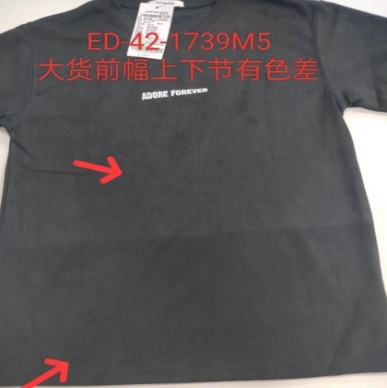
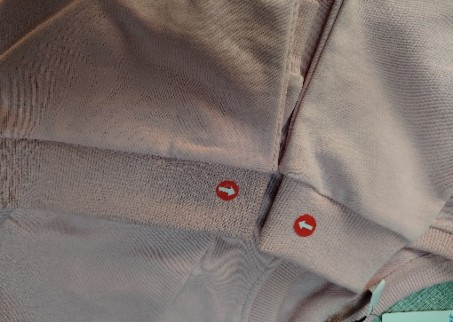
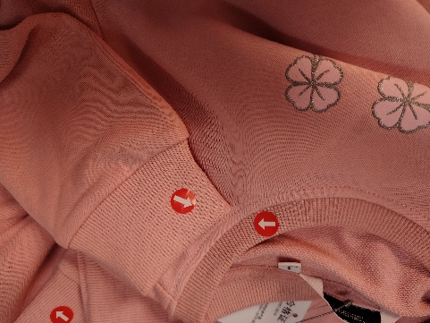
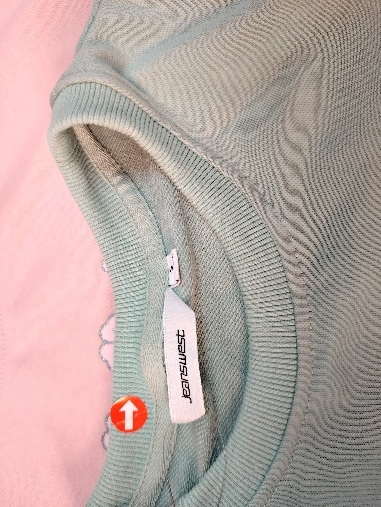
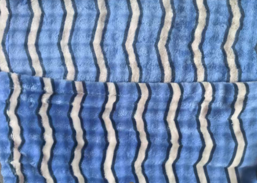
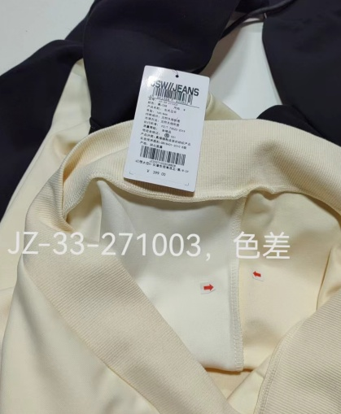

**3、色差（針織圓領）**

3.1疵點圖片

      N……

3.2問題原因及解決方案

<table style="width:100%;">
<colgroup>
<col style="width: 8%" />
<col style="width: 10%" />
<col style="width: 16%" />
<col style="width: 19%" />
<col style="width: 19%" />
<col style="width: 26%" />
</colgroup>
<thead>
<tr>
<th style="text-align: center;"><strong>發生階段</strong></th>
<th style="text-align: center;"><strong>色差問題類型</strong></th>
<th style="text-align: center;"><strong>可能來源/原因</strong></th>
<th style="text-align: center;"><strong>特征說明</strong></th>
<th style="text-align: center;"><strong>解決方法</strong></th>
<th style="text-align: center;"><strong>預防措施</strong></th>
</tr>
</thead>
<tbody>
<tr>
<td>A)染整階段</td>
<td>
1.缸差（Lot-to-Lot）、

2.中邊色

3.左右裁片色差
</td>
<td>1.不同染缸之間的工藝參數（溫度、時間、浴比）有微小差異. 
2. 軋車（染色機）的輥筒左右壓力不均. 
3.在定形機或烘乾機中，熱風溫度或風速左右不一致 
4.每缸使用的助劑（鹽、堿）濃度不同.</td>
<td>
1<strong>.</strong>整件衣物顏色一致，但與另一缸生產的同款衣物相比，顏色明顯不同. 這是批量性問題.

2.布幅左右兩邊的顏色與中間部分的顏色不一致，呈對稱性差異
</td>
<td>
1.將有缸差的裁片/衣物嚴格分開，作為不同批次處理. 
2.輕微色差可嘗試「修色」回染，但有風險

3.校正軋車輥筒的壓力平衡. 
4.檢查並調整定形機風嘴的均勻性.
</td>
<td>
1.使用自動化染機和精確的配料系統，優化染色曲線與浴比.

2.定期保養染缸噴嘴與泵浦 
3.控制布速與導布系統

4.每日生產前檢查並調整關鍵設備的均勻性

5.定期儀器檢測，使用色差儀測量布幅多點位置的色差
</td>
</tr>
<tr>
<td>B1)縫製階段：領圈拼接/包邊/與衣身拼接</td>
<td>
1.領圈與衣身色差.

2.領圈拼接縫兩側色差.

3.包邊帶與領圈/衣身色差.

4.領圈局部染色不均色差
</td>
<td>
1.面料因素：領圈與衣身面料批次不同、染色工藝不一致，或面料本身染色不均.

2.輔料因素：包邊帶色號與面料不匹配，或包邊帶本身色牢度差、染色不均.

3.環境因素：車間光照不均、潮濕，導致面料/輔料色變，或檢查時因光照誤判色差.

4.管控因素：面料/輔料投產前驗佈階段未做色差對比檢驗，不同批次混用
</td>
<td>
1.領圈與衣身色差：領圈與衣身顏色深淺、色調存在明顯差異，自然光下肉眼清晰可見，影響整體協調性.

2.拼接縫兩側色差：領圈拼接處線跡兩側面料顏色不一致，呈條狀色差，與拼接線平行.

3.包邊帶色差：包邊帶顏色與領圈/衣身不匹配，邊緣形成明顯色彩分界線.
</td>
<td>
1.輕度色差（肉眼輕微可辨）：拆開瑕疵部位線跡，更換與面料色號匹配的輔料/面料重新平整縫製.

2.中度色差（明顯可辨）：拆線後更換同批次、同染色工藝的領圈/衣身面料及包邊帶，縫製後在標準光照下檢查色差.

3.重度色差（嚴重不協調）：若面料本身染色不均或批次差異無法彌補，補換裁片，按標準工藝重新生產.

4.輔助處理：對輕度褪色導致的色差，用符合面料特性的固色劑處理，晾乾後檢查色差是否改善
</td>
<td>
1.批次管控：領圈、衣身面料及包邊帶需選用同一批次、同色號產品，併在裁床階段做好裁片查片和編號標識，投產前核對批次單、色卡及編號.

2.色差預檢：投產前在標準光照條件（自然光/標準光源箱）下，對面料、輔料進行逐片/逐卷色差對比，不合格的退回.

3.操作規範：操作員佩戴乾淨手套，防止汗漬污染.

4.環境管控：保持車間光照均勻、乾燥通風，避免面料/輔料吸潮、受熱變色.

5.首件或首札確認：每班首件或首扎領圈縫製後，在標準光照下檢查色差，合格後方可批量生產
</td>
</tr>
<tr>
<td>B2)縫製階段：肩縫/側縫/袖縫縫製</td>
<td>
1.前後片衣身色差.

2.左右袖片色差.

3.接縫線兩側褪色色差（中邊色）.

4.線跡與面料色差
</td>
<td>
1.面料因素：前後片、左右袖片面料批次不同、染色不均，或面料彈性不同導致拉伸後色差顯現.

2.後整理因素：縫製後局部面料沾染油污、清潔劑，未及時清理與面料產生反應導致色變.

3.檢驗因素：縫製前未對面料進行查片和編號，不同色調面料混用

4.未選用匹配縫紉線
</td>
<td>
1.前後/左右片色差：前後衣身、左右袖片顏色深淺、色調不一致，平鋪對比時差異明顯，穿著時對稱性差.

2.接縫處褪色色差：接縫線兩側面料顏色偏淺（中邊色）.

3.線跡與面料色差：線跡顏色與面料不協調，或線跡因褪色呈淺色，與面料形成明顯色彩分界.

4. 共性特征：色差多沿接縫線分佈，或呈對稱性偏差.
</td>
<td>
1.輕度色差：拆開偏差部位接縫線，更換同批次、同色編碼裁片面料重新對位縫製.

2.重度色差（嚴重影響外觀）：若面料染色不均或褪色嚴重，無法修復，按廢品處理，避免流入下工序.

3.對稱性糾正：左右袖片、前後片色差需同步更換面料，確保對稱部位顏色一致

4.裁床階段避裁（輕度中邊色）
</td>
<td>
1.面料驗佈查片：投產前將前後片、左右袖片面料按色調分揀並做好裁片編號標識，同一產品選用色調一致的面料，批次不同的面料單獨標記、分開使用.

2. 線材匹配：選用與面料色號一致、色牢度達標（≥4級）的縫紉線，投產前進行線料與面料的色差對比.

4.過程檢查：做好初查、複查工序的設立，在標準光照下抽檢前後片、左右袖片色差，及時發現問題並整改.

5.污染防控：縫製過程中避免面料沾染油污、清潔劑，若不慎沾染，立即用中性清潔劑輕拭清理，避免因與面料反應導致變色

4.裁床階段避裁（輕度中邊色）
</td>
</tr>
<tr>
<td>B3)縫製階段：袖口/下擺折邊縫製</td>
<td>
1.袖口與衣身色差.

2.下擺與上衣身色差.
</td>
<td>
1.面料因素：袖口/下擺與衣身面料批次不同、面料編號不一、染色不均導致色差顯現.

2.環境因素：車間潮濕，面料/折邊帶吸潮色變，或光照不均導致檢驗時漏判色差.

3.管控因素：面料投產前未經色差或中邊色檢驗，與面料隨意搭配使用
</td>
<td>
1.袖口/下擺與衣身色差：袖口/下擺與衣身顏色深淺、色調存在明顯差異，邊緣形成清晰色彩分界.

2.下擺與上身染色不均，與中心部位形成明顯色差呈深淺漸變色.
</td>
<td>
1.輕度色差：拆開折邊線跡，更換與衣身同批次面料，重新平鋪折邊縫製.

2.重度色差：若面料/折邊帶本身染色不均或批次差異無法彌補，更換合格袖口/下擺面料重新生產.

3.輔助處理：對於輕度中邊色可通過布廠採用染料化妝過度，晾乾後檢查色差是否改善
</td>
<td>
1.編碼管控：袖口/下擺面料、折邊帶需與衣身面料同批次、同色號，投產前做好驗佈、查片及對比色差.

2.過程檢驗：投產前檢查染色均勻性、色牢度，與面料進行色差對比，不合格的退回供應商.

3.環境管控：保持車間乾燥、光照均勻，面料儲存在乾燥通風處，避免吸潮色變.

4.首件或手札確認：每班首件或首扎領圈縫製後，在標準光照下檢查色差，合格後方可批量生產.
</td>
</tr>
<tr>
<td>C)後整階段：熨燙定型/翻修/儲存</td>
<td>
1.整體色變色差.

2.翻修部位局部色差.

3.儲存過程中沾染色差.

4.定型不當導致色差
</td>
<td>
1.定型因素：蒸汽定型溫度過高、時間過長，或定型時面料受熱不均，導致成衣全件或局部色變.

2.翻修因素：翻修時使用的面料/線材與原產品裁片編號不匹配.

3.儲存因素：不同顏色產品混放堆積，色牢度差的面料褪色沾染其他產品，或儲存環境潮濕、陽光直射導致色變.

4.污染因素：成衣後整理時沾染油污、清潔劑，未及時處理理導致局部面料色變.

5.檢驗因素：半成品、成品檢驗時，未在標準光照下檢查色差，導致不合格產品流入下工序
</td>
<td>
1.成衣整體色變色差：整衣顏色與標準色卡存在偏差，或局部受熱、受潮部位色變，與其他部位形成對比.

2.翻修部位色差：翻修處面料、線跡顏色與原產品不一致，翻修區域呈明顯色彩塊，與周圍協調性差.

3.沾染色差：產品表面有不規則異色沾染痕跡，沾染部位與其他顏色產品堆積接觸部位對應.

4.定型不當色差：色差呈規律性分佈，與定型時受熱部位對應，受熱嚴重部位顏色偏淺或偏深
</td>
<td>
1.輕度色差（局部色變/沾染）：對色變部位進行固色處理，沾染色差用符合面料特性的清潔劑輕拭清理，翻修部位拆線後更換匹配色號面料/線材重新翻修.

2.中度色差（明顯色變/沾染）：拆開色差嚴重部位線跡，更換合格面料/線材，重新縫製並定型，整衣進行統一固色處理.

3.重度色差（整衣色變/嚴重沾染）：若整衣色變無法修復或沾染嚴重，按廢品處理，避免流入市場.

4.輔助處理：對於輕度中邊色可通過布廠採用染料化妝過度，整改後將整衣置於標準光照下檢查，確保色差符合標準後入庫
</td>
<td>
1.定型管控：統一蒸汽定型工藝，確保面料受熱均勻，定型後及時晾乾.

2.翻修管控：翻修前核對面料/線材色號，與原產品保持一致.

3.儲存管控：不同顏色、不同色牢度的產品分開儲存，避免堆積擠壓，儲存環境保持乾燥通風，避免陽光直射.

4.污染防控：成衣後整理時避免沾染油污、清潔劑，若不慎沾染，立即用中性清潔劑清理並晾乾，避免污染物因子與面料發生反應.

5.全流程檢驗：建立「首件或首扎確認+過程抽檢+成品終檢」制度，所有檢驗均在標準光照下進行，留存色差檢驗記錄
</td>
</tr>
</tbody>
</table>
