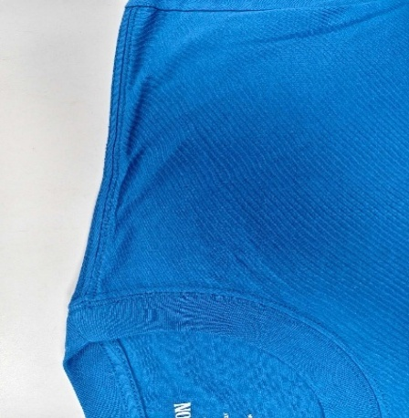
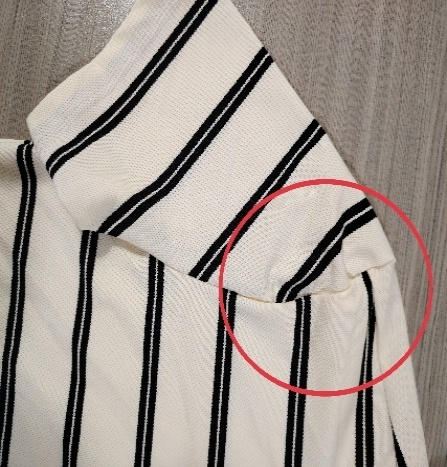
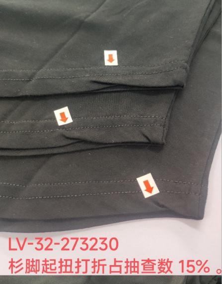

**6、打褶問題（針織圓領）**

6.1疵點圖片

  

6.2問題原因及解決方案

<table style="width:99%;">
<colgroup>
<col style="width: 8%" />
<col style="width: 8%" />
<col style="width: 17%" />
<col style="width: 19%" />
<col style="width: 20%" />
<col style="width: 24%" />
</colgroup>
<thead>
<tr>
<th style="text-align: center;">發生階段</th>
<th style="text-align: center;">打褶問題類型</th>
<th style="text-align: center;">可能來源/原因</th>
<th style="text-align: center;">特征說明</th>
<th style="text-align: center;">解決方法</th>
<th style="text-align: center;">預防措施</th>
</tr>
</thead>
<tbody>
<tr>
<td>A)縫製階段：領口拼接/包邊/鎖邊</td>
<td>
1.牽拉打褶（局部拉伸擠皺）.

2.對位打褶（對位不準導致堆褶）.

3.包邊打褶（包邊帶鬆緊不均起褶）.

4.弧度打褶（領口弧度處堆積皺褶）
</td>
<td>
1.操作因素：拼接/包邊時單側牽拉力度過大，或領口弧度處未鬆放面料，導致面料拉伸擠皺.

2.對位因素：領口裁片對位標記錯位、漏標，對位時未精准重合，局部面料堆積.

3.機台因素：包邊機送料牙磨損不均、壓腳壓力過大，或鎖邊機走布速度與牽拉速度不同步.

4.面料因素：面料與領圈螺紋或包邊材質特性不匹配或針織面料彈性不均，領口裁片裁剪弧度偏差，縫製時無法順勢走布.

5.工藝因素：包邊帶預拉伸不足或過度，與領口面料贴合度差，縫製後起褶
</td>
<td>
1.牽拉打褶：褶皺呈拉伸狀，多見於領口邊緣，面料有輕微變薄痕跡，熨燙後暫時平整但易復現.

2.對位打褶：褶皺集中在對位偏差部位，呈堆積狀，褶紋方向與線跡垂直，肉眼清晰可見.

3.包邊打褶：包邊帶表面起波浪狀皺褶，或包邊內側面料堆積，邊緣不平整.

4.弧度打褶：領口前後弧度處（尤其雞心位、後領中心）有連續堆積皺褶，穿著時領口歪斜翹起
</td>
<td>
1.輕度打褶（局部淺褶）：拆開瑕疵部位線跡，用蒸汽熨斗低溫熨燙鬆弛面料，重新對齊標記點，保持均勻牽拉力低速縫製.

2.中度打褶（堆積皺褶）：拆線後修剪局部多餘面料（堆積部位），調整機台壓腳壓力和送料速度，領口弧度處輕托面料順勢走布，重新拼接/包邊.

3.重度打褶（拉伸變形褶）：若面料因過度牽拉變形，更換合格領口裁片，更換包邊帶並調整預拉伸力度，重新生產.

4.輔助處理：縫製前預縮縫製後立即用蒸汽熨燙領口，定型平整，避免褶皺固化

5.使用正確的線跡/線材：缺乏足夠彈性的線跡（如未用四線或五線拷克車），縫線在穿著時限制面料伸展.

6.在領圈和袖窿等弧線部位關鍵點位做對位記號，確保吃勢均勻.
</td>
<td>
1.材料匹配：大身布與羅紋的彈性、克重必須協同開發與測試

2.標準化作業：必須使用適合針織彈性面料的設備、線跡和操作手法制定並提供書面的縫製工藝說明書，標明線跡、針距、對位點.

3. 操作規範：培訓操作員標準手法，領口拼接/包邊時保持左右牽拉力均勻，弧度處輕托面料鬆放，禁止用力拉拽.

4.對位管控：領口裁片必須標註清晰對位點，強制用對位尺核對，禁止目測對位.

5.機台調整：每日檢查包邊機/鎖邊機送料牙、壓腳狀態，磨損部件及時更換，壓力調整至適中（針織面料壓力宜輕）.

6.裁片核對：領口裁片投入前，核對弧度一致性，偏差超標的退回裁剪車間.

7.首件或首扎定型：每班首件或首扎領口完成後，蒸汽熨燙定型，檢查是否起褶，合格後批量生產
</td>
</tr>
<tr>
<td>A2)縫製階段：肩縫/側縫縫製</td>
<td>
1.層疊打褶（多層面料縫製時堆褶）.

2.牽拉打褶（單側牽拉過度起褶）.

3.接縫打褶（厚接縫處擠壓起褶）.

4.線跡打褶（線跡過緊牽拉面料起褶）
</td>
<td>
1.操作因素：肩縫/側縫多層面料縫製時，未分層梳理面料，局部堆積.或牽拉力度不均，一側面料拉伸過度.

2.工藝因素：厚接縫處（如肩縫與袖山交接）未分層打薄縫份，縫製後面料擠壓起褶.

3.機台因素：雙針車兩根機針線跡張力不均，或壓腳壓力過大，導致面料被線跡牽拉起褶.

4.裁片因素：肩縫/側縫裁片長度偏差、對位標記模糊，對位時錯位，面料無法平整走布.

5.線跡因素：面線/底線張力過大，縫製後收縮牽拉面料，形成細小褶皺
</td>
<td>
1.層疊打褶：褶皺集中在多層面料交接處，呈不規則堆積狀，拆開線跡後面料可平整鋪開.

2.牽拉打褶：褶紋沿牽拉方向分佈，面料有拉伸變形痕跡，線跡一側緊密、一側鬆散.

3.接縫打褶：厚接縫處面料向外凸起，接縫兩側有擠壓褶皺，熨燙後褶紋仍無法完全消除.

4.線跡打褶：面料表面有與線跡平行的細小褶皺，線跡緊密發亮，拉伸面料時褶皺暫時消失
</td>
<td>
1.層疊/對位打褶：拆開瑕疵部位線跡，分層梳理面料，重新精准對位標記點，分層平整後低速縫製.

2.牽拉/線跡打褶：調整面線/底線張力至標準值（針織面料張力宜鬆），拆線後蒸汽熨燙鬆弛面料，重新縫製並保持均勻牽拉.

3.接縫打褶：拆線後修剪厚接縫處多餘縫份（分層打薄），調整機台壓力，慢車通過厚接縫，避免擠壓.

4.重度瑕疵：若面料拉伸變形嚴重，更換合格裁片重新生產，確保接縫平整
</td>
<td>
1.操作管控：肩縫/側縫縫製時，分層梳理面料，確保多層面料平整無堆積，保持均勻牽拉力，厚接縫處慢車通過.

2.工藝標準：厚接縫處實行分層打薄工藝，縫份控制在1cm，避免子口過厚擠壓.

3.機台管控：每日檢查平車/雙針車線跡張力、壓腳壓力，確保兩根機針張力一致，壓力適中.

4.標準化作業：必須使用適合針織彈性面料的設備、線跡和操作手法制定並提供書面的縫製工藝說明書，標明線跡、針距、對位點.

5.裁片核對：投產前核對肩縫/側縫裁片長度、對位標記，偏差超標、標記模糊的裁片禁止使用.

6.核心防控關鍵在「平整走布+均勻牽拉+精准對位+標準定型」

7.過程檢驗：在關鍵工序設立中查質檢工序，對完成工序100%查驗，抽檢肩縫/側縫平整度，及時發現打褶問題並整改
</td>
</tr>
<tr>
<td>A3）縫製階段：袖口/下擺</td>
<td>
1.折邊打褶（折邊處堆積皺褶）.

2.拉伸打褶（折邊時拉伸面料起褶）.

3.對位打褶.上袖夾圈打褶

4.鬆緊打褶（折邊帶鬆緊不均起褶）
</td>
<td>
1.操作因素：折邊時未平鋪面料，局部堆積.或拉伸折邊帶過度，縫製後收縮起褶.

2.機台因素：折邊機送料不均、壓腳壓力過大，或折邊導向裝置偏移，導致面料走布不順.

3.工藝因素：折邊高度設定不一致，或折邊帶預拉伸力度不均，與面料贴合度差.

4.面料因素：袖口/下擺面料彈性大，折邊時未控制牽拉力，導致面料變形起褶.

5.對位因素：袖身與衫身對位標記錯位，對位時面料偏移堆積
</td>
<td>
1.折邊打褶：折邊內側或表面有堆積皺褶，褶紋與折邊平行，穿著時袖口/下擺翹起，不平整.

2.拉伸打褶：褶皺呈細小波浪狀，分佈在折邊邊緣，面料有拉伸變薄痕跡，熨燙後易復現.

3.對位打褶：褶皺集中在對位偏差部位，呈局部堆積狀，與線跡垂直，肉眼明顯可見.

4.鬆緊打褶：折邊帶表面起不規則皺褶，局部鬆弛堆積、局部緊拉變形
</td>
<td>
1.輕度打褶：拆開折邊線跡，蒸汽熨燙平整面料和折邊帶，重新設定標準折邊高度，平鋪面料低速折邊縫製.

2.中度打褶：拆線後修剪局部堆積面料，調整折邊機送料速度和壓腳壓力，對齊標記點重新折邊.

3.重度打褶：若折邊帶拉伸變形或面料受損，更換合格折邊帶和裁片，重新按標準工藝生產.

4.輔助處理：縫製前預縮，縫製後立即用蒸汽熨斗低溫熨燙定型，確保袖口/下擺平整
</td>
<td>
1.操作規範：折邊時必須平鋪面料，保持均勻牽拉力，禁止用力拉伸折邊帶和面料，袖口/下擺對位時精准對齊標記點.

2.機台管控：每日檢查折邊機送料系統、導向裝置，調整壓腳壓力至適中，確保走布順暢.

3.工藝標準：統一折邊高度，折邊帶預拉伸力度一致（根據面料彈性調整），確保與面料紧密贴合.

4.面料管控：袖口選用彈性均勻的面料，縫製前預熨燙，穩定面料尺寸.

5.核心防控關鍵在「平整走布+均勻牽拉+精准對位+標準定型」

6.過程檢驗：在關鍵工序設立中查質檢工序，對完成工序100%查驗，抽檢肩縫/側縫平整度，及時發現打褶問題並整改
</td>
</tr>
<tr>
<td>
B)後整階段:

翻修/熨燙
</td>
<td>
1.翻修車縫打褶（翻修時牽拉不均起褶）.

2.熨燙打褶（熨燙定型不當起褶）.
</td>
<td>
1.翻修車縫因素：翻修車縫時未對齊原線跡，牽拉力度不均，導致局部面料起褶.

2.定型因素：蒸汽熨燙溫度過高、壓力過大，或熨燙時面料未平鋪，導致人為打褶.

3.檢驗因素：半成品、成品檢驗時，未重視輕微打褶，導致瑕疵流入下工序或出廠
</td>
<td>
1.翻修車縫打褶：翻修部位周圍有局部褶皺，褶紋與翻修線跡相交，與原縫製部位平整度差.

2.熨燙定型打褶：褶皺呈規律性分佈，與熨燙方向一致，高溫熨燙處面料可能有發亮痕跡.
</td>
<td>
1.累計打褶：逐部位排查瑕疵來源，優先整改褶皺明顯部位，拆線後重新縫製並定型，整衣蒸汽熨燙平整.

2.翻修車縫打褶：拆開問題線跡，蒸汽熨燙平整面料，對齊原線跡輕度牽拉車縫，翻修車縫後修剪線頭並熨燙.

3.熨燙定型：用蒸汽熨斗低溫、均壓熨燙整衣，鬆弛面料應力，平整後懸掛晾乾.無法熨燙消除的嚴重褶皺，按廢品處理.

4.全面復檢：整改完成後，平鋪檢查整衣平整度，確保無打褶瑕疵後入庫
</td>
<td>
1.全流程管控：建立「首件確認+過程抽檢+半成品全檢+成品終檢」制度，每環節均檢查平整度，輕微打褶立即整改.

2.翻修車縫管控：翻修車縫前必須對齊原線跡，用對位夾固定面料，保持輕微牽拉力，翻修車縫後立即熨燙並複查.

3.定型管控：統一蒸汽熨燙工藝（溫度、壓力、時間），熨燙時確保面料平鋪，禁止高溫長時間熨燙.

4.培訓強化：定期開展打褶防控培訓，提升操作員、檢驗員的平整度管控意識和技能

5.改進包裝方式，如使用掛裝或減少包裝入箱件數，或採用內襯紙板/泡沫條支撐領口
</td>
</tr>
</tbody>
</table>
