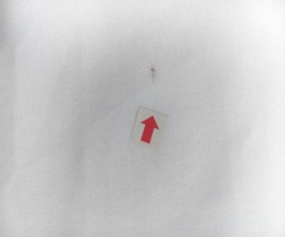
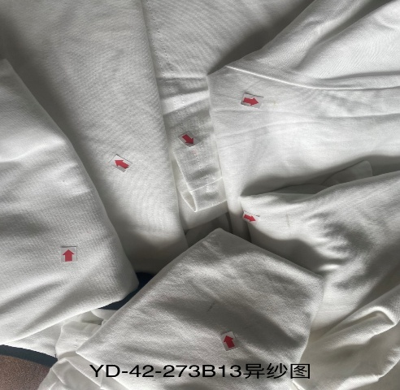

**7、色紗問題（針織圓領）**

**7.1疵點圖片**

    **N……**

**7.2問題原因及解決方案**

<table style="width:99%;">
<colgroup>
<col style="width: 6%" />
<col style="width: 8%" />
<col style="width: 18%" />
<col style="width: 20%" />
<col style="width: 20%" />
<col style="width: 24%" />
</colgroup>
<thead>
<tr>
<th style="text-align: center;"><strong>發生階段</strong></th>
<th style="text-align: center;"><strong>色紗問題類型</strong></th>
<th style="text-align: center;"><strong>可能來源/原因</strong></th>
<th style="text-align: center;"><strong>特征說明</strong></th>
<th style="text-align: center;"><strong>解決方法</strong></th>
<th style="text-align: center;"><strong>預防措施</strong></th>
</tr>
</thead>
<tbody>
<tr>
<td>織布階段</td>
<td><blockquote>

异色纤维

</blockquote>

2.纱线混入
</td>
<td>
1.针织机针舌、针钩磨损，导致纱线跳针，异色纱线跳出面料表面.

2.纱线结头过大、飞花附着在纱线上，导致编织时跳纱，异色结头 / 飞花显现.

3.全流程中纱线受到污染，出现局部色点
</td>
<td>
1.面料表面出现异色纱线跳出编织纹路，呈点状、小圈状凸起，跳纱部位纱线松散，易勾丝，单个疵点面积小但数量可多可少.

2.颜色、光泽可能完全不同.
</td>
<td>
1.用镊子挑出跳纱的异色纱线，将周边纱线整理平整，用同色纱线轻微锁边，防止脱散.

2.更换针织机磨损的针舌、针钩，清理机台飞花后重新编织
</td>
<td>
1.定期检查、更换针织机易损部件（针舌、针钩、沉降片），做好设备保养.

2.纱线使用前进行清纱，去除结头、飞花、杂质，采用无结头纱线.

3.全流程做好防尘、防污染措施，车间保持清洁.

4.加强车间除尘.同区域安排同色系生产.
</td>
</tr>
</tbody>
</table>
