**1、破洞（牛仔裤）**

1.1疵點圖片

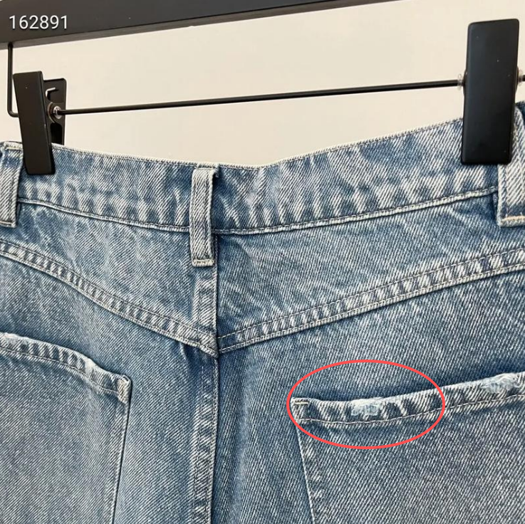 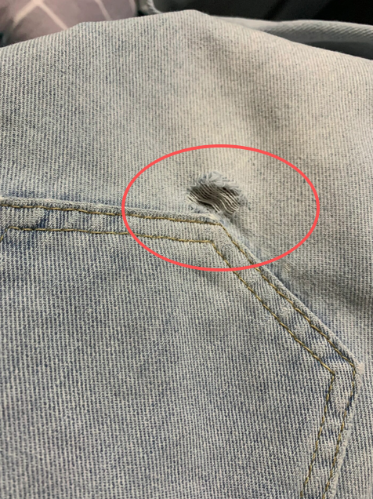 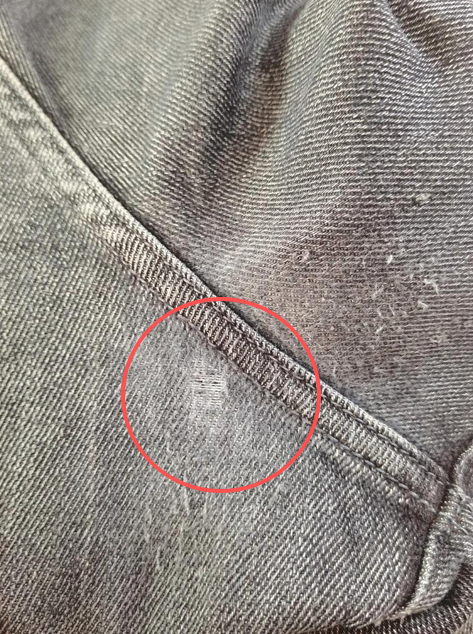 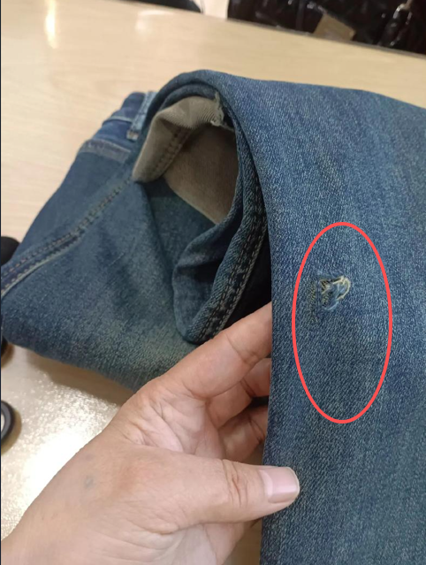 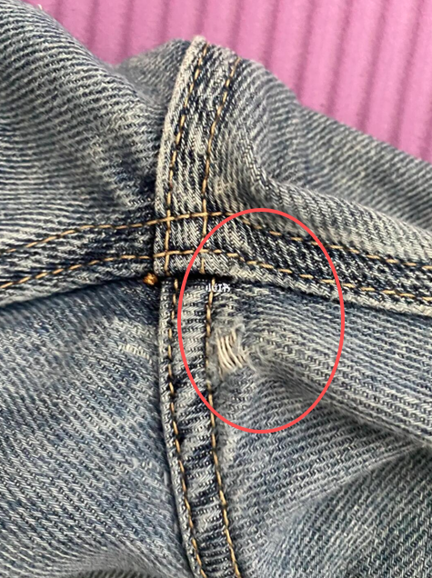 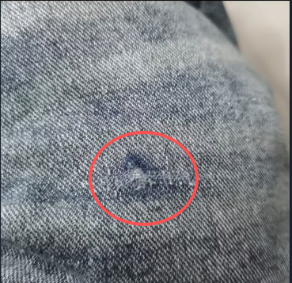 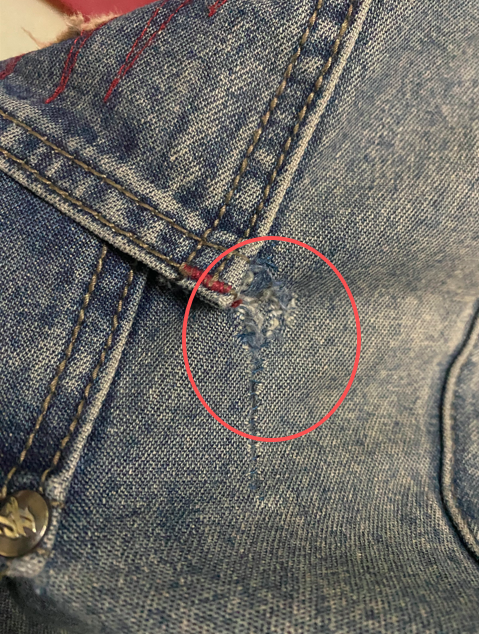 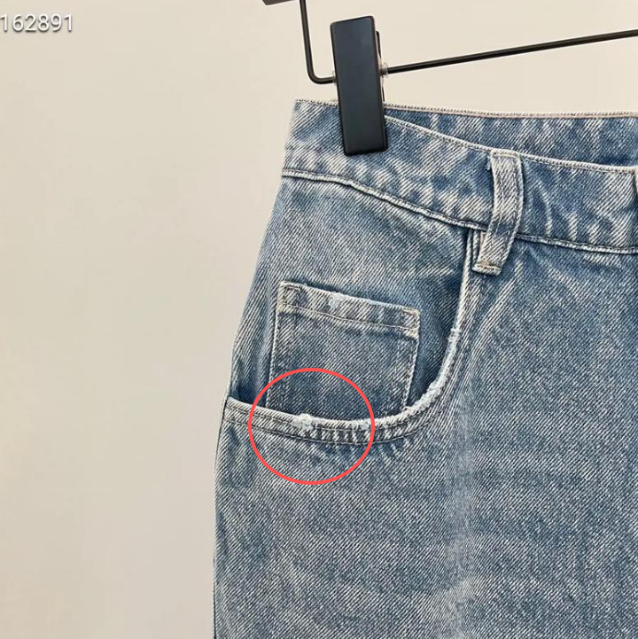 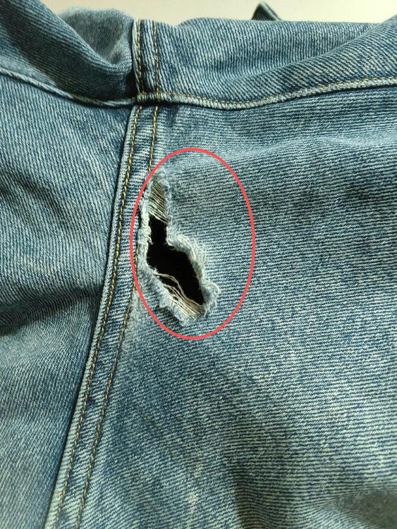 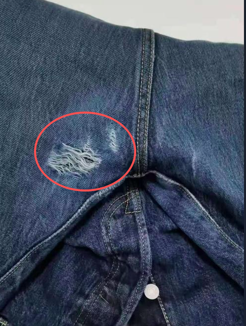 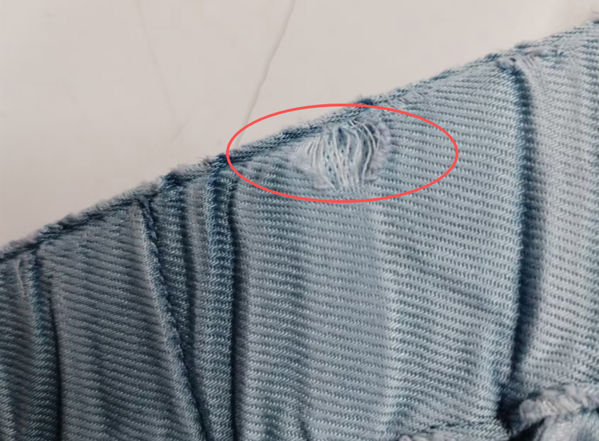 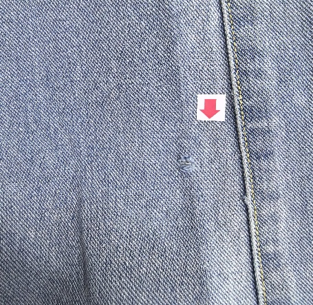 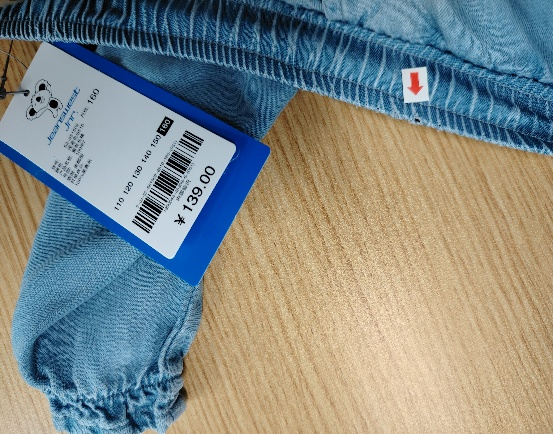 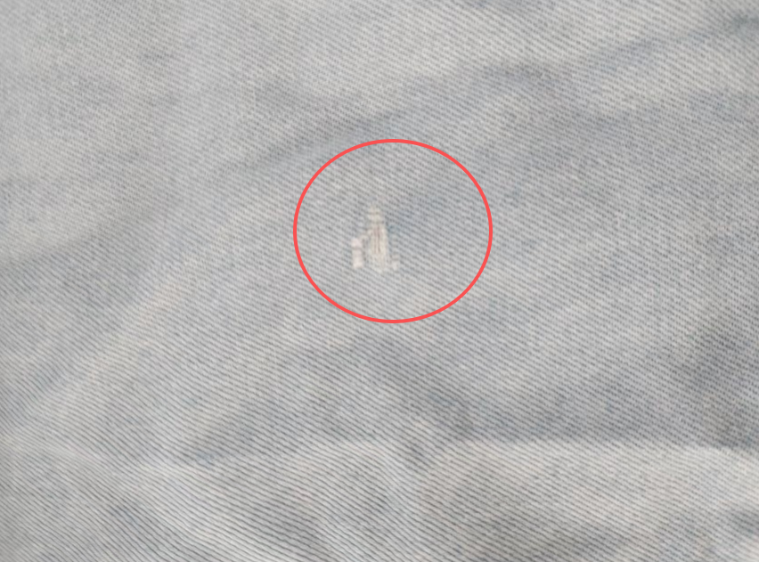 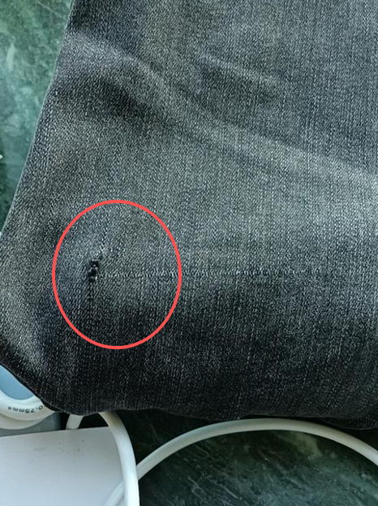 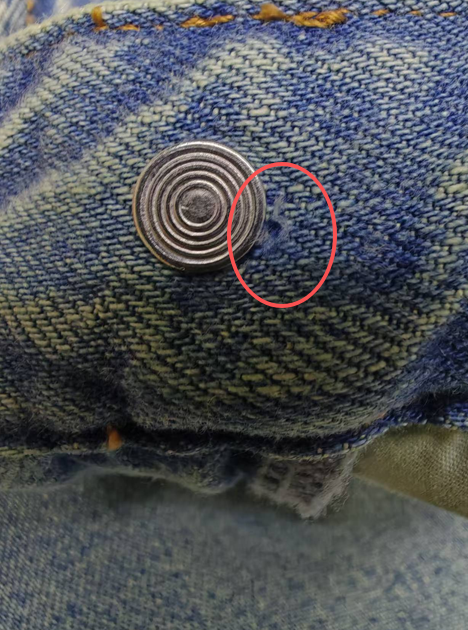 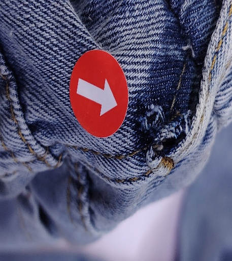 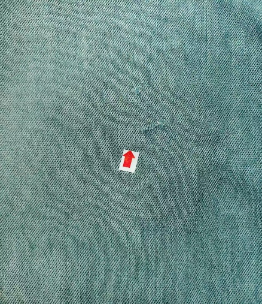 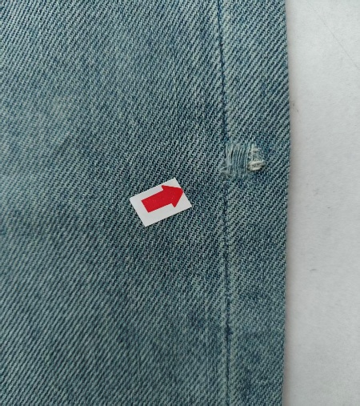 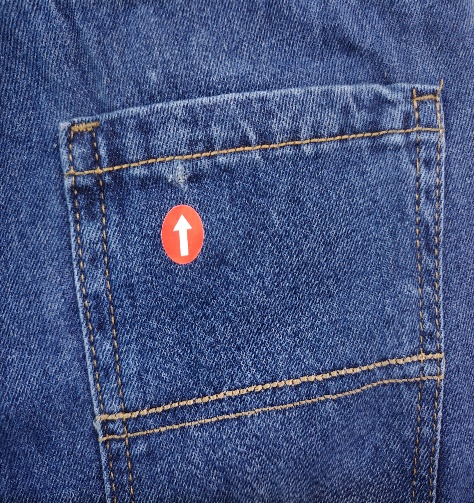 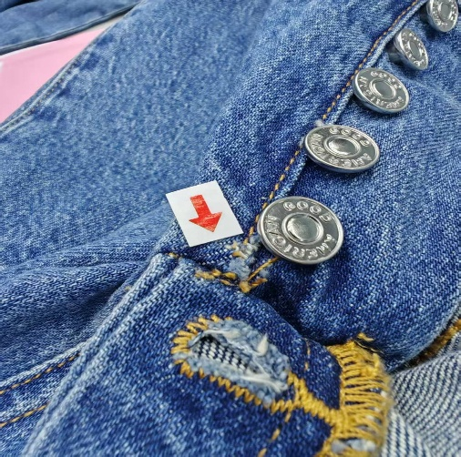

1.2問題原因及解決方案

| 發生階段 | 破洞問題類型 | 可能來源/原因 | 特征說明 | 解決方法 | 預防措施 |
| --- | --- | --- | --- | --- | --- |
| A)裁剪與備料 | 面料破洞、針孔、斷紗 | 1. 織造時的斷經、斷緯或跳紗； 2. 染整過程中的機械刮傷； 3. 驗布時漏檢微小破損； | 1.破洞邊緣較平整，無明顯磨損或拉扯痕跡； 2.洗水後因纖維鬆弛，小疵點擴大成明顯破洞； | 1. 裁床發現立即換片； 2. 嚴重者整匹退還供應商； | 1. 嚴格執行驗布標準（如四分制）； 2. 裁床鋪布時雙人复核，重點檢查面料反面； 3. 對高風險批次進行預洗測試； |
| B)車縫過程 | 針刺破洞 | 1. 車針型號過粗或針尖變鈍、彎曲； 2. 車針安裝不正，撞擊壓腳或送布牙； 3. 車縫厚薄交接處（如側縫過腰頭）速度過快導致斷針刺破； | 1.破洞呈圓形或橢圓形，邊緣有纖維被切斷痕跡； 2.常出現在接縫線旁、口袋角或省道末端 | 1. 立即更換細號或圓頭針； 2. 調整車縫速度，厚處手輪輔助； | 1. 定時更換車針； 2. 使用適合牛仔面料的專用針（如DBx1）； 3. 培訓員工在厚薄交接處減速慢行； |
| C)車縫過程 | 拉扯/剪切破洞 | 1. 工人車縫時過度拉扯面料導致撕裂； 2. 剪線頭時剪刀過尖或操作失誤剪破面料； | 1.破洞形狀不規則，常伴隨面料變形；2.多發生在褲襠彎位、口袋邊緣或縫份處； | 1. 小破洞嘗試織補，大破洞換片； 2. 加強剪線頭工序管理； | 1. 規範操作手法，禁止暴力拉扯； 2. 使用圓頭剪刀修剪線頭； |
| D)洗水過程(高發階段) 漂洗/脫水/烘干 | 機械磨損破洞 刮破、鈎破、烘乾破損 | 1. 石洗/酵素洗時浮石過多、棱角鋒利或體積過小； 2. 滾筒轉速過快、時間過長或裝載量過少； 3. 拉鍊、鈕扣未保護好，在滾筒內刮擦面料； 4. 機筒內有焊疤、異物、鐵屑； | 1.破洞多發生在接縫處、口袋角、褲腳邊； 2.邊緣有明顯磨白、起毛現象，呈不規則撕裂狀 | 1. 調整洗水工藝參數（時間、轉速、石量）； 2. 將褲子翻面洗水，拉鍊拉好,清潔機筒、拋光焊疤、調整脫水參數； | 1. 使用磨圓處理的浮石或替代材料（如膠球）； 2. 嚴格控制洗水時間和化學劑濃度； 3. 易損部位（如袋角）加縫塑料模墊片，增加抗摩擦力； 4. 定期檢查洗脫烘機內壁； 5. 控制裝載量、避免打絞； |
| E)洗水過程 磨破、撞破、酵素腐蝕破洞 | 化學腐蝕破洞 磨破、撞破、酵素腐蝕破洞 | 1. 漂白水（次氯酸鈉）或高錳酸鉀或酵素濃度和溫度過高； 2. 局部噴灑不均勻，導致某點纖維過度降解； 3. 中和不徹底，殘留化學劑在烘乾時繼續腐蝕； 4. 石洗石頭過大、數量過多； 5. 洗水時間過長、轉速過快； 6. 縫位 / 骨位被重點磨損； | 破洞不規則、邊緣磨白，多在側縫、內側、褲腳 | 1. 立即中和並清水漂洗； 2. 調整化學劑配比和噴灑工藝及時間參數； 2. 破洞位加貼無紡布或加縫塑料模墊片，增加抗摩擦力保護； | 1. 嚴格監控化學劑濃度、溫度和pH值； 2. 噴灑後及時進入下一工序，避免停留過久； 3. 優先使用酶製劑代替強氧化劑進行局部處理； 4. 先做小樣試洗； |
| F)洗水過程 (打磨/手擦) | 人工打磨過度 | 1. 砂紙打磨力度過大、次數過多或粒度太粗； 2. 打磨工具（如磨輪）過於鋒利或轉速過快； 3. 激光燒花功率設定過高或聚焦點錯誤； | 1.破洞位於設計磨白區域（如大腿前側、膝蓋）； 2.邊緣呈現漸變磨損，但中心完全穿透，無化學腐蝕痕跡； | 1. 調整打磨力度和工具粒度； 2. 重新校準激光參數； | 1. 製作標準樣板供員工隨時對照； 2. 定期檢查打磨工具和激光設備狀態； 3. 對薄弱面料減少打磨次數或更換細砂紙； |
| G)熨燙與檢驗 | 燙焦/燙破 | 1. 熨斗溫度過高，燙穿化纖含量高的牛仔布或縫線； 2. 熨斗停留在同一位置時間過長； | 1.破洞邊緣有焦黑痕跡或熔融現象（若含滌綸）； 2.多發生在縫份、腰頭、口袋處等厚度不均處； | 1. 降低熨燙溫度，控制蒸汽壓力、加快移動速度； 2. 強制使用隔熱布（墊布）； 3.在關進工序設立查驗工序； | 1. 根據面料成分設定標準熨燙溫度並張貼標識； 2. 定期校準熨斗溫控裝置； 3. 對洗水後較薄的面料必須加墊布熨燙； 4.所有貨品熨燙後包裝前需100%查驗，並做好破洞數據的記錄和分析； |
| H)包裝與出貨 | 鉤掛/剪刀割破 | 1. 包裝時被別針、吊牌槍針頭鉤破或包裝剪刀誤剪； 2. 摺疊時硬物掛件頂破面料； 3. 裝箱過滿或運輸途中受尖銳物擠壓穿刺； | 1）破洞整齊（剪破） 2）破洞小而集中，常位於摺疊處或靠近金屬配件處，邊緣有單向鉤絲痕跡或穿刺孔； | 1. 改進包裝手法，避開金屬件； 2. 檢查包裝環境是否有尖銳物； | 1. 使用圓頭吊牌槍，並在打釘處加墊紙片； 2. 摺疊時注意金屬配件位置，必要時加襯紙包裝隔離； 3. 優化装箱規劃，避免過度擠壓，使用強度達標的無釘紙箱； |
