**10、不平服/容皱（牛仔裤）**

10.1疵點圖片

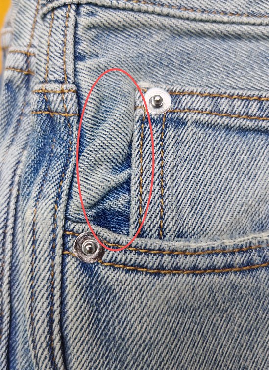 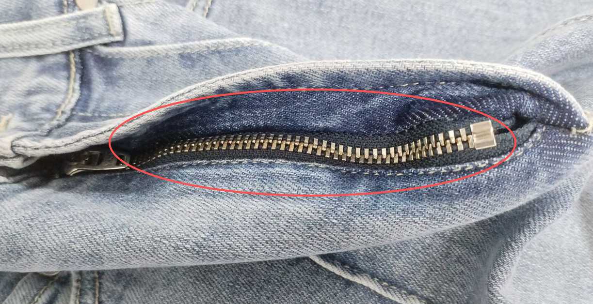 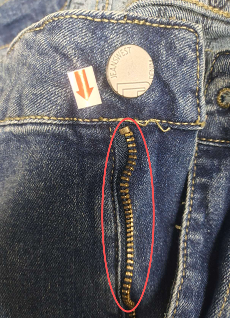 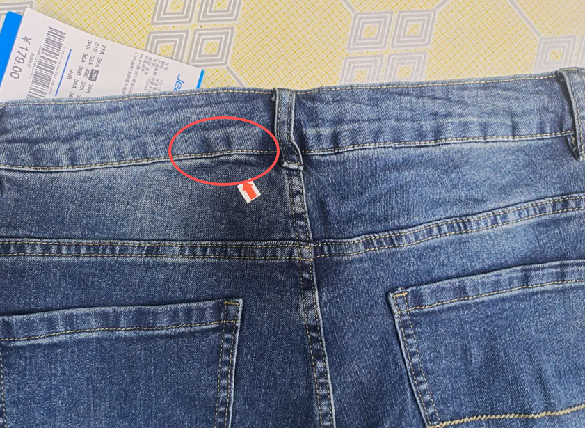 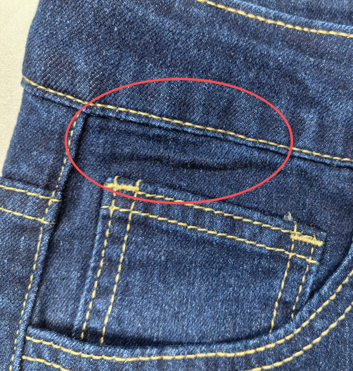 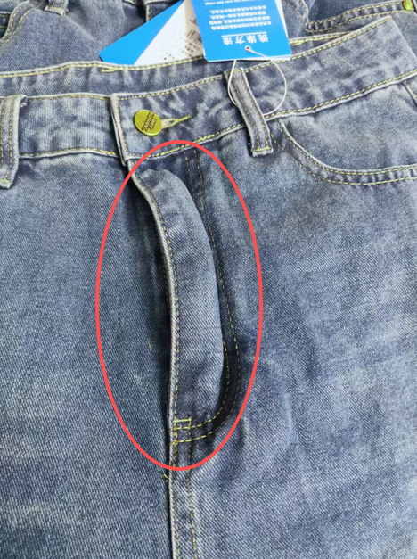 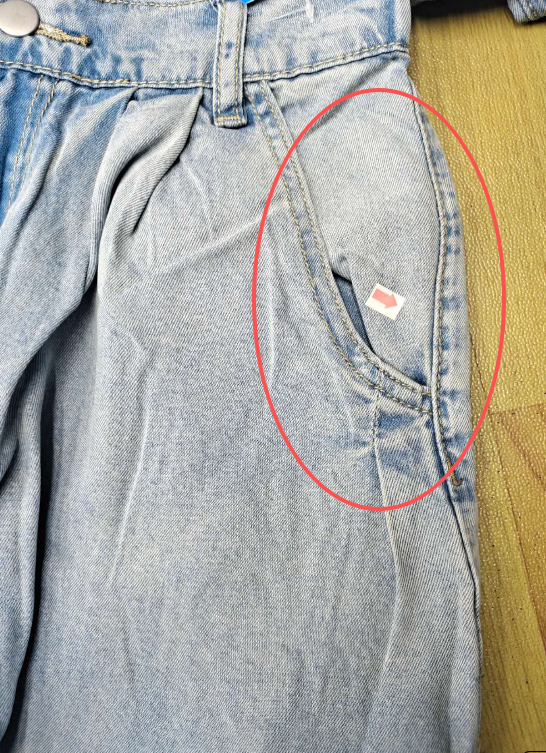 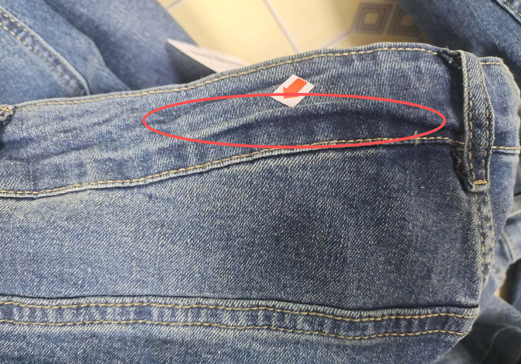 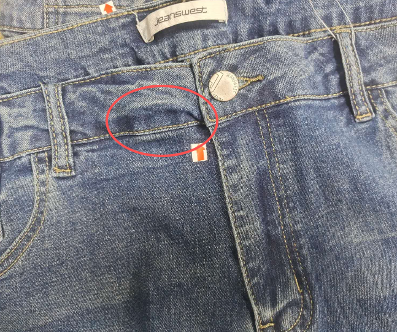 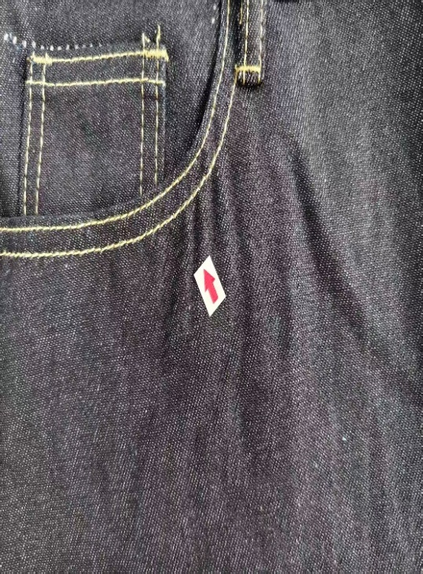 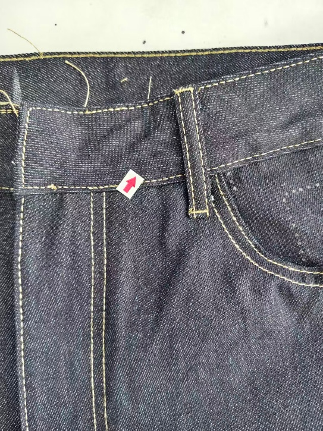 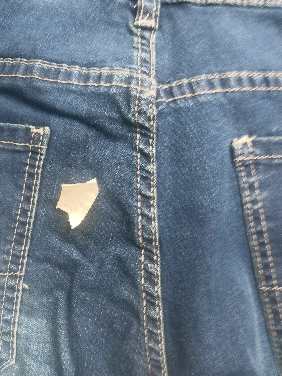

10.2問題原因及解決方案

| 發生階段 | 不平服/容皺問題類型 | 可能來源/原因 | 特征說明 | 解決方法 | 預防措施 |
| --- | --- | --- | --- | --- | --- |
| A)車縫階段 | 拉鏈不平服 （前中拉鏈） | 1. 拉鏈本身質量差，帶體彎曲、變形，無法平整鋪放； 2. 車縫時拉鏈與面料對位偏差，一邊緊一邊松； 3. 車工車縫力度不均，線跡鬆緊不一，導致拉鏈起皺； 4. 拉鏈車縫時未拉開拉頭，車縫後拉頭移動導致不平； 5. 面料與拉鏈厚度不匹配，車縫後受力不均 | 前中拉鏈部位出現起皺、歪斜，拉鏈帶與褲身面料不贴合，起波浪形、拉頭移動時卡滯，車縫線跡不平整影響褲子整體版型和穿著體驗 | 1. 輕微歪斜起皺：拆開局部線跡，重新對位拉鏈，調整線跡鬆緊，均勻車縫； 2. 拉鏈變形：更換合格拉鏈，重新車縫，確保對位準確； 3. 線跡不均：調整車速和線跡張力，拆線後重新車縫； 4. 拉頭偏移：拉開拉頭固定車縫 | 1. 入庫時檢查拉鏈質量，剔除彎曲、變形、帶體鬆散的不合格品； 2. 車縫前對拉鏈與面料進行對位標記，確保兩側對稱； 3. 規範車工操作，保持車速均勻、線跡張力一致； 4. 車縫時拉開拉頭至合適位置，車縫兩端加固； 5. 根據面料厚度選擇匹配規格的拉鏈 |
| B)車縫階段 | 褲頭面布不平服 （腰頭部位） | 1. 燙朴本身不平服、厚薄不均、硬軟突兀； 2. 燙朴貼合不緊、翹邊、移位； 3. 熨燙溫度不足→燙朴鬆脫、後續受力後起泡； 4. 燙朴與面布張力不一致→腰頭整體變形； 5. 車縫時受力不均，拉扯腰頭變形； | 1.腰頭面布出現凹凸、起皺、鼓包、歪斜； 2.貼身時明顯不服帖； 3.燙朴鬆脫處會形成隆起皺痕； 4.腰頭邊緣厚薄落差大，穿著易勒腰； | 1. 拆開腰頭局部線跡，更換平整合格燙朴，重新高溫熨貼再車縫； 2. 燙朴鬆脫者：返朴重貼（溫度 / 時間 / 壓力到位）； 3. 硬軟不匹配者：換同材質、同厚度燙朴； 4. 嚴重變形：修剪腰頭，重新對位車縫 | 1. 燙朴入庫檢查：平整、無皺、無硬點、厚薄一致； 2. 燙朴貼合必須溫度到位＋時間足＋壓力均； 3. 燙朴尺寸與腰頭嚴格匹配，避免厚薄差異； 4. 車縫前檢查燙朴是否貼實，無鬆脫、無翹邊才車縫； 5. 選用與面布對應的燙朴（硬軟 / 厚薄 / 彈性一致） |
| C)車縫階段 | 褲頭底部褲身不平服 | 1. 褲頭裁剪不規則、長短不一，與褲身對接時對位偏差； 2. 車縫褲頭時，褲身面料拉伸不均，一側緊一側松； 4. 車工褲身彈力面料預縮走疏密針步時，線跡鬆緊不一，拉扯面料變形； 5. 褲身側縫、後縫車縫不平整，導致褲頭底部偏移 | 褲頭底部與褲身銜接處出現起皺、凹凸不平，褲頭邊緣不平整，一側偏高、一側偏低，腰頭襯布外露或起鼓，車縫線跡彎曲，整體版型歪斜，穿著時褲頭易下滑、不服帖 | 1. 輕微起皺：拆開褲頭局部線跡，重新對位褲身與褲頭，調整面料張力，均勻車縫； 2. 褲頭長短偏差：修剪褲頭多餘部分，重新對接車縫； 3. 襯布問題：更換平整、軟硬合適的襯布，重新車縫褲頭； 4. 線跡不均：調整車縫參數，拆線後重新車縫，確保線跡平整 | 1. 褲頭、襯布裁剪後逐件檢查，確保尺寸規則、平整； 2. 車縫褲頭前，對褲身與褲頭進行對位標記，分點固定； 3. 車工車縫時保持受力均勻，避免拉伸面料； 4. 選擇與面料匹配的腰頭襯布，確保硬軟適中； 5. 車縫前檢查褲身側縫、後縫平整度，不合格者先返工 6. 嚴格五點或三點對位 |
| D)車縫階段 | 口袋車縫不平服 （側袋/後袋） | 1. 口袋裁片裁剪不規則、大小不一，與褲身對位偏差； 2. 車縫時口袋布與褲身面料拉伸不均，導致起皺； 3. 車工車縫時線跡鬆緊不一，口袋邊緣起鼓； 4. 前彎袋車縫時側骨未固定好，導致口袋偏移、歪斜； 5. 口袋布質地與褲身面料不匹配，受力後變形 | 口袋邊緣起皺與褲身面料不贴合，口袋口鬆弛或緊繃，部分區域凸起，車縫線跡彎曲、不平整，嚴重時口袋偏移，影響褲子外觀和使用功能。 | 1. 輕微起皺歪斜：拆開口袋局部線跡，重新對位口袋與褲身，調整面料張力，均勻車縫； 2. 裁片不合格：更換合格口袋裁片，重新車縫； 3. 線跡不均：調整車縫張力，拆線後重新車縫，加固口袋口；4. 口袋偏移：拆開整個口袋線跡，重新對位固定，再車縫 | 1. 口袋裁片裁剪後嚴格檢查，確保尺寸統一、形狀規則； 2. 車縫前將口袋布與褲身對位標記，用定位夾固定，避免偏移； 3. 車工車縫時保持車速均勻，避免拉伸面料； 4. 選擇與褲身面料質地、厚度匹配的口袋布； 5. 車縫後逐件檢查口袋平整度，及時返工 |
| E)車縫階段 | 側縫/後縫車縫不平服 | 1. 褲身裁片裁剪不對稱、邊緣不平整，對接時偏差； 2. 車縫時兩片面料拉伸不均，一側緊一側松 3. 車工車縫時線跡鬆緊不一，導致面料起皺； 4. 車縫後未及時熨燙定型，面料自然回彈變形； 5. 車縫時對位標記不清晰（例如膝圍線），導致對接偏差 6.後浪埋夾蝴蝶筒不匹配 | 側縫/後縫線跡彎曲、不平整，縫份歪斜，兩側面料凹凸不平，起皺明顯，褲腿出現歪斜、不對稱，整體版型失衡，穿著時褲身不服帖，易出現扭曲現象 | 1. 輕微起皺偏差：拆開局部線跡，重新對接裁片，調整線跡張力，均勻車縫； 2. 裁片不對稱：修剪裁片邊緣，調整對位，重新車縫； 3. 線跡不均：調整車縫參數，拆線後重新車縫； 4. 未定型：拆線後熨燙定型，再重新車縫加固 5.大身裁片做好畫位（例如膝圍線）及選用匹配合規的車縫蝴蝶附件 | 1. 褲身裁片裁剪後逐件檢查，確保對稱、邊緣平整； 2. 裁片車縫前畫清晰完整對位線（例如膝圍線全畫）避免偏移，建議不要採用裁床刀打定位，避免散邊看不見子口或車縫完成後爆子口； 3. 規範車工操作，保持車速、線跡張力及均勻送布，避免拉伸面料； 4. 車縫過程中定期檢查線跡和平整度 |
| F)整燙階段 （輔助修復） | 車縫不平服熨燙未修正 | 1. 車縫後不平服未檢出，直接進入整燙環節； 2. 熨燙溫度不夠、力度不均，無法消除起皺； 3. 熨燙方向錯誤，拉扯面料導致進一步不平服； 4. 熨燙後未及時抽風定型，面料回彈變形 | 原有車縫不平服（拉鏈、褲頭、口袋等）未消除，經熨燙後可能出現新的起皺、歪斜，面料表面有熨燙痕跡，不平服現象更為明顯，影響成品外觀合格率 | 1. 輕微不平服：用高溫蒸汽熨斗，順著面料紋理熨燙，配合手動整理定型； 2. 中度不平服：拆開對應部位線跡，重新車縫後再熨燙； 3. 熨燙痕跡：調整熨燙溫度，用濕布墊熨，消除熨燙痕 | 1.整燙前先檢查車縫平整度，發現不平服及時返工後再熨燙； 2.控制熨燙溫度（150-180℃），按面料紋理方向熨燙，用力均勻； 3.熨燙時大面積或特殊部位用夾機輔助，將不平服部位壓平定型； 4.熨燙抽風後將褲子平整放置，自然冷卻定型，避免回彈 5.加強燙工技能的培訓 |
