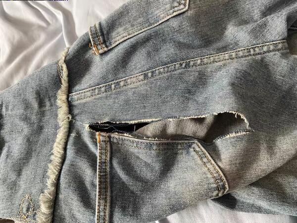
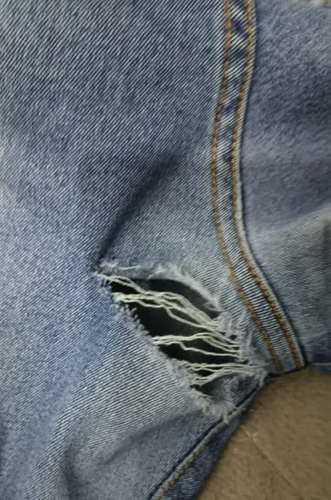
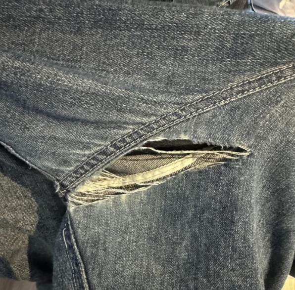
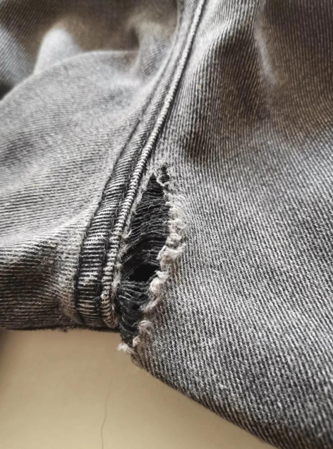
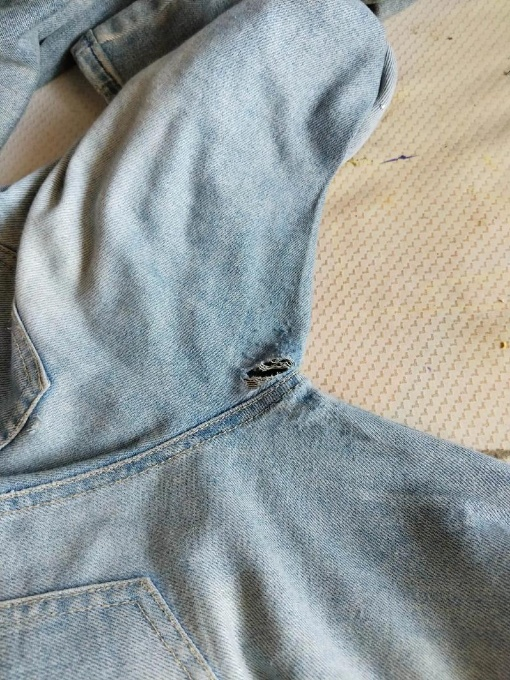

**11、撕裂（牛仔裤）**

11.1疵點圖片

    

11.2問題原因及解決方案

| 發生階段 | 撕裂問題類型 | 可能來源/原因 | 特征說明 | 解決方法 | 預防措施 |
| --- | --- | --- | --- | --- | --- |
| A)車縫階段 | 後袋邊位撕裂 （含袋口、袋側） | 1. 車縫時線跡過密、過緊，拉扯面料導致纖維斷裂； 2. 後袋裁片邊緣未锁边或锁边不牢固，毛邊脫散引發撕裂； 3. 車工操作不規範，用力拉扯面料，導致袋邊受力撕裂； 4. 後袋邊位車縫未加固，受力後易撕裂；5. 面料本身質量差，纖維疏鬆、強度不足 | 後袋邊位出現線性撕裂、毛邊脫散，多沿車縫線或袋口邊緣延伸，輕度撕裂僅毛邊脫散，重度撕裂可見面料纖維斷裂，袋口鬆弛、變形，影響外觀和使用功能，裝物後撕裂加劇 | 1. 輕度撕裂（毛邊脫散）：修剪毛邊，重新锁边，並在袋邊位加固車縫1-2道； 2. 中度撕裂：拆開袋邊車縫線，修剪撕裂部位，更換裁片或補強面料，重新車縫加固； 3. 重度撕裂：更換後袋整體裁片，按標準車縫、锁边、加固 | 1. 車縫時調整線跡密度（每厘米8-10針），控制線跡張力，避免過緊； 2. 後袋裁片邊位必須先锁边，锁边寬度均勻、牢固； 3. 袋口、袋側邊位必須加固車縫，車縫長度不少於1.5cm； 4. 規範車工操作，避免用力拉扯面料； 5. 做好面料及成品拉撕力強度測試， |
| B)車縫階段 | 前浪撕裂 （含前中、前浪接縫） | 1. 前浪裁片對接不準，車縫時受力不均，局部拉扯撕裂； 2. 車縫線跡鬆緊不一，緊張部位易斷裂撕裂； 3. 前浪接縫未加固，穿著時受力集中導致撕裂； 4. 洗水前車縫線跡有暗裂，洗水後撕裂加劇； 5. 車縫時針距過大，線跡牢固度不足 | 前浪部位沿接縫線出現撕裂，多為線性裂縫，輕度撕裂僅車縫線斷裂，重度撕裂連同面料一起撕裂，裂縫處面料毛邊明顯，穿著時易卡滯、變形，影響版型和穿著安全性 | 1. 輕度撕裂（線跡斷裂）：拆開局部線跡，重新對位車縫，並在撕裂部位加固； 2. 中度撕裂：修剪撕裂毛邊，補強面料後重新車縫，兩端加固； 3. 重度撕裂：拆開前浪整體接縫，更換裁片，按標準對位、車縫、加固 | 1. 車縫前對前浪裁片進行精確對位，用定位夾固定，避免偏差； 2. 調整車縫參數，保持線跡張力均勻、針距合理； 3. 前浪接縫兩端及中間部位必須加固車縫，提升牢固度； 4. 車縫後檢查線跡完整性，避免暗裂； 5. 選用強度達標的車縫線，匹配牛仔面料厚度 6. 做好面料及成品拉撕力強度測試， |
| C)車縫階段 | 後浪撕裂 （含後浪接縫、臀圍處） | 1. 後浪裁片裁剪不對稱，車縫縫份子口不均時拉扯面料導致撕裂； 2. 臀圍部位車縫線跡過緊，穿著時受力拉伸撕裂； 3. 後浪接縫未加固，受力集中引發撕裂； 4. 面料磨損後強度下降，車縫部位易撕裂； | 後浪接縫處出現撕裂，多集中在臀圍受力部位，裂縫呈線性或不規則狀，重度撕裂可延伸至臀圍側邊，面料毛邊脫散，穿著時易開裂加劇，影響產品耐用性和外觀 | 1. 輕度撕裂：拆開局部線跡，重新車縫並加固，修剪毛邊； 2. 中度撕裂：補強受力部位面料，重新車縫，確保線跡牢固；3. 重度撕裂：更換後浪裁片，重新對位車縫，全段加固，避免再次撕裂 | 1. 後浪裁片裁剪後逐件檢查，確保對稱、邊緣平整； 2. 車縫時根據臀圍部位受力特點，適當放鬆線跡張力； 3. 後浪接縫全段加固車縫，臀圍處增加加固針腳； 4. 避免面料磨損，車縫前檢查面料表面狀態； 5. 定期檢查車縫機，避免跳針、浮線問題 6. 做好面料及成品拉撕力強度測試， |
| D)車縫階段 | 褲腿邊緣/腳口撕裂 | 1. 腳口裁剪不平整，車縫時受力不均導致撕裂； 2. 腳口車縫未锁边，毛邊脫散引發撕裂；3. 車工操作時用力拉扯腳口面料，導致纖維斷裂； 4. 洗水時腳口磨損，車縫部位強度下降引發撕裂； 5. 腳口車縫線跡過疏，牢固度不足 | 褲腿邊緣、腳口部位出現毛邊脫散或線性撕裂，多沿車縫線或腳口邊緣分佈，輕度撕裂僅毛邊外露，重度撕裂可見明顯裂縫，影響褲子整體外觀，洗水後撕裂易擴大 | 1. 輕度撕裂：修剪毛邊，重新锁边，並加固車縫腳口； 2. 中度撕裂：修剪撕裂部位，調整腳口裁剪邊緣，重新車縫、锁边； 3. 重度撕裂：裁剪多餘撕裂部位，重新修整腳口尺寸，再車縫、锁边 | 1. 腳口裁剪後檢查平整度，確保邊緣規整； 2. 腳口車縫前先锁边，锁边牢固、寬度均勻； 3. 規範車工操作，避免拉扯腳口面料； 4. 洗水時避免腳口過度磨損，合理設置洗水參數； 5. 腳口車縫線跡密度適中，確保牢固度 6.做好面料及成品拉撕力強度測試， |
| E)洗水階段 （撕裂加劇階段） | 洗水後加劇撕裂 | 1. 車縫時已存在暗裂（線跡斷裂、面料纖維受損），未檢出； 2. 洗水時水流衝擊、面料摩擦，導致暗裂擴大； 3. 洗水溫度過高、轉速過快，面料受損撕裂； 4. 洗水助劑腐蝕面料，降低纖維強度，引發撕裂； 5. 樹脂定型操作不規範：樹脂用量過多/濃度過高、定型溫度過高/時間過長，導致面料纖維變脆、韌性下降，受力後撕裂； 6. 選用的樹脂與牛仔面料不匹配，固化後面料柔韌性不足，易引發撕裂； 7. 樹脂定型後未充分冷卻，面料結構不穩定，後續受力易撕裂； 8. 洗水裝載量過多，面料無法充分翻動，局部受力集中引發撕裂； 9. 洗水時間過長，持續磨損面料纖維，導致纖維疲勞、強度下降； 10. 洗水助劑濃度過高或添加不均，局部損傷面料纖維； 11. 洗水機內有尖銳雜物，刮擦面料形成破損，後續受力擴為撕裂； 12. 洗水機滾筒轉速不穩定，面料瞬間受力過大引發撕裂 | 1.原有車縫暗裂擴大為明顯裂縫，裂縫處面料毛邊嚴重、纖維斷裂，多沿接縫線延伸； 2.若因樹脂定型導致，撕裂處面料多呈脆硬狀，纖維易折斷，裂縫邊緣整齊且易擴展； 3.若因洗水參數、設備問題導致，撕裂處多有明顯磨損痕、刮擦痕，裂縫不規則，部分撕裂可穿透面料，影響產品品質，無法修復或修復後影響外觀和耐用性 | 1. 輕度擴大撕裂：修剪毛邊，重新車縫加固，補強面料； 2. 中度擴大撕裂：拆開對應部位線跡，更換受損裁片，重新車縫； 3. 重度擴大撕裂：無法修復，按次品處理，禁止流入市場； 4. 樹脂定型導致的撕裂：輕中度需先用专用去樹脂劑去除多餘樹脂，再按上述方法修復，修復後重新選用适配樹脂、規範參數定型；重度則直接報廢； 5. 刮擦、磨損導致的撕裂：修剪撕裂邊緣，補強面料後重新車縫，避免再次磨損； 6. 受力集中導致的撕裂：拆開局部線跡，調整面料張力，重新車縫並加固 | 1. 洗水前全面檢查車縫部位，發現暗裂及時返工； 2. 控制洗水溫度、轉速，避免面料過度摩擦和衝擊，洗水溫度不超過60℃，轉速均勻穩定； 3. 選用中性洗水助劑，避免腐蝕面料，嚴格控制助劑濃度，均勻添加； 4. 洗水後及時檢查，發現撕裂立即處理； 5. 樹脂定型相關：選用與牛仔面料适配的柔性樹脂，嚴格控制樹脂用量和濃度； 6. 把控樹脂定型溫度和時間，避免高溫長時間固化； 7. 樹脂定型後需充分冷卻至常溫，再進入後續工序； 8. 定型後檢查面料韌性，剔除脆硬、易斷裂的不合格面料； 9. 控制洗水裝載量，確保面料可充分翻動，避免局部受力集中； 10. 合理設置洗水時間，避免面料纖維過度疲勞； 11. 洗水前檢查洗水機內部，清除尖銳雜物，避免刮擦面料； 12. 定期檢查洗水機，確保滾筒轉速穩定； 13. 洗水後及時干燥，控制干燥溫度和風速，避免面料脆化、拉扯撕裂； 14. 干燥後檢查面料狀態，剔除受損面料 15. 做好面料及成品拉撕力強度測試， |
