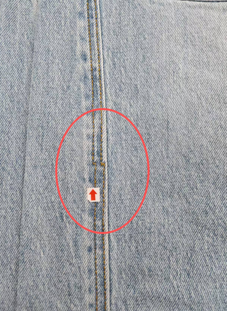
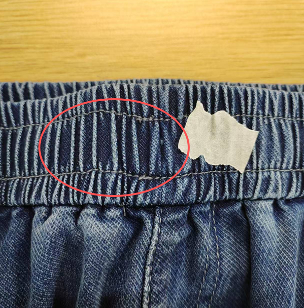
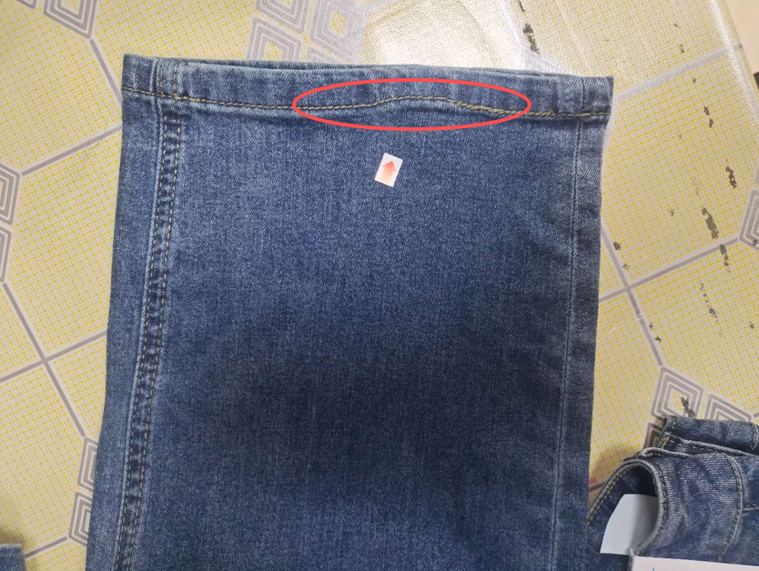
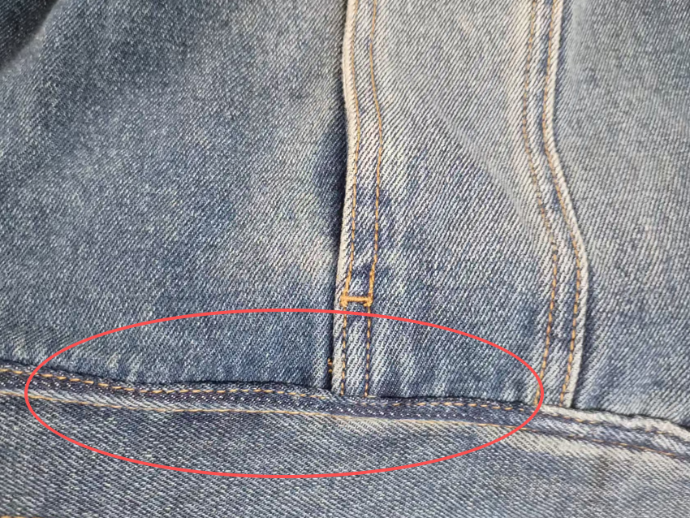
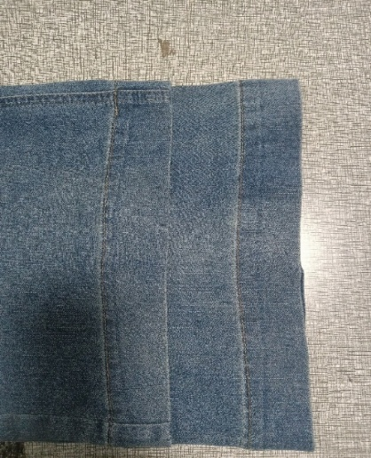
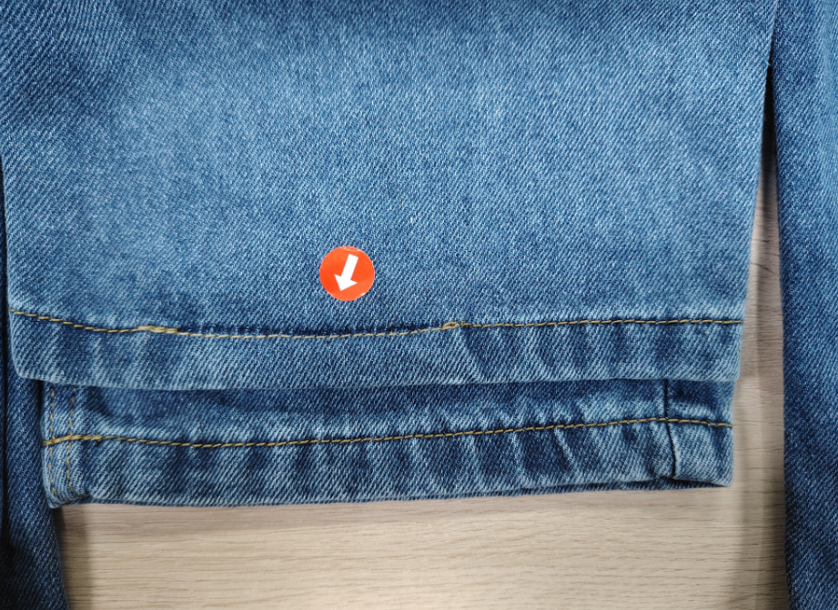
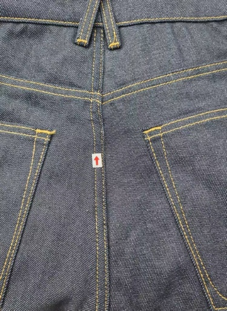
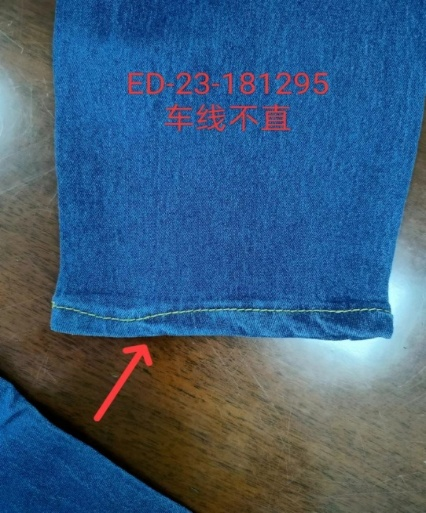

**12、車線不直（牛仔裤）**

12.1疵點圖片

       

12.2問題原因及解決方案

| 發生階段 | 車線不直問題類型 | 可能來源/原因 | 特征說明 | 解決方法 | 預防措施 |
| --- | --- | --- | --- | --- | --- |
| A)車縫階段 | 褲腳車線不直 （含腳口卷邊車線） | 1. 車工操作不規範，車縫時手勢偏移，未沿裁剪邊緣或標記線車縫； 2. 褲腳裁剪不平整、邊緣不規整，導致車線跟隨歪斜； 3. 車縫機壓腳壓力不均，面料受力偏移，車線跑偏； 4. 車速過快，車工無法及時調整手勢，導致車線彎曲； 5. 褲腳面料拉伸不均，車縫後回彈，車線變形不直 | 褲腳車線呈彎曲、歪斜狀，不與褲腳邊緣平行，局部有凸起、凹陷，卷邊車線內外不對齊，線跡彎曲不順直； | 拆開局部車線，沿褲腳標記線重新車縫，調整手勢和車速，重新車縫卷邊,確保車線順直； | 1. 褲腳裁剪後逐件檢查，確保邊緣平整、規整，做好車縫標記線； 2. 規範車工操作，車縫時沿標記線匀速車縫，保持手勢穩定，避免偏移； 3. 調整車縫機壓腳壓力，確保面料受力均勻，不跑偏； 4. 控制車速，避免過快，方便及時調整手勢； 5. 車縫前將褲腳面料拉平，避免拉伸不均，車縫後及時熨燙定型 |
| B)車縫階段 | 褲頭車線不直 （含腰頭接縫車線） | 1. 褲頭裁片裁剪不規則、長短不一，對接時對位偏差，車線跟隨歪斜； 2. 車工車縫時手勢偏移，未沿褲頭邊緣或標記線車縫； 3. 車縫機送布齒運轉不穩，導致面料送布不均，車線跑偏； 4. 褲頭襯布貼合不平整，導致車縫時面料受力不均，車線不直； 5. 車縫時拉力過大，拉扯面料變形，車線彎曲 | 褲頭車線呈彎曲、歪斜狀，不與褲頭邊緣平行，腰頭接縫車線對接不平整、有錯位，車線局部凸起或凹陷； | 拆開局部車線，重新對位標記線，調整手勢和車速，重新車縫； | 1. 褲頭裁片裁剪後嚴格檢查，確保尺寸統一、邊緣平整，做好對位標記； 2. 車縫前將褲頭襯布貼合平整，避免起鼓、偏移； 3. 定期檢查車縫機送布齒，確保運轉穩定，送布均勻； 4. 車工保持穩定手勢，沿標記線匀速車縫，避免拉力過大； 5. 車縫後及時熨燙褲頭，固定車線形狀 |
| C)車縫階段 | 側骨車線不直 （側縫車線） | 1. 褲身側縫裁片對接不準，標記線模糊或偏移，車線跟隨歪斜； 2. 車工車縫時手勢不穩，未沿對接標記線車縫； 3. 車縫機壓腳壓力過大或過小，面料跑偏，車線彎曲； 4. 面料拉伸不均，車縫時一側緊一側松，導致車線不直； 5. 車速過快，無法及時調整對位，車線偏移 | 側骨車線呈線性彎曲、歪斜，不沿側 縫對接線延伸，局部有偏移、凸起，車線與面料紋理不順直； | 拆開局部側骨車線，重新對接裁片標記線，調整車縫參數，校正標記線，匀速車縫； | 1. 車縫前清晰標記側縫對接線，用定位夾固定裁片，避免偏移； 2. 調整車縫機壓腳壓力，確保面料受力均勻，送布平穩； 3. 規範車工操作，保持手勢穩定，沿標記線匀速車縫，控制車速； 4. 車縫前將裁片拉平，避免拉伸不均，車縫時避免用力拉扯面料； 5. 車縫後檢查側骨車線平整度，及時返工 |
| D)車縫階段 | 後袋車線不直 （含袋口、袋側車線） | 1. 後袋裁片裁剪不規則，對位標記模糊，車線跟隨歪斜； 2. 車工車縫時手勢偏移，未沿袋口、袋側標記線車縫； 3. 車縫機針距不均、車速不穩，導致車線彎曲； 4. 後袋面料與褲身面料貼合不緊，車縫時面料滑動，車線跑偏； 5. 車縫時拉力不均，導致車線變形不直 | 後袋袋口、袋側車線呈彎曲、歪斜狀，不與袋口、袋側邊緣平行，車線局部偏移、起皺，袋口車線兩端不對齊； | 拆開局部袋口/袋側車線，重新對位標記線，調整車速和手勢，重新車縫, 確保車線順直； | 1. 後袋裁片裁剪後檢查，確保尺寸規則、邊緣平整，做好對位標記；2. 車縫前用後袋模版熨燙袋型，確保定型牢固，避免因裁片反生導致後袋裁片與褲身拼縫時滑動走位； 3. 調整車縫機參數，保持針距均勻、車速穩定； 4. 車工沿標記線匀速車縫，保持手勢穩定，避免拉力不均； |
| E)整燙階段 | 車線不直經整燙後暴露/加劇 | 1. 車縫時已存在輕度車線不直，未檢出，整燙後面料定型，不直現象更明顯； 2. 整燙溫度不均、力度不當，拉扯面料，導致車線進一步彎曲； 3. 整燙方向錯誤，與車線紋理不符，加劇車線不直； 4. 整燙後未及時冷卻定型，面料回彈，車線變形 | 原有輕度車線不直變得清晰可見，車線彎曲、歪斜更明顯，部分車線因整燙拉扯出現輕微變形，與面料貼合不緊，影響成品外觀； | 1.輕度暴露：用高溫蒸汽熨斗，順著車線方向熨燙，手動整理車線至順直，冷卻定型； 2. 中度加劇：拆開局部車線，重新對位車縫，再進行規範整燙確保車線順直； | 1. 整燙前先檢查車線平整度，發現輕度不直及時處理後再整燙； 2. 控制整燙溫度（150-180℃），按車線和面料紋理方向熨燙，用力均勻； 3. 整燙時用壓板輔助，將車線壓平定型，避免拉扯； 4. 整燙後將褲子平整放置，自然冷卻定型，避免回彈； 5. 整燙後再次檢查車線平整度，及時返工 6．加強熨燙技能的培訓 |
