**13、燙工欠佳（牛仔裤）**

13.1疵點圖片

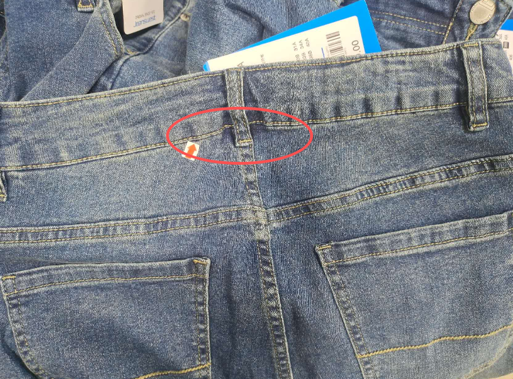 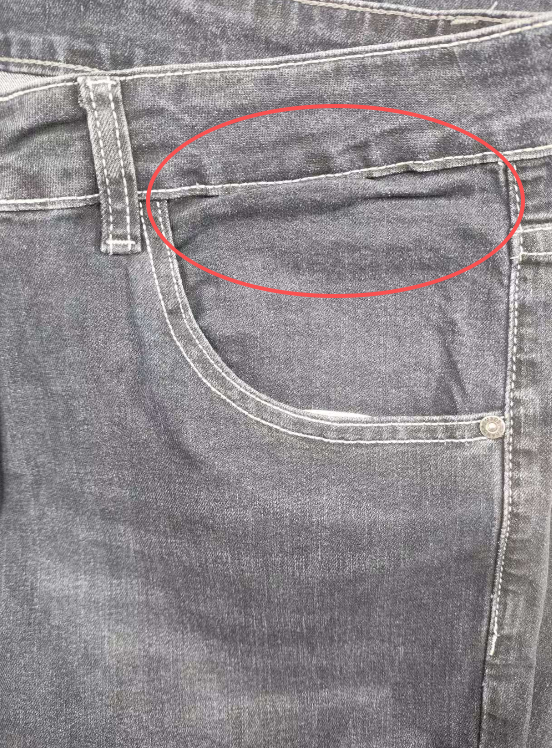 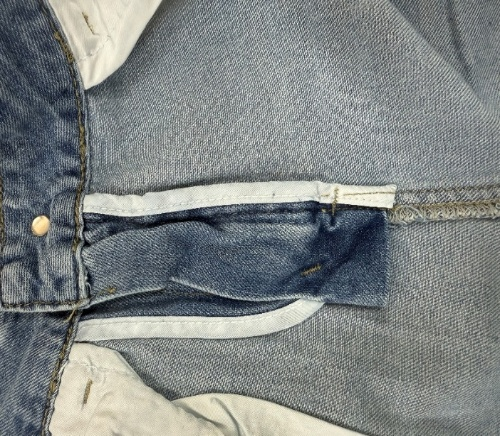 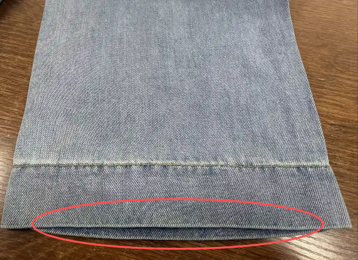 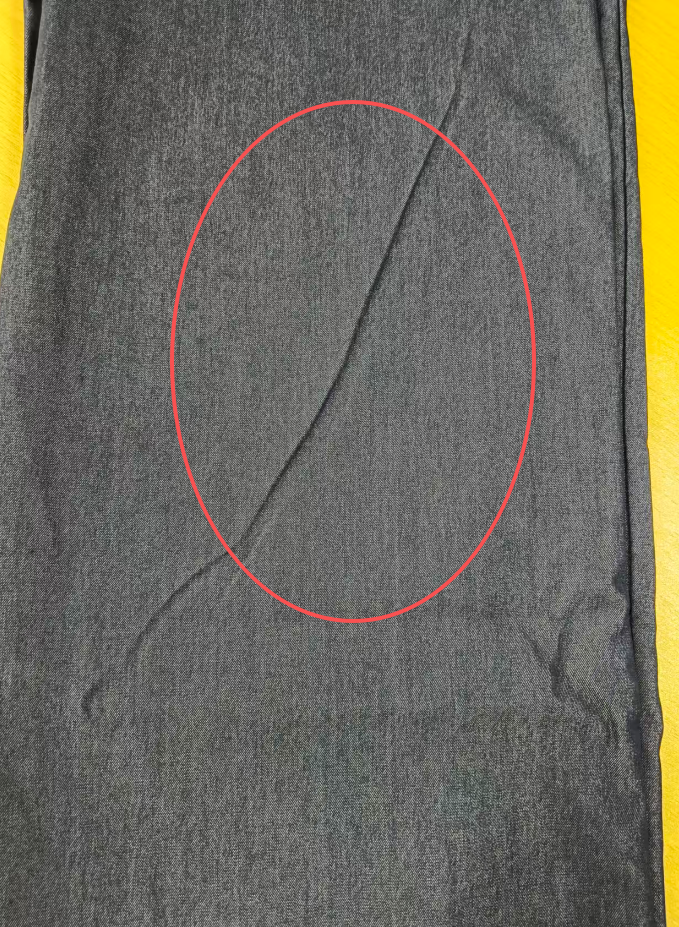 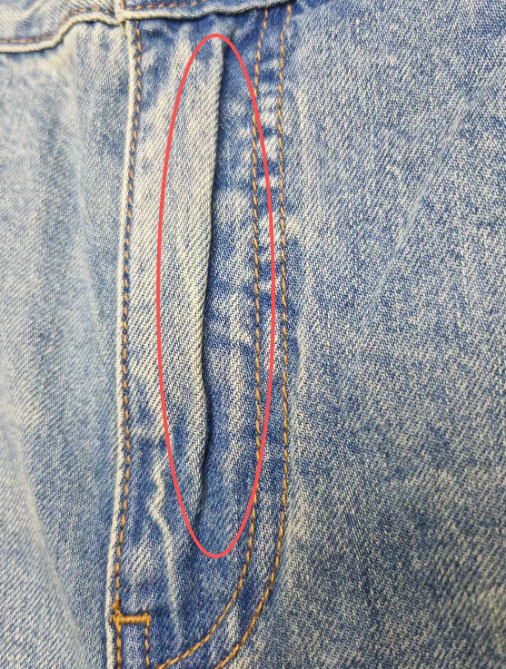 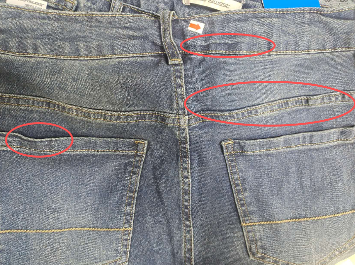 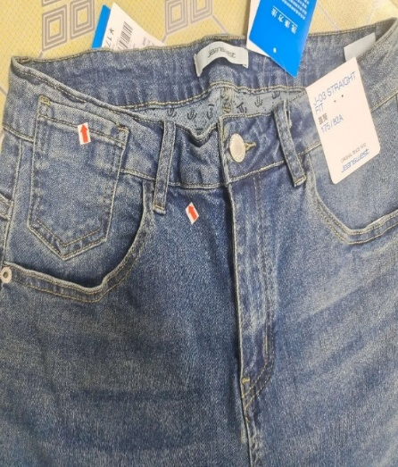 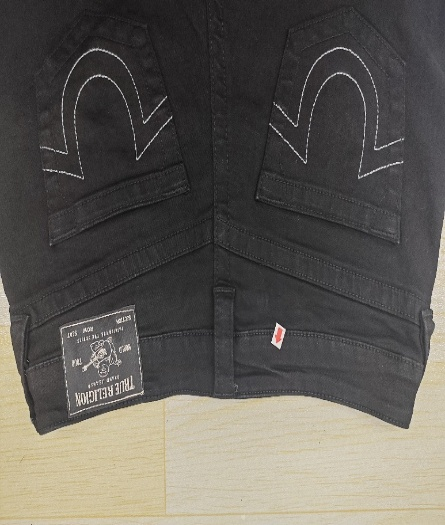 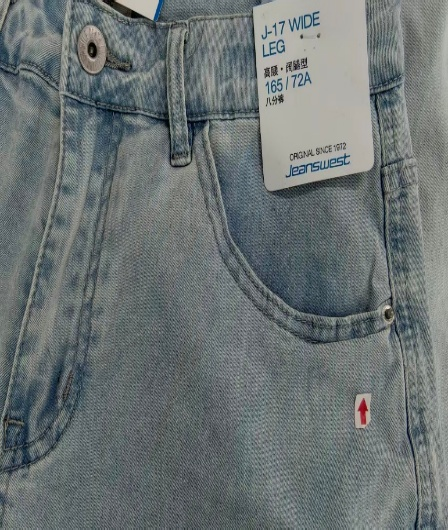 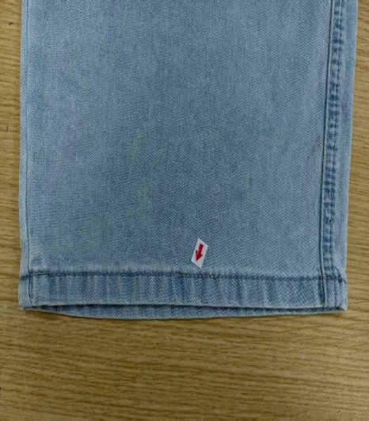 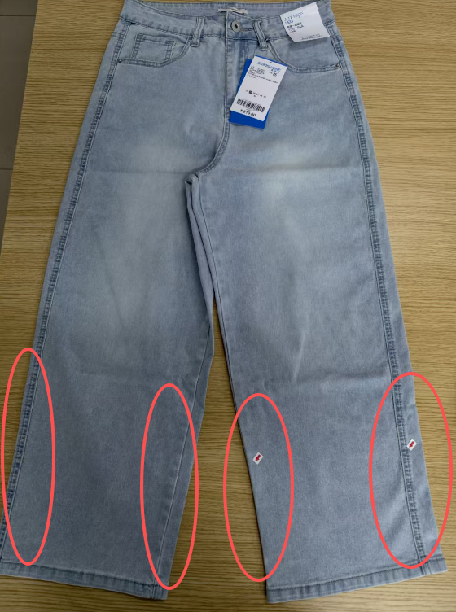 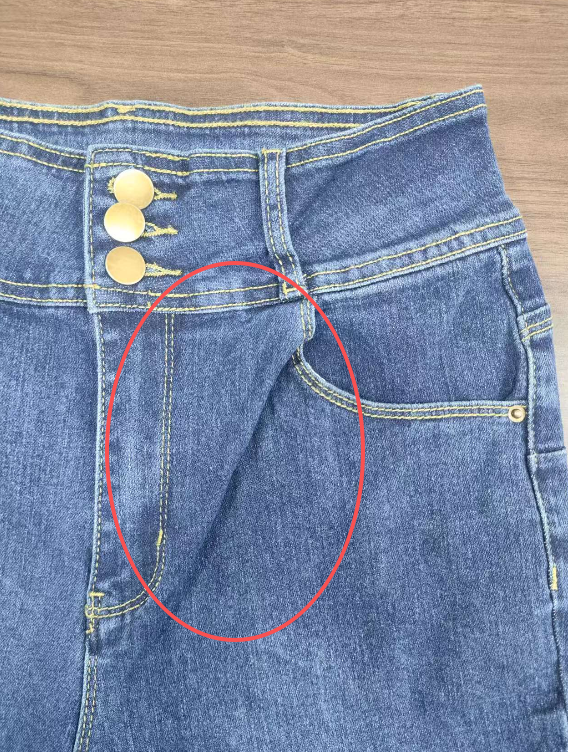 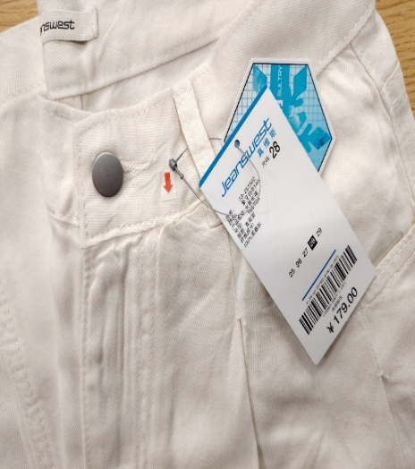 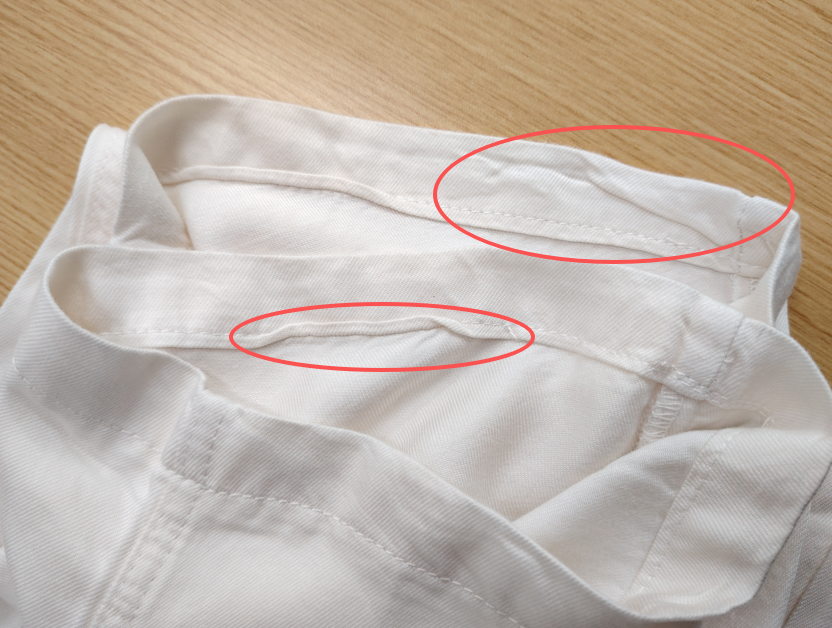 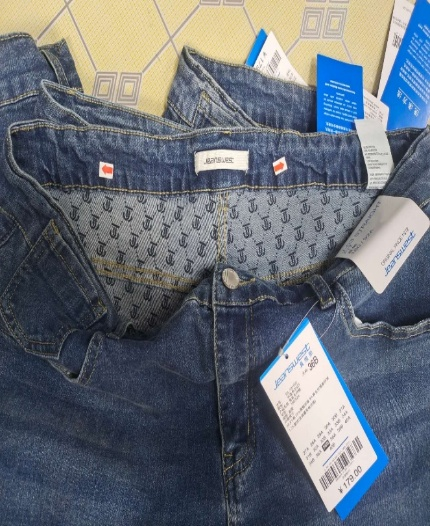 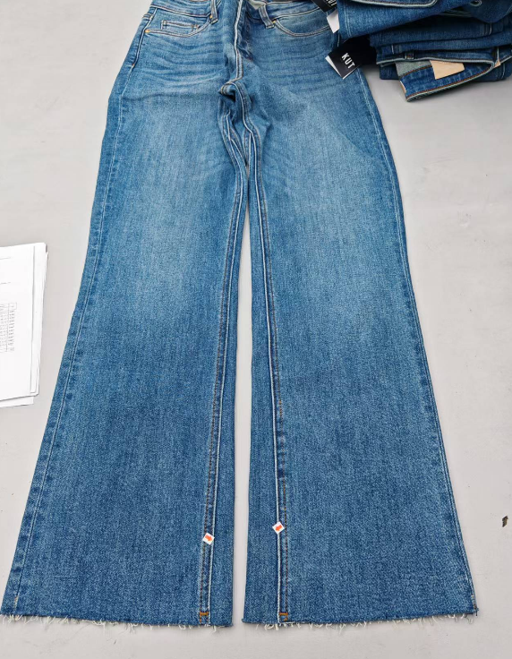 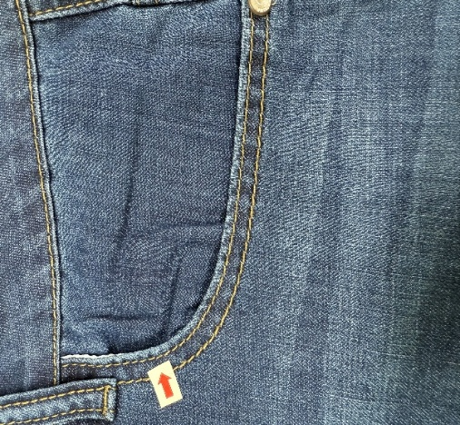 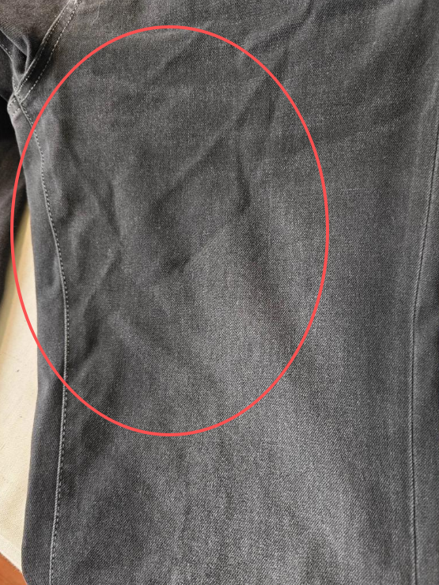 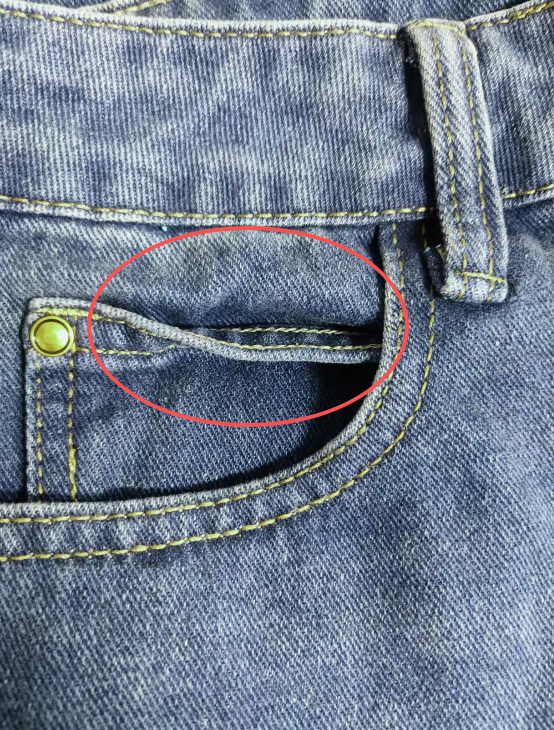

13.2問題原因及解決方案

| 發生階段 | 燙工欠佳問題類型 | 可能來源/原因 | 特征說明 | 解決方法 | 預防措施 |
| --- | --- | --- | --- | --- | --- |
| 車縫階段 （輔助誘發） | 車縫後未及時熨燙，誘發燙工欠佳隱患 | 1. 側骨、袋口、鈕牌、褲頭、腳口等部位車縫後，未及時初步熨燙定型，線跡收縮導致面料變形； 2. 車縫時面料拉伸不均，未經熨燙定型，後續整燙難以糾正； 3. 車縫線跡不平整，未及時熨燙壓實，導致後續整燙後不平服； 4. 車縫時裁片對位偏差過大，後續整燙無法彌補，導致不平服； 5. 車縫線跡過緊，熨燙時線跡收縮，牽拉面料變形 | 1.車縫部位線跡鬆弛、起皺，面料輕微變形，後續整燙後仍難以達到平整效果，易出現歪斜、起鼓等問題，隱患易被放大，影響成品品質； 2.裁片對位偏差、線跡過緊導致的變形，整燙後仍有明顯歪斜、起皺，無法完全糾正 | 1. 拆開局部車線，重新對位車縫，車縫後立即初步熨燙定型； 2. 對變形部位用蒸汽熨斗整理，冷卻後再進行後續整燙； 3. 線跡不平整處，重新熨燙壓實，確保線跡順直、面料平整； 4. 裁片對位偏差過大：拆開車線，重新對位裁片，車縫後熨燙； 5. 線跡過緊：拆開局部線跡，重新車縫（調松線跡張力），再熨燙定型 | 1. 車縫時避免拉扯面料，保持面料和線跡平整；  2. 針對特殊工序,裁片設置專門的車縫前熨燙定型工序，確保每個部位車縫後符合品質要求； 3. 車縫前仔細對位裁片，做好標記，避免偏差過大； 4. 調整車縫機線跡張力，避免線跡過緊 |
| B)整燙階段 | 大小褲骨 （側縫/內浪骨） | 1. 整燙溫度不均、力度不當，一側熨燙過度、一側不足，導致側骨長短不一； 2. 熨燙方向錯誤，未沿側骨紋理熨燙，拉扯面料導致側骨歪斜、不平服； 3. 熨燙時未固定側骨位置，面料滑動，導致兩側側骨對稱性差； 4. 熨燙後未冷卻定型，面料回彈反生導致側骨變形； | 1.兩條褲腿側骨或內浪骨位高低不對稱，寬窄不對稱、側骨線跡不順直； 2.輕度影響版型，重度導致褲腿歪斜、穿著不服帖，洗水後偏差加劇，肉眼可明顯看出兩側側骨不對稱； | 1. 輕度偏差：用高溫蒸汽熨斗，沿側骨紋理匀速熨燙，手動調整對稱位置，夾機固定抽濕後冷卻定型； 2. 中度偏差：拆開局部側骨車線，重新對位車縫後，按標準整燙定型； 3. 有印痕/燙痕：墊布低溫熨燙，輕輕撫平印痕； | 1. 整燙前檢查側骨車線對位情況； 2. 控制熨燙溫度（150-180℃），保持力度均勻，沿側骨紋理方向熨燙； 3. 熨燙時抓骨擺平並抽氣固定側骨，避免面料滑動，確保兩側對稱； 4. 整燙抽濕後平整放置，自然冷卻定型，避免回彈； 5. 定期檢查整燙設備，校正溫度、穩定蒸汽壓力，及時維修故障； |
| C)整燙階段 | 前袋襯/袋口不平服（燙工問題） | 1. 前袋襯熨燙不平整、未完全貼合面料，導致袋口起鼓； 2. 熨燙溫度過高，燙壞袋口面料或使袋口收縮變形； 3. 熨燙力度不均，袋口一側壓實、一側鬆弛，出現歪斜不平； 4. 袋口裁片車縫前未做好定型整燙，導致車縫後線跡收縮不平服； 5. 熨燙後未冷卻，袋口受擠壓變形； 6. 袋口面料含潮量不均，熨燙時收縮不一致，導致不平服； 7. 熨燙時墊布厚度不當，局部受熱不均，出現起鼓或凹陷 | 1.前袋襯起鼓、不服帖，袋口歪斜、起皺，線跡處有凸起，袋口邊緣不平整、高低不一； 2.輕度影響外觀，重度導致袋口變形、無法正常使用，裝物後不平服現象更明顯，與褲身銜接處起皺； 3.面料含潮量不均導致局部收縮差，出現不規則皺褶；墊布不當導致局部凹凸不平 | 1. 輕度不平服：用低溫蒸汽熨斗，墊布熨燙袋口和袋襯，手動整理至平整，抽濕冷卻定型； 2. 中度不平服：拆開袋口局部車線，重新熨燙袋襯至完全貼合，再重新車縫、熨燙； 3. 重度不平服：拆開整個袋口車線，更換袋襯，重新車縫後按標準整燙； 4. 收縮不均導致的皺褶：均勻噴霧增潮，重新匀速熨燙，冷卻定型 | 1. 貼袋車縫前先單獨熨燙平整，確保無皺褶、無起鼓； 2. 控制熨燙溫度，避免高溫燙壞面料，墊布熨燙袋口，防止產生起鏡面； 3. 熨燙袋口時力度均勻，沿袋口邊緣匀速熨燙，確保平整對稱； 4. 熨燙抽濕後將袋口平整放置，冷卻後再進行後續工序； 5. 熨燙前檢查袋口面料含潮量，確保均勻，乾燥面料適當噴霧增潮； 6. 選用厚度均勻的墊布，確保熨燙時受熱均勻 |
| D)整燙階段 | 鈕牌/鈕子不平服 （燙工問題） | 1. 鈕牌熨燙時溫度、力度不均，導致鈕牌起皺、歪斜； 2. 鈕牌洗水後線跡收縮導致不平服； 3. 熨燙時未固定鈕牌位置，面料滑動，導致鈕牌與鈕子對位偏差、不平服； 4. 熨燙後未冷卻定型，鈕牌受擠壓變形； 5. 鈕子安裝後未熨燙固定，導致鈕子歪斜、不服帖； 6. 鈕牌面料質地特殊（如涂层、刺绣），熨燙溫度不匹配，導致變形、起皺； | 1.鈕牌起皺、歪斜、不服帖，與褲身貼合不緊，局部凸起；鈕子歪斜，與鈕牌對位不準，按壓時鬆動，鈕牌邊緣不平整； 2.輕度影響外觀，重度導致鈕子無法正常扣合，穿著不便，洗水後偏差加劇； | 1. 輕度不平服：用低溫蒸汽熨斗，墊布熨燙鈕牌，手動調整鈕子位置，壓實後冷卻定型； 2. 中度不平服：拆開鈕牌局部車線，重新熨燙鈕牌至平整，調整鈕子對位，重新車縫、熨燙； 3. 重度不平服：拆開鈕牌車線，更換鈕牌裁片，重新安裝鈕子，按標準整燙定型； 4. 鈕子變形/面料損壞：更換鈕子，修剪受損鈕牌面料，重新熨 | 1. 鈕牌鈕子車縫前裁片先熨燙平整，做好對位標記； 2. 控制熨燙溫度和力度，墊布熨燙，避免燙壞鈕牌面料； 3. 熨燙時確保與鈕子對位準確，避免滑動； 5. 熨燙抽濕後冷卻定型，避免擠壓變形； 6. 根據鈕牌面料特性調整熨燙溫度，涂层、刺绣面料用低溫熨燙； 7. 熨燙時避開鈕子，可用隔熱墊遮擋鈕子 |
| E)整燙階段 | 褲頭不平服 （燙工問題） | 1. 褲頭熨燙溫度不均、溫度不夠、力度不當，局部起鼓、凹陷； 2. 熨燙方向錯誤，拉扯褲頭面料，導致褲頭歪斜、不服帖； 3. 褲頭襯布熨燙不平整、未完全貼合，導致褲頭起皺； 4. 熨燙後未冷卻定型，面料回彈，褲頭變形； 5. 車縫後褲頭未及時熨燙，線跡收縮導致不平服； 6. 褲頭彈力帶鬆緊不均，熨燙時收縮不一致，導致不平服； 7. 整燙時褲頭拉伸過度，冷卻後回彈變形 | 1.褲頭整體歪斜、起皺，局部凸起或凹陷，與褲身銜接處不服帖，腰頭邊緣不平整； 2.輕度影響外觀，重度導致褲頭下滑、穿著不服帖，洗水後不平服現象加劇，甚至出現熨燙痕跡； 3.彈力帶不均導致褲頭局部鬆弛、局部緊繃，拉伸過度導致褲頭變形、不服帖 | 1. 輕度不平服：用高溫蒸汽熨斗，沿褲頭紋理匀速熨燙，手動整理至平整，或用夾機夾燙並抽濕冷卻定型； 2. 中度不平服：拆開褲頭局部車線，重新熨燙襯布至完全貼合，校正褲頭位置，重新車縫、熨燙； 3. 重度不平服：拆開整個褲頭車線，修剪褲頭裁片，重新車縫、熨燙定型； 4. 彈力帶問題：拆開褲頭車線，調整彈力帶鬆緊度，重新車縫熨燙； | 1. 褲頭車縫前先熨燙襯布，確保平整貼合，無起鼓、無皺褶； 2. 控制熨燙溫度（150-180℃），力度均勻，沿褲頭邊緣和紋理方向熨燙； 3. 特殊部位可以採用夾機輔助夾燙，並及時將褲頭抽濕壓平定型，避免拉扯； 4. 熨燙後平整放置，自然冷卻定型，避免擠壓回彈； 5. 車縫前檢查褲頭彈力帶，確保鬆緊均勻，不合格則更換； 6. 加強燙工技能培訓，整燙時避免過度拉伸褲頭，保持自然狀態熨燙 |
| F)整燙階段 | 褲腳口燙工欠佳 - 馬蹄腳 | 1. 熨燙時褲腳口拉伸不均，前後或左右受力不一致，一側緊一側松，冷卻定型後形成馬蹄狀彎曲； 2. 熨燙方向錯誤，未沿腳口邊緣和面料紋理匀速熨燙，過度拉扯腳口面料； 3. 熨燙時未固定腳口位置，面料滑動，導致腳口邊緣受力不均； 4. 車縫後腳口線跡收縮不均，誘發馬蹄腳； 5. 熨燙後未冷卻定型，面料回彈，馬蹄狀更明顯； 6. 腳口裁剪時前後長度偏差，熨燙時無法彌補，加劇馬蹄腳 | 1.褲腳口呈明顯馬蹄狀彎曲，前後或左右不對稱，腳口邊緣不順直，靠近腳尖處出現內凹或外凸； 2.洗水後面料回彈，馬蹄狀偏差加劇，線跡起皺、不服帖，影響整體外觀和穿著體驗 | 1. 輕度馬蹄腳：用高溫蒸汽熨斗，墊布沿腳口邊緣匀速熨燙，手動拉平彎曲部位後冷卻定型； 2. 中度馬蹄腳：拆開腳口車線，修剪腳口邊緣至平整，重新對位標記線，拉平面料後按標準熨燙，再重新車縫； 3. 重度馬蹄腳：重新裁剪腳口裁片，校正前後長度，車縫後按標準整燙，確保腳口順直 | 1. 腳口裁剪後逐件檢查，確保前後長度一致、邊緣平整，； 2. 熨燙時擺平褲腳口，保持面料自然狀態，抽風熨燙避免過度拉伸或受力不均； 3. 控制熨燙溫度（150-180℃），力度均勻，沿腳口邊緣和面料紋理方向匀速熨燙； 4. 車縫控制車線的鬆緊和縫份的大小均勻，洗水熨燙後平整放置冷卻定型； 5. 熨燙前檢查腳口平整度，提前糾正輕度彎曲偏差 6. 熨燙後冷卻定型，再進行後續工序 |
| G)整理包裝/倉儲階段（二次影響） | 整燙後二次變形，加劇燙工欠佳 | 1. 整理、折疊時用力拉扯、擠壓，導致整燙定型後的部位（尤其是腳口、褲頭）變形、不平服； 2. 包裝時折疊不規範，壓迫褲頭、袋口、腳口等部位，出現起皺； 3. 搬運、堆放時碰撞、擠壓，使燙工部位復原變形； 4. 倉儲堆放過高，壓力過大，導致不平服現象加劇； 5. 包裝材料過硬、過緊，擠壓燙工部位，導致變形； | 1.整燙後的平整部位出現起皺、歪斜、起鼓，褲頭、袋口、鈕牌、腳口等部位不平服程度加劇，與面料貼合不緊，部分部位出現永久性變形，影響成品合格率； 2.包裝材料擠壓導致局部凹陷、起皺，潮濕環境導致面料回彈，出現大面積不平整 | 1. 輕度變形：用蒸汽熨斗重新熨燙整理，冷卻定型後再包裝； 2. 中度變形：拆開局部車線，重新熨燙定型，再車縫、包裝； 3. 重度變形：無法修復，按次品處理，禁止流入市場； 4. 潮濕導致的回彈：先將面料烘干至標準含潮量，再重新熨燙定型 | 1. 整理、包裝時輕拿輕放，避免用力拉扯、擠壓整燙部位，尤其是腳口、褲頭； 2. 規範折疊方式，避免壓迫褲頭、袋口、鈕牌、腳口等易變形部位；3. 搬運時輕拿輕放，避免碰撞、擠壓； 4. 倉儲時平整堆放，控制堆放高度，減少壓力；5. 包裝前再次檢查燙工品質，確保平整合格； 6. 選用柔軟、尺寸合適的包裝材料，避免過緊、過硬； 7. 控制倉儲環境濕度（45%-65%），避免面料吸潮回彈 |
| H)人員操作 （全過程影響） | 操作人員技能不足，導致燙工欠佳 | 1. 操作人員未經專業培訓，不熟悉不同面料熨燙參數，溫度、力度把控不當； 2. 操作手法不規範，熨燙時來回拉扯、停留時間過長，導致面料變形； 3. 責任心不足，未按工藝要求檢查，導致輕度不平服未及時處理，後續加劇； 4. 未按標準流程操作，跳過冷卻定型環節，導致面料回彈； 5. 對腳口馬蹄腳、不水平等細微問題關注不足，未及時校正 | 1.各部位出現不規則皺褶、歪斜、起鼓，熨燙痕跡明顯，部分部位出現燙壞、面料發硬等問題；腳口馬蹄腳、不水平等細微問題未及時處理，後續逐漸加劇； 2.不同產品之間燙工品質差異大，影響批量產品合格率 | 1. 輕度問題：重新按標準熨燙整理，冷卻定型； 2. 中度問題：拆開局部車線，重新車縫、熨燙； 3. 重度問題：按次品處理或返工重做； 4. 對操作人員進行即時指導，糾正不規範操作手法； 5. 重點指導腳口等細微部位的熨燙技巧，及時校正偏差 | 1. 對整燙操作人員進行專業培訓，熟悉不同面料熨燙參數和操作流程，重點培訓腳口、鈕牌等細微部位的熨燙技巧； 2. 制定標準操作手冊，要求人員嚴格按流程操作，避免跳步； 3. 定期開展技能考核，不合格者暂停上崗，重新培訓； 4. 建立巡查機制，及時糾正不規範操作，發現輕度問題立即處理； 5. 強化責任心教育，要求操作人員做好自檢自驗 6.特殊工序位置設立100%查驗，加強查驗人員對品質標準的認識 |
