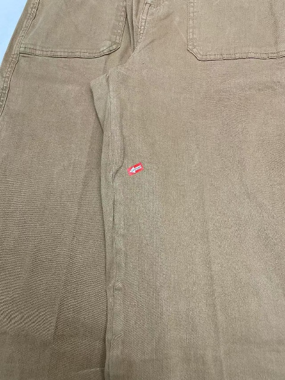
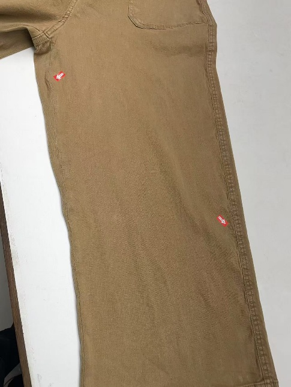
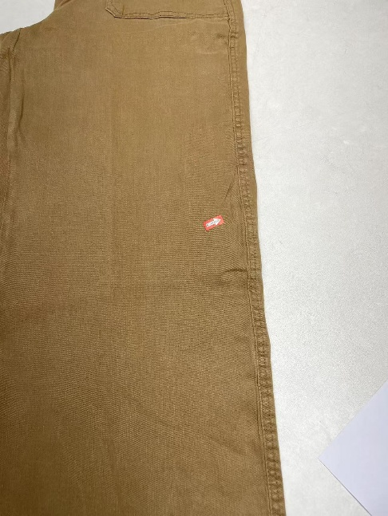
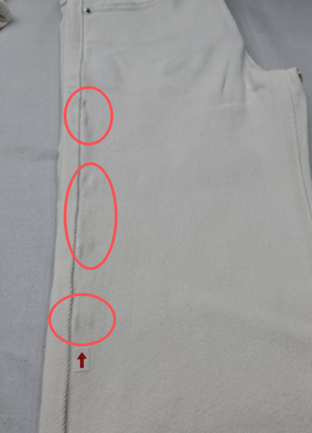
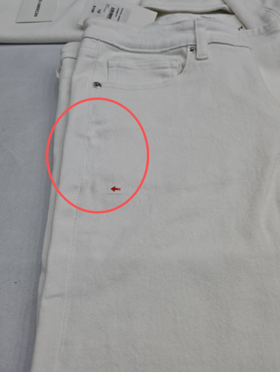
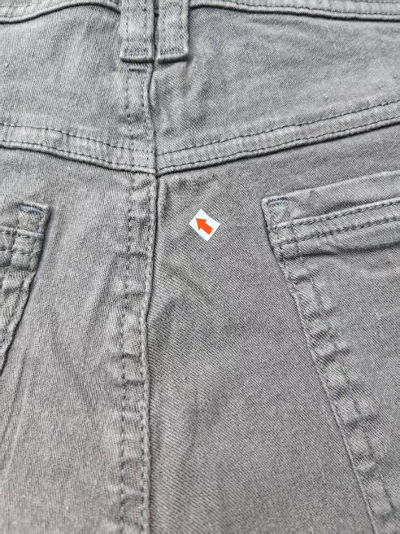

**17、斷拉架（牛仔裤）**

17.1疵點圖片

     

17.2問題原因及解決方案

| 發生階段 | 斷拉架問題類型 | 可能來源/原因 | 特征說明 | 解決方法 | 預防措施 |
| --- | --- | --- | --- | --- | --- |
| A)面料織造/原料 | 原料性斷裂/脆損 | 1. 氨綸質量差：氨綸絲本身強度不足或批次不穩定； 2. 包覆紗斷裂：氨綸被棉紗包覆時張力不均，導致部分氨綸裸露或斷裂； 3. 織造張力過大：織布機張力設定過高，直接拉斷彈性纖維； | 1.面料在未車縫前已有細微斷裂聲或肉眼可見的氨綸斷頭； 2.面料彈性回覆率差； | 退回面料供應商；若輕微，可嘗試在後整理中加固 | 1.進料檢驗：嚴格測試面料的彈性回覆率和斷裂強力； 2.源頭控制：選用高品質氨綸（如萊卡）； 3. 裁片出庫前逐片檢查並做好記錄 |
| B)車縫階段 (通用) | 針熱/針擊斷裂 | 1. 針溫過高：高速車縫時機針摩擦產生高溫（超過150°C），熔化氨綸； 2. 機針過粗/型號錯：機針太粗或不是圓頭針（如使用普通尖頭），直接切斷彈性紗線； 3. 車縫張力過大：車縫時工人過度拉伸面料，導致氨綸在縫線處斷裂 | 1.縫線處面料收縮、起皺； 2.針孔處有燒焦痕跡； 3.拉伸面料時縫線處發出「啪啪」斷裂聲 | 更換細針或專用彈力針；調整車縫張力；嚴重者需拆線重車 | 1.專用機針：使用塗層機針（減少摩擦熱）或圓頭針（不切紗）；  2.放鬆張力：車縫時避免過度拉伸面料 |
| C)車縫階段 | 機頭位置 面料斷拉架 | 1. 厚度突變：機頭位置有多層布料疊加，車縫阻力大，導致氨綸被拉斷； 2. 倒回針過密：加固倒回針時，同一位置針孔過密，切斷經緯紗 | 十字縫周圍面料變形、起拱 | 1.拆開重車，使用更強的彈性線； 2.若面料已脆斷，需換片； | 工藝優化：在厚位縫份處進行「削薄」處理； 調整針距：厚位適當調大針距，減少單位面積內的針孔密度 |
| D)車縫階段 | 側骨位置 面料斷拉架 | 1. 側骨部位多層面料疊加（面布、裡布、襯布），車縫線張力過大，強烈拉扯拉架導致斷裂； 2. 車縫機壓腳壓力過大，反復摩擦側骨面料，破壞拉架結構，導致斷裂； 3. 操作人員車縫時用力拉扯面料，使拉架超負荷拉伸，超過承受力而斷裂； 4. 車縫機送布牙磨損不均，送布不穩，導致面料局部受力過大，拉架斷裂； | 1.側縫處面料呈現波浪狀（荷葉邊）；2.面料失去彈性，變得鬆垮； 3.側骨車縫線旁出現面料斷裂、拉架外露，斷裂沿車縫線呈連續條狀分佈，部分斷裂處會出現面料起毛、纖維外露； | 更換全新側骨裁片，重新車縫整個側骨部位，確保車縫參數合理； | 1. 車縫前整理側骨多層面料，減少車縫時的拉扯，控制疊加厚度均勻； 2. 調整車縫機參數，壓腳壓力調至中低檔，選用11-14號牛仔專用機針，車縫線張力適中，避免過緊； 3. 規範操作手法，車縫時輕扶面料，保持送布平穩，避免用力拉扯；4. 定期檢查、更換磨損的送布牙，確保送布均勻，避免面料局部受力過大； |
| E)車縫階段 | 前浪位置面料斷拉架 | 1. 前浪部位面料彎曲度大，車縫時需拉伸面料，若拉伸過度，拉架超負荷斷裂； 2. 車縫線與拉架材質不匹配，車縫線拉力大於拉架承受力，車縫時直接拉斷拉架； 3. 車縫轉角時速度過快，面料擠壓變形，拉架被擠斷，且斷裂多集中於轉角處； 4. 前浪裁片未預先熨燙定型，車縫時面料受力不均，拉架局部受力過大斷裂； | 前浪車縫處、轉角處出現面料斷裂、拉架外露，斷裂多呈點狀、短條狀，轉角處斷裂更為明顯 | 1. 輕度：拆除局部車線，手動修復斷裂面料，剔除拉架殘餘，減小轉角車縫張力，更換彈力車縫線，重新車縫並倒針加固； 2. 中度（斷裂明顯、無面料變形）：拆除前浪車線，重新整理面料彎曲度，預先熨燙定型，選用與拉架匹配的彈力線，中低速車縫，重新固定； 3. 重度（大面積斷裂/面料變形）：更換全新前浪裁片，重新車縫並預留彈力餘量，確保轉角處車縫平順； | 1. 車縫前對前浪裁片進行熨燙定型，減少彎曲阻力，避免車縫時過度拉伸； 2. 選用與拉架材質匹配的彈力車縫線，控制線張力，針距設為每厘米3-4針，避免拉力過大； 3. 車縫轉角時調至中低速車縫，避免面料擠壓變形； 4. 車縫時輕扶面料，保持自然狀態，避免人為拉扯，確保受力均勻 |
| F)車縫階段 | 袋口裝飾性斷裂 | 1. 套結/打棗過緊：袋口兩端加固打棗時，線跡收縮過緊，勒斷內部氨綸； 2. 車縫線張力大：使用普通縫線且張力過大，縫線像鋸子一樣勒斷彈性紗 | 袋口兩端或後袋裝飾線周圍出現凹陷、起皺；拉伸時袋口變形； | 更換彈性縫線； 調整打棗機的密度和張力 | 1.使用彈性線：在受力點使用高彈力縫線（如芯線）； 2.優化打棗：減少打棗針 |
| G)洗水/整燙階段（輔助誘發） | 全工序部位 面料斷/拉架加劇 | 1. 洗水時溫度過高（超過60℃）、化學藥劑（漂白劑、還原劑）濃度過高，侵蝕拉架，導致拉架強度下降，後續整理時易斷裂； 2. 整燙時溫度過高（超過150℃），熨斗直接接觸面料，導致拉架熱熔斷裂；或熨斗壓力過大，擠壓拉架使其斷裂； 3. 洗水後面料未徹底烘干，拉架長時間處於潮濕狀態，發生水解反應，整燙時受熱易斷； 4. 洗水時面料相互摩擦過劇，拉架受損加劇，出現斷裂； | 1.原本輕微拉架鬆脫、隱藏性斷架的部位，在洗水、整燙後出現斷裂加劇，甚至拉架全斷； 2.斷裂處面料變形、發硬，拉架外露明顯，斷裂範圍擴大，觸摸有強烈斷裂感； 3.部分部位會出現面料起毛、撕裂，無法通過修復恢復品質，影響產品外觀和耐用性； | 1. 輕度（斷裂長度小於0.5cm）：用專用彈力修復劑均勻噴塗於斷裂處，晾乾後用彈力線縫合加固，避免再次受損； 2. 中度（斷裂明顯、未大面積變形）：拆除相關部位車線，更換局部裁片，重新車縫，並嚴格按照標準流程洗水、整燙； 3. 重度（大面積斷裂/面料報廢）：直接報廢該產品，禁止流入市場，避免影響品牌口碑； | 1. 嚴格控制洗水工藝，控制洗水溫度，化學藥劑按標準比例配製，漂白後必須徹底中和，去除殘留化學品；避免過量侵蝕拉架； 2. 整燙時溫度控制在150℃左右，必須墊布熨燙，避免高溫直壓，熨斗壓力調至適中，避免擠壓拉架； 3. 洗水後將面料徹底烘干，烘干溫度控制在80-100℃，確保無潮濕殘留，防止拉架水解； 4. 洗水時控制面料數量，避免相互摩擦過劇，減少拉架受損； |
| H)人員操作 （全過程影響） | 全工序 批量面料斷拉架 | 1. 操作人員未掌握彈力面料加工技巧，車縫時用力拉扯、整燙時高溫直壓、洗水時參數控制不當，導致批量斷裂； 2. 未按工藝標準進行檢查，將拉架斷裂、彈力不足的面料、裁片流入各工序，導致批量疵點； 3. 省略面料預縮、裁片定型、拉架檢查等關鍵步驟，導致面料拉架受力不當，批量斷裂； 4. 新員工未經專業培訓上崗，操作不規範，導致疵點頻發； | 多件產品在相同位置（前袋口、機頭、後袋、側骨、前浪）批量出現面料斷/拉架疵點，斷裂程度、形態一致，修復後易再次出現；部分產品因疵點過重無法修復，造成原材料浪費，影響生產效率和產品批次合格率； | 1. 分類修復：對輕度疵點按對應工序方法及時修復，中度疵點更換裁片重新加工，重度疵點直接報廢； 2. 現場指導：組織操作人員進行彈力面料加工專題培訓，重點演練車縫、洗水、整燙的規範手法，糾正不當操作； 3. 流程整改：補充缺失的關鍵工序，建立全流程拉架檢查機制，避免不合格面料、裁片流入下道工序； | 1. 建立詳細的彈力面料加工標準作業指導，明確各工序操作標準、拉架檢查要求和參數設置； 2. 每批次開線前製作首件樣品，經檢驗合格後方可批量生產，及時調整不合理的工藝參數； 3. 加強現場巡檢，安排專人負責各工序拉架檢查，將拉架檢查納入入廠、入工序、出成品三重檢查； 4. 定期開展員工培訓，提升操作技能，新員工經考核合格後方可上崗 |
