**18、駁線（牛仔裤）**

18.1疵點圖片

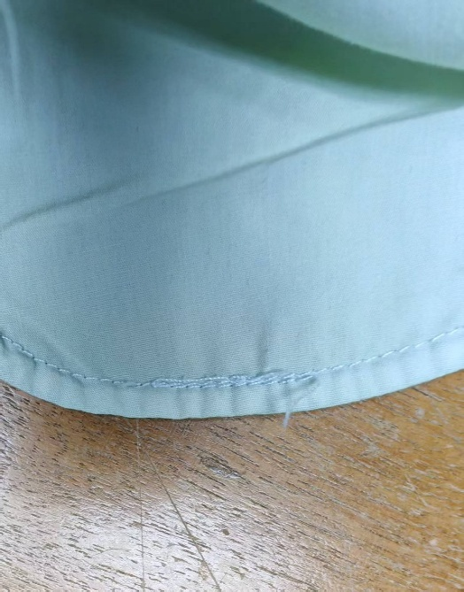 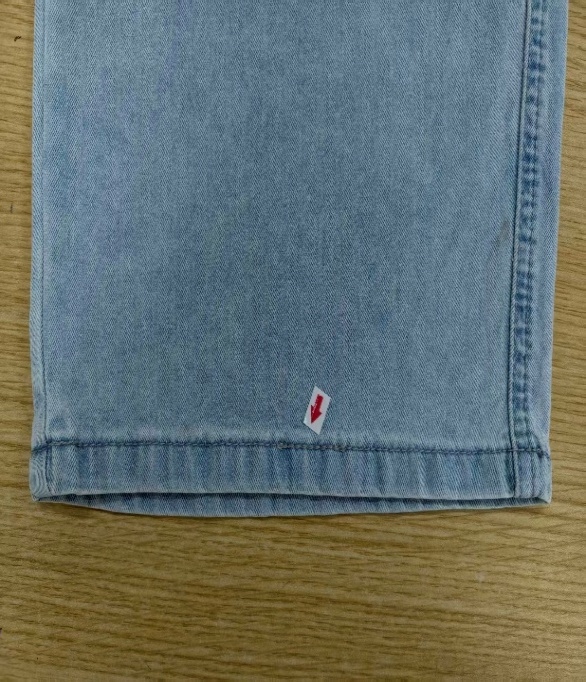 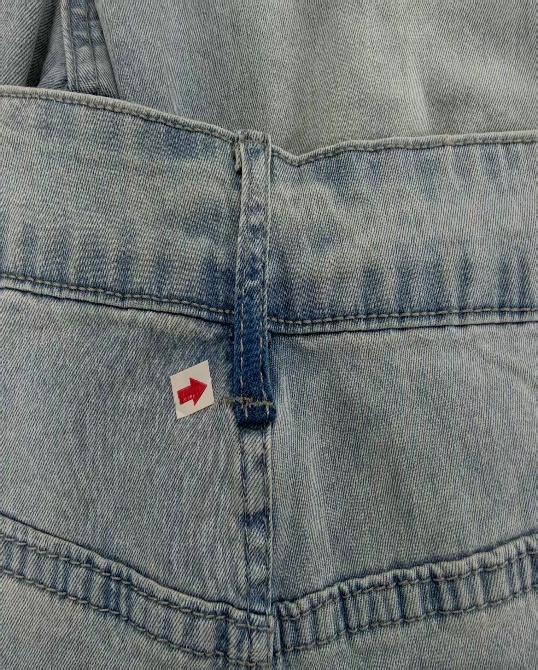 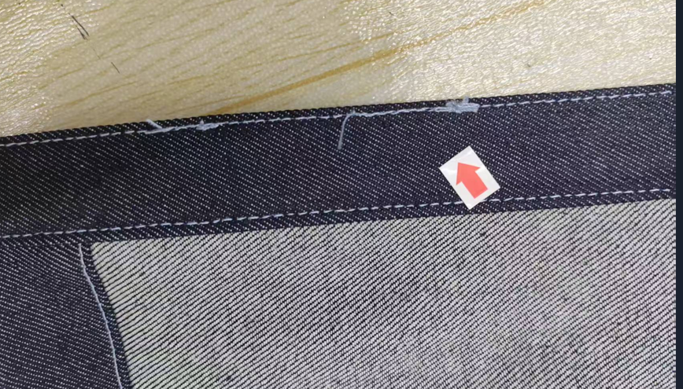 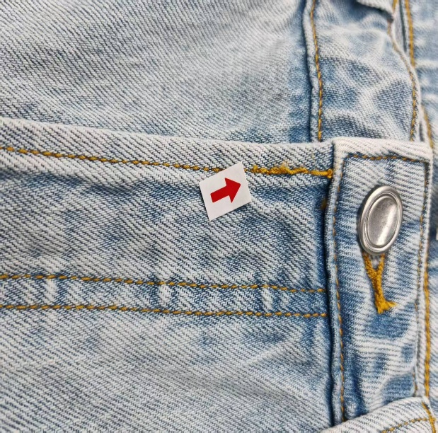 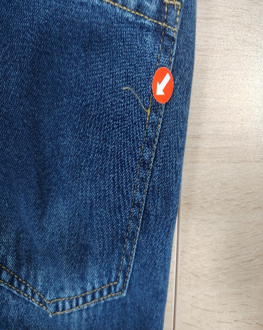 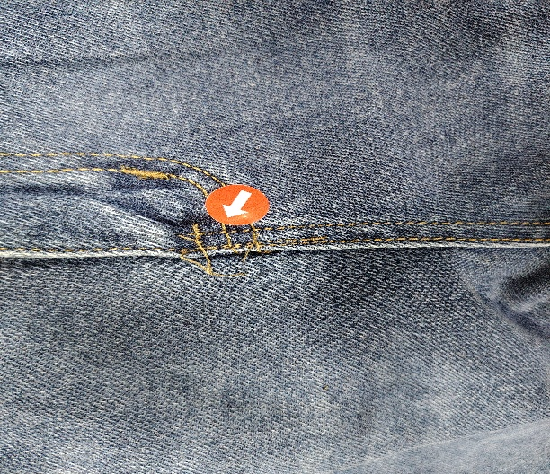 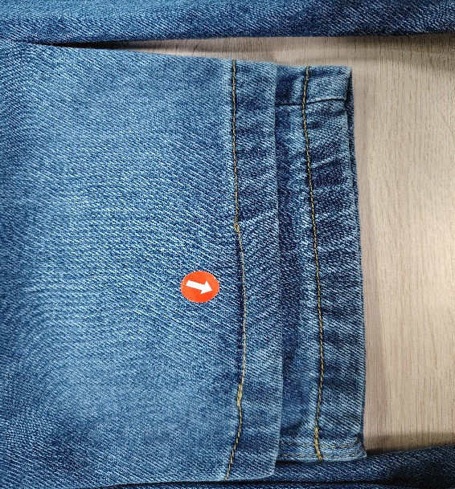 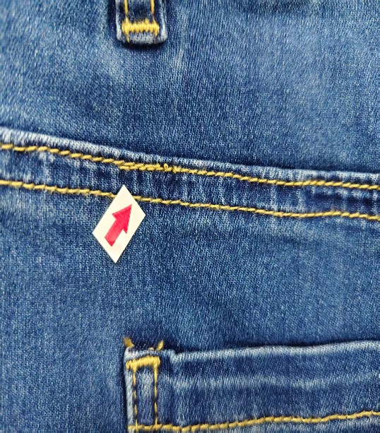 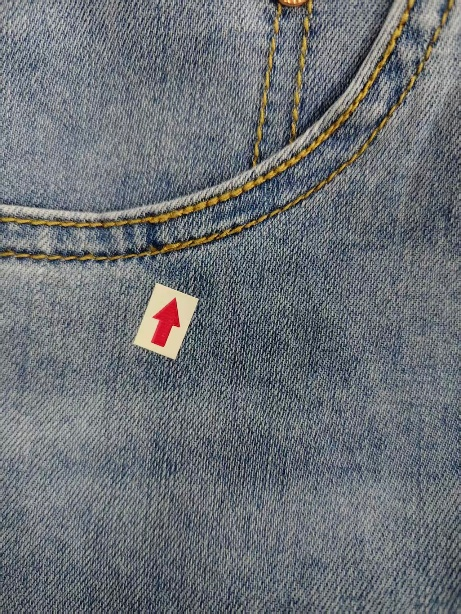 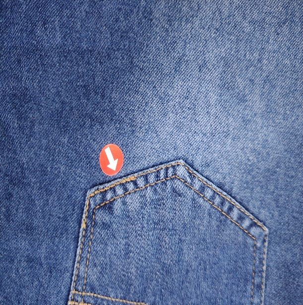

18.2問題原因及解決方案

| 發生階段 | 駁線問題類型 | 可能來源/原因 | 特征說明 | 解決方法 | 預防措施 |
| --- | --- | --- | --- | --- | --- |
| 車縫操作  (起止) | 未打回針 / 回針不足 | 1. 工人疏忽：為求速度，省略了起針和收針的倒回針動作； 2. 機器設定錯誤：自動剪線機的「打回針」設定被關閉或針數設定過少（標準應為2-3針）； 3. 操作失誤：手動倒車時未踩到位； | 1.線跡兩端線頭鬆散，輕微拉扯即散開； 2.縫口容易「崩開」或「脫線」； 3.無法承受洗水拉力 | 1.拆開重新車縫並打回針； 2.若在內部且無法重車，可用手針加固（不建議） | 1.設備設定：採用電腦衣車開啟自動回針功能，設定起針3針、收針3針； 2.巡檢：質檢員抽查半成品，發現無回針或回針不牢立即糾正； |
| B)車縫操作  (中途) | 斷線接駁不良 (接線疙瘩 | 1. 接線手法錯誤：斷線後，面線與底线未打結或打結過大； 2. 重疊長度不足：接線時未在原線跡上重疊車縫足夠長度（標準需重疊1-2英寸）； 3. 線頭未修剪：接線後的線尾留得太長（超過0.5英寸）且未修剪； | 1.接駁處有明顯的「線團」或「大疙瘩」，觸感刺手； 2.接駁處線跡鬆弛或過緊； 3.洗水後線頭散開； | 1.拆開接駁處，重新修剪線頭並正確接線； 2.嚴重者需拆線重車； | 1.規範手法：培訓工人採用「打結後埋入縫份」或「重疊車縫」法； 2.修剪標準：規定接線後線頭長度不得超過1cm； 3.機加強衣車設備的檢查，禁止工人私自調校衣車 |
| C)車縫操作  (連續) | 駁線不順 (雙軌/斷點) | 1. 接線位置偏差：重新接線時，針孔未落在原線跡孔位上，導致「雙軌」； 2. 張力未恢復：斷線重接後，未先試縫調整張力，導致接駁處浮線或緊線； 3. 針距不一致：接線時車速忽快忽慢，導致針距疏密不一； | 1.明線接駁處出現分叉（兩條線）； 2.線條粗細明顯不同； 3.影響外觀流暢度； | 拆開重車，確保新線跡與舊線跡完美重合； | 1.對位車縫：接線時使用「針位記憶」功能或手動轉輪對準針孔； 2.試縫：斷線重接後，必須在廢布上試縫確認張力； 3.機加強衣車設備的檢查，禁止工人私自調校衣車 |
| D)特定部位  (受力點) | 套結/打棗接線不良 | 1. 位置偏移：加固套結未完全覆蓋原縫線端點； 2. 密度不足：套結針數過少，未能鎖住線頭； 3. 跳針：套結機針頭磨損，導致加固點本身跳針 | 袋角、褲耳、鈕扣位容易撕裂；加固結看起來歪斜或鬆散； | 1.在原位重新打套結（需小心不要打歪）； 2.若面料已受損需換片； | 1.模具檢查：定期檢查套結打棗機模板是否磨損； 2.對位檢查：確保套結/打棗完全覆蓋縫線起止點； 3.機加強衣車設備的檢查，禁止工人私自調校衣車； |
| 特定部位  (長縫) | 長線跡中間接線 (如側骨) | 1. 隨意停車：車縫長距離（如側骨、浪位）時因換線軸隨意停車接線； 2. 未在原位接：接線點未選在隱蔽處（如口袋底），而是在明顯處接線 | 1.在明顯的明線中間出現接駁痕跡； 2.影響整體美感; | 盡量整條線拆掉重車，確保頭尾同針孔車縫駁線，且針數足夠牢固 | 1.備線充足：開工前檢查底面和線量，避免中途缺線； 2.隱蔽接線：若必須接線，應在縫份內部或轉角處進行 |
| F)洗水階段 | 洗水爆口 (接線失效) | 1. 線材質差：使用了不耐氯漂或強度不足的縫線； 2. 接線不牢：上述的「未打回針」或「接線疙瘩」在洗水機強力攪拌下散開； | 1.洗水後褲子接縫處張開，露出內部；2.線跡斷裂 | 無法修復，屬於嚴重品質事故； | 1.選用高強線：牛仔褲必須使用高強度滌綸線或邦迪線； 2.嚴格測試：對縫線進行色牢度和強力測試； |
| G)後整階段 | 駁線色差明顯 | 1. 同工序使用不同批次線 2. 褪色線與不褪色線混用 | 駁線與原線色澤不一致，陽光下反差大 | 更換同色號車線重駁 | 車間線材分色標識，同一款式統一線材批次，上線前核對色號 |
