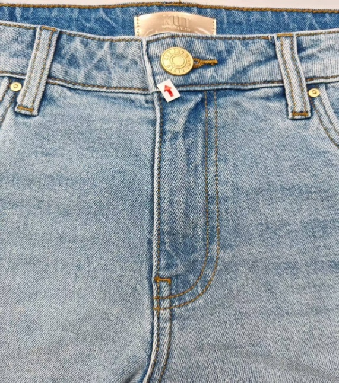
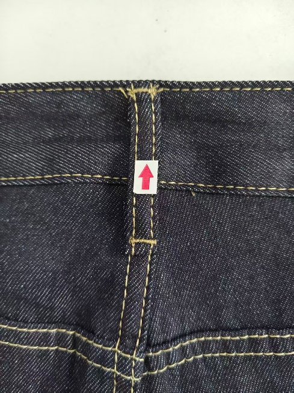
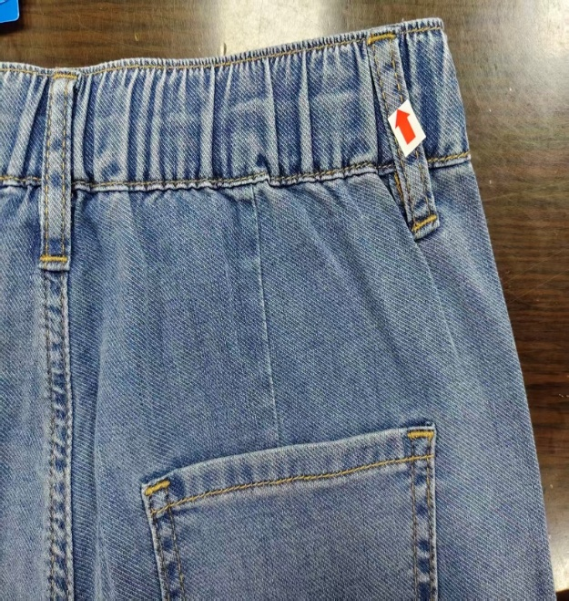
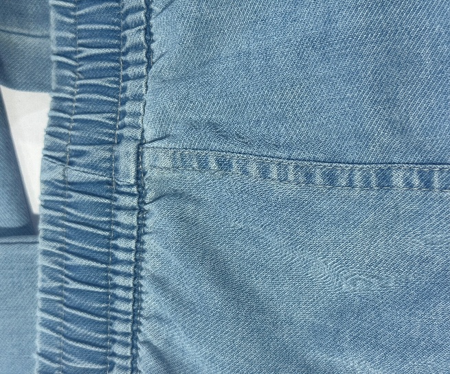
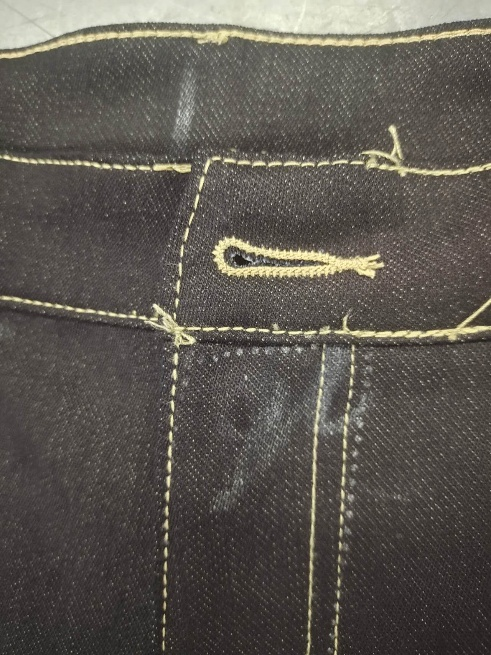
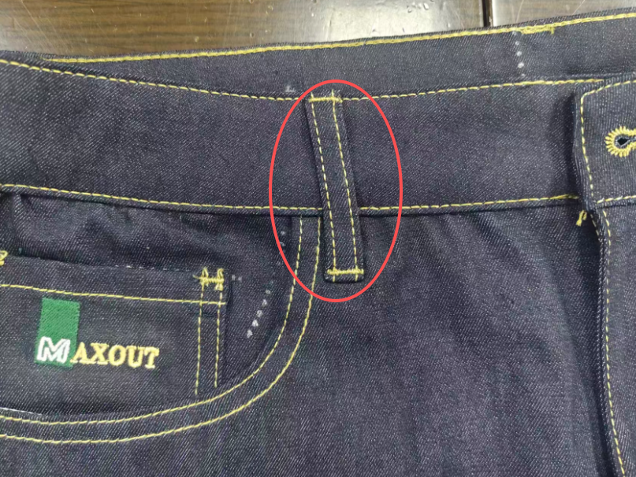

**20、傾斜（牛仔裤）**

20.1疵點圖片

     

20.2問題原因及解決方案

| 發生階段 | 傾斜問題類型 | 可能來源/原因 | 特征說明 | 解決方法 | 預防措施 |
| --- | --- | --- | --- | --- | --- |
| A)裁剪 / 裁床階段 | 裁片歪斜引發後續傾斜 | 1. 拉布歪斜、布紋不順直 2. 刀模 / 電腦裁割定位偏差 3. 面料彈性不均，收縮不一致 | 耳仔、褲頭、後袋等裁片本身不方正，組合後自然傾斜 | 更換方正裁片，禁止使用變形裁片 | 1. 拉布時保持布紋順直，避免張力不均 2. 校驗刀模與裁床精度 3. 彈性面料提前做縮水測試 |
| B)車縫階段 （耳仔車縫） | 耳仔傾斜 | 1. 打棗時耳仔未 2. 壓腳壓力不均、牙齒送布異常 3. 定位線標記歪斜、手工定位不准 4. 耳仔裁剪本身歪斜 | 耳仔整體與褲身垂直線不平行，一邊高一邊低，視覺明顯歪扭 | 1. 拆線重車，重新對位定位線 2. 調整壓腳壓力與送布牙速度 | 1. 車縫前確認耳仔裁剪方正 2. 統一畫定位基準線，嚴格按線車縫 3. 定期校驗車縫機送布系統 |
| C)車縫階段 （褲頭封嘴） | 褲頭封嘴傾斜 | 1. 褲頭貼合時左右鬆緊不一致 2. 封嘴車縫起點與終點定位偏差 3. 車縫轉角時速度過快、走位偏移 4. 褲頭裁片本身不方正 | 褲頭封口處車線歪斜，左右不對稱，褲頭整體翹斜不平 | 拆除封嘴線，重新對齊褲頭邊緣車縫 | 1. 褲頭組合前先對齊剪口、固定定位 2. 轉角處放慢車速，保持布片平整 3. 檢查裁片是否方正，不合格不流入車縫 |
| D)車縫階段 （機頭後中） | 機頭後中傾斜 | 1. 後中縫車縫時上下層布牽引不均 2. 後片裁片對位偏差、縫份不均 3. 鎖邊 / 合縫時走位累積誤差 4. 後浪定位點不對稱 | 後中縫車線偏斜，左右後片不對稱，褲子穿上後後腰歪斜 | 拆縫重新合後中縫，校正對位點 | 1. 後中縫加打定位剪口，上下層同步推送 2. 控制縫份寬度一致，避免拉扯變形 3. 合縫後即時檢查對稱性 |
| E)車縫階段 （後袋車縫） | 後袋傾斜 | 1. 後袋定位粉線 / 模板定位歪斜 2. 車縫時袋布移位、未固定牢固 3. 雙針車軌道偏移、車頭精度不足 4. 後袋裁片本身不規則 | 後袋與褲身基準線不平行，左右袋高低 / 角度不一致，視覺失衡 | 拆除袋線，按定位模板重新車縫 | 1. 使用定位模板 / 夾具固定後袋位置2. 車縫前先用假線定位，防止走位3. 定期校驗雙針車、平車精度4. 後袋裁片先檢查方正度 |
| F)車縫階段 （前浪/後浪車縫） | 前浪 / 後浪傾斜 | 1. 浪位定位點不對稱 2. 合縫時縫份不均 3. 裁片弧度不對 | 前浪 / 後中線偏斜，左右不對稱，腰頭不平 | 重新合浪，校正定位 | 浪位加定位點；車縫時保持布片平整 |
| G)車縫階段 （腳口車縫） | 褲腳腳口傾斜 | 1. 褲管長短不一 2. 車腳口時拉伸不均 3. 側縫已扭曲 | 腳口線不水平，一邊高邊低 | 重新車腳口，修正長短 | 車腳口前對齊褲管底邊；控制縫份一致 |
| H)整燙/成型階段 | 整燙導致的傾斜變形 | 1. 整燙時拉伸力度不均 2. 燙台模具不標準、未對齊基準 3. 蒸汽壓力不均，局部收縮不一致 | 車縫本無傾斜，整燙後耳仔、褲頭、袋位出現歪斜 | 重新整燙定型，校正拉伸力度 | 1. 按標準模具整燙，統一拉伸力度 2. 控制蒸汽與溫度，避免局部過度收縮 3. 整燙後逐件檢查對稱性 |
