**22、車線不良（牛仔裤）**

22.1疵點圖片

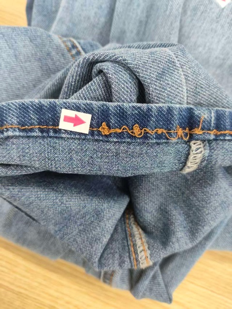 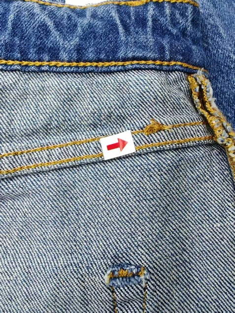 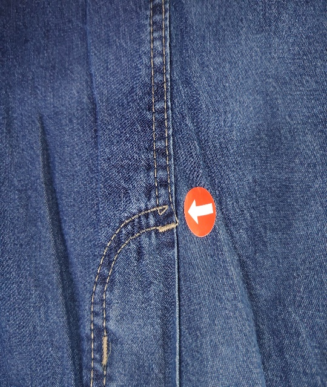 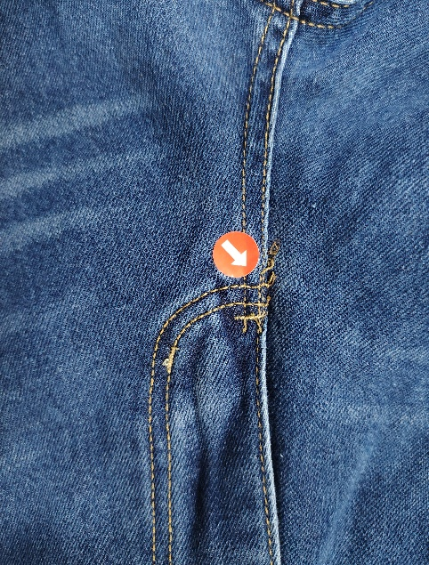 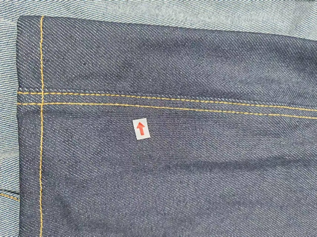 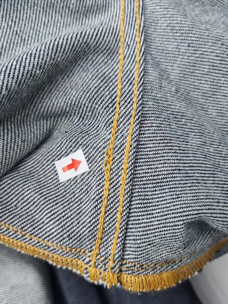 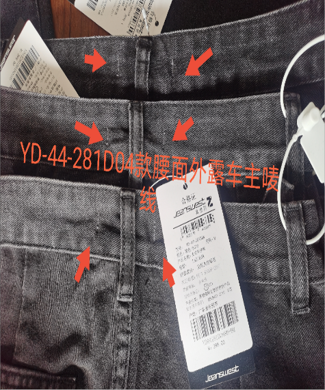 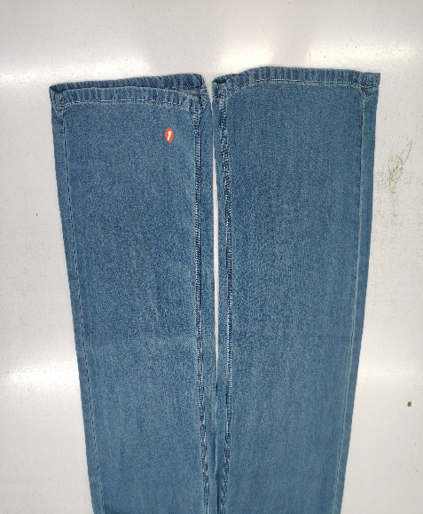 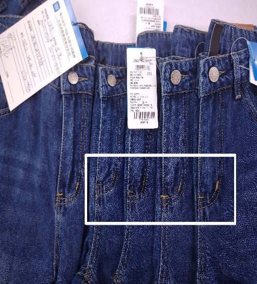 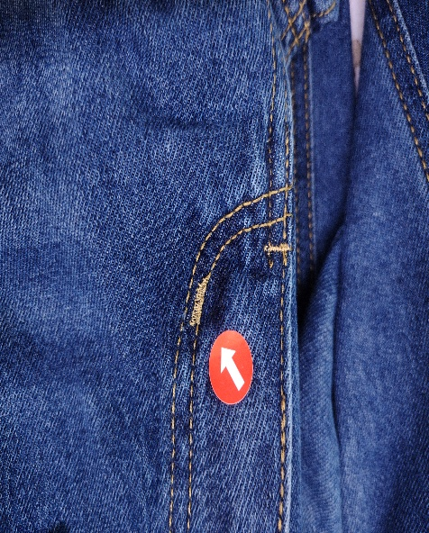 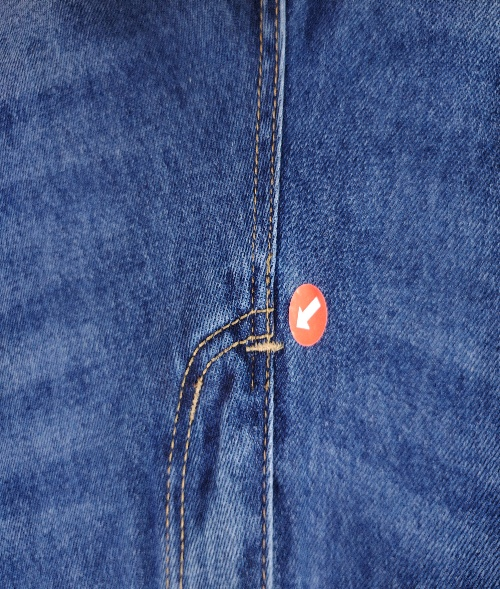

22.2問題原因及解決方案

| 發生階段 | 車線不良問題類型 | 可能來源/原因 | 特征說明 | 解決方法 | 預防措施 |
| --- | --- | --- | --- | --- | --- |
| A)車縫階段 | 底線起線團 | 1. 梭殼鬆緊度不當，底線過松； 2. 梭芯磨損、線質差（起毛、斷線）； 3. 車針與梭床配合間隙過大； | 褲身拼合處（側縫、後浪、機頭等）底線堆積，形成線團、線結，觸感粗糙，易勾掛，影響外觀與牢固度 | 1. 拆去起線團的車線，重新穿線、調整梭殼鬆緊； 2. 更換磨損梭芯和合格車線；3. 校正車針與梭床間隙，調整送布與車速匹配度，重新車縫 | 1. 規範穿線流程，車縫前拉緊底線線頭； 2. 定期檢查梭芯、梭殼磨損情況，及時更換； 3. 選用高品質車線，避免使用起毛、易斷線材； 4. 機修每日校驗車縫機梭床與車針配合精度，禁止工人隨意自己調節； |
| B)車縫階段 | 車線雙軌/打棗粗細 | 1. 車縫車針位偏移、針距不一致； 2. 車縫時布片移位、拉伸不均； 3. 壓腳壓力不均，送布不順； 4.打棗車針數未按要求固定 | 1. 雙針車針位偏移、針距不一致； 2. 車縫時布片移位、拉伸不均； 3. 壓腳壓力不均，送布不順； 4.外觀見棗粗細 | 1. 雙針車針位偏移、針距不一致； 2. 車縫時布片移位、拉伸不均； 3. 壓腳壓力不均，送布不順； 4.按制單要求調節打棗針數 | 1. 每日校驗雙針車針位、針距，確保運行精度； 2. 車縫前固定布片，避免移位，控制拉伸力度； 3.機修需開始車縫或打棗時調節好衣車，並過程巡查機車的穩定性 |
| C)車縫階段 | 線步起珠 | 1. 車線質量差，纖維鬆散、易起毛； 2. 底面線張力調節不匹配，出現面線松底線緊或者面線緊底線鬆 | 褲身拼合車線表面起球，形成小顆粒狀線珠，觸感粗糙，外觀雜亂，長期摩擦易斷線 | 1. 拆去起珠車線，更換高品質、耐磨車線； 2. 調慢車速，調整線張力至合適程度，重新車縫 | 1. 選用耐磨、不易起毛的車線，入廠前檢驗線質； 2. 根據牛仔面料厚度，選用合適粗細的車針； 3. 控制車速，避免過快導致線料磨損； 4. 調節線張力，確底面線張力匹配 5. 機修每日校驗車縫機梭床與車針配合精度，禁止工人隨意自己調節； |
| D)車縫階段 | 車線/打棗落坑 | 1. 車縫時布片重疊處未拉平，厚薄不均；2. 壓腳壓力過大，將布片壓陷； 3. 送布牙高低不當，推送時導致布片局部凹陷； 4. 車縫轉角、接頭處未放鬆布片，拉伸過度 5.打棗擺位不正 | 褲身拼合處（尤其是接頭、轉角、厚料重疊處）車線陷入布面，形成凹陷痕跡，線跡不平整，影響外觀， | 1. 拆去落坑處車線，將布片拉平、整理平整，避免重疊不均；2. 調整壓腳壓力和送布牙高度，避免壓陷布片； 3. 轉角、接頭處放慢車速，放鬆布片，重新車縫 | 1. 車縫前將布片拉平、鋪整，確保重疊處厚薄均勻； 2. 根據面料厚度調整壓腳壓力和送布牙高度； 3. 轉角、接頭處規範操作，放慢車速，避免拉伸過度； 4. 加強工人車縫技能培訓 |
| E)車縫階段 | 車線浮線 | 1. 上下線張力調節不當（面線過松或底線過松）； 2. 車針與車線規格不匹配； 3. 壓腳壓力不足，送布不穩，線跡無法貼合布面； 4. 梭床、線軸運行不順暢 | 褲身拼合處車線（面線或底線）未貼合布面，呈浮起狀態，用手輕拉可移動，線跡鬆散，易脫線，外觀不整潔 | 1. 拆去浮線，調整上下線張力，確保線跡貼合布面； 2. 更換與車針匹配的車線規格； 3. 調整壓腳壓力，檢查梭床、線軸運行狀態，排除卡線問題，重新車縫； | 1. 車縫前調試車線張力，確保上下線配合合理； 2. 根據車針規格選用對應車線，避免不匹配； 3. 定期檢查壓腳壓力，及時調整； 4. 每日保養梭床、線軸，確保運行順暢 5. 機修每日校驗車縫機梭床與車針配合精度，禁止工人隨意自己調節； |
| F)車縫階段 | 車線歪斜/彎曲 | 1. 車工操作不規範，車線未沿定位線車縫； 2. 送布不均，布片移位； 3. 壓腳壓力不均，導致布片跑偏； | 褲身拼合車線未沿基準線車縫，出現歪斜、彎曲，左右不對稱（如側縫、後浪），影響褲身版型和外觀 | 1. 拆去歪斜車線，重新畫定位基準線； 2. 調整壓腳壓力和送布系統，確保送布均勻； 3. 校正車頭運行軌道，按定位線放慢車速，重新車縫； | 1. 規範車工操作，要求按線車縫； 2. 定期校驗車頭運行軌道，調整送布和壓腳壓力； 3. 車縫時保持布片平整，避免移位 |
| G)洗水工序 | 洗水後車線收縮/變形 | 1. 車線縮水率與面料不匹配，洗水後收縮不均； 2. 車線質量差，耐洗性不足； 3. 洗水溫度過高、時間過長，導致車線收縮變形； 4. 洗水時車線摩擦過度； | 車縫時車線平整，洗水後出現車線收縮、皺曲，線跡變形，甚至帶動褲身拼合處輕微歪斜，影響外觀 | 1. 輕度變形：重新整燙定型，拉平車線； 2. 重度收縮/變形：拆去變形車線，更換與面料縮水率匹配的耐洗車線，重新車縫； | 1. 選用與牛仔面料縮水率匹配的車線，入廠前做縮水測試； 2. 選用耐洗性強的車線； 3. 控制洗水溫度和時間，避免過度洗滌； 4. 洗水時減少車線部位摩擦 |
