**5、洗水痕（牛仔裤）**

5.1疵點圖片

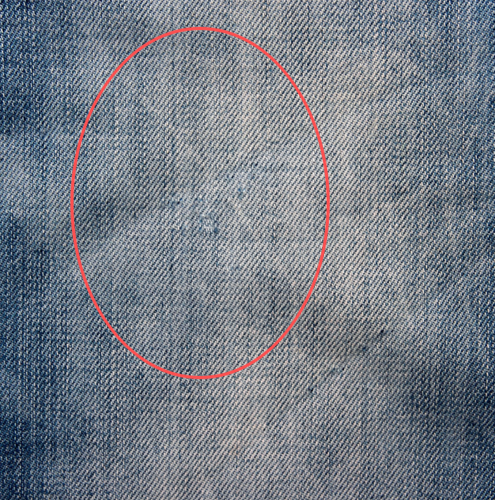 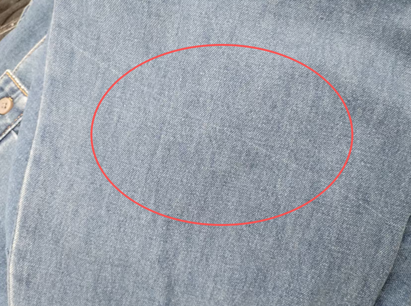 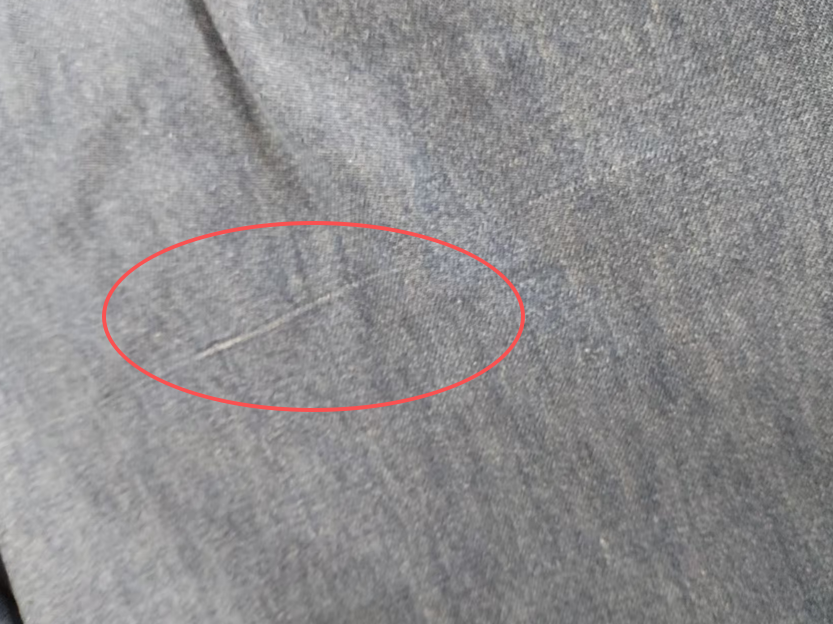 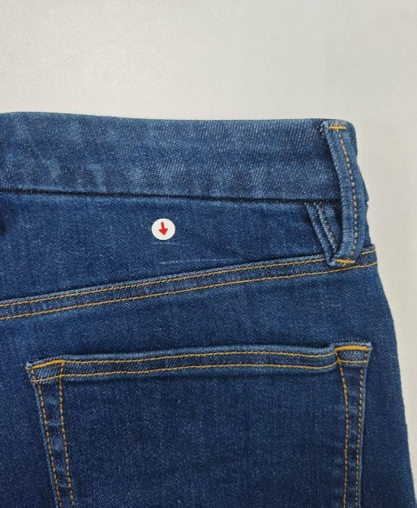 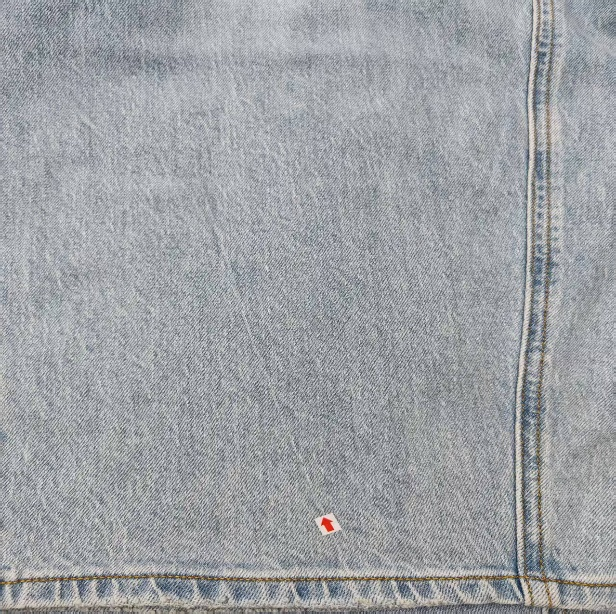 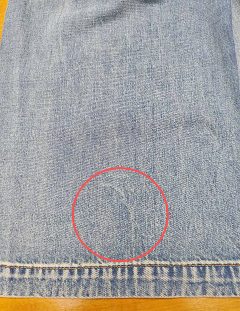 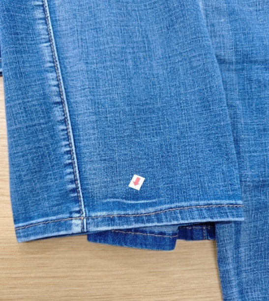 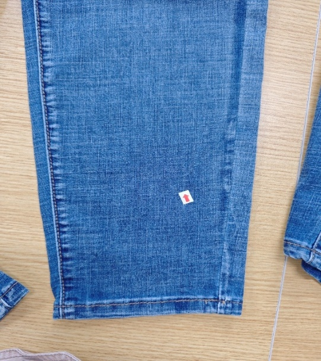 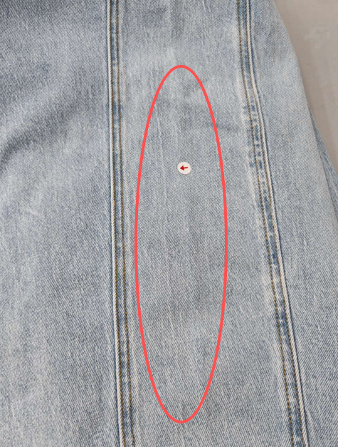 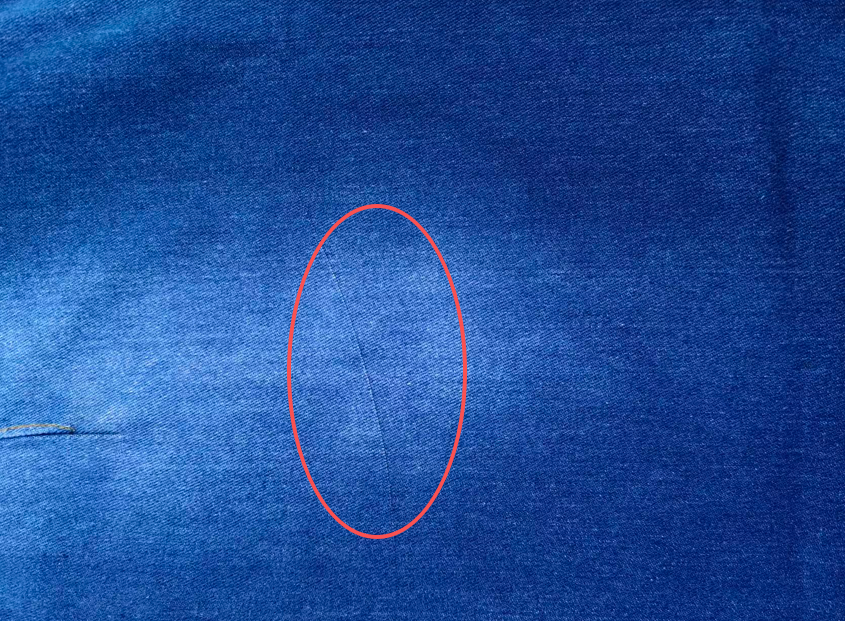 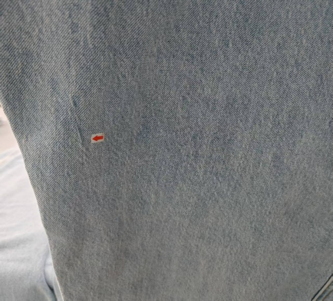 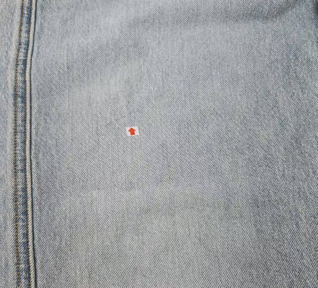 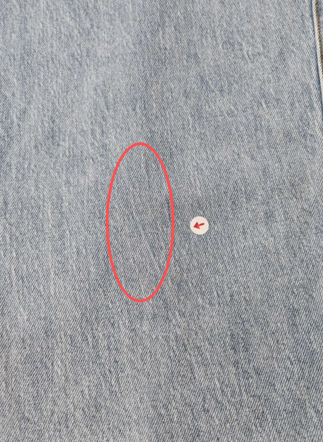 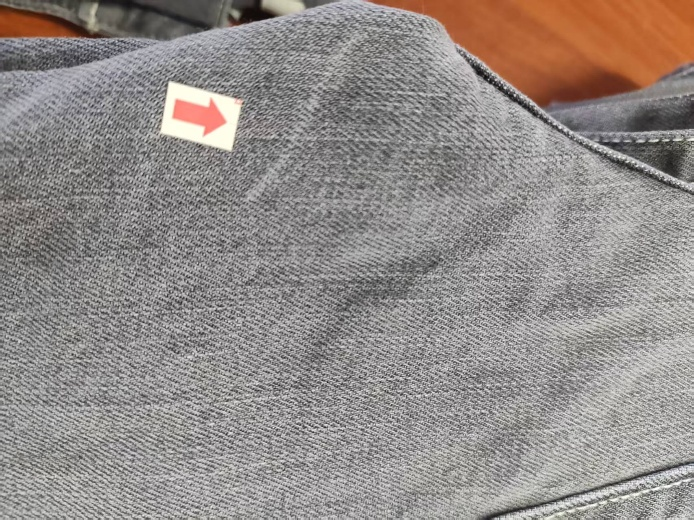 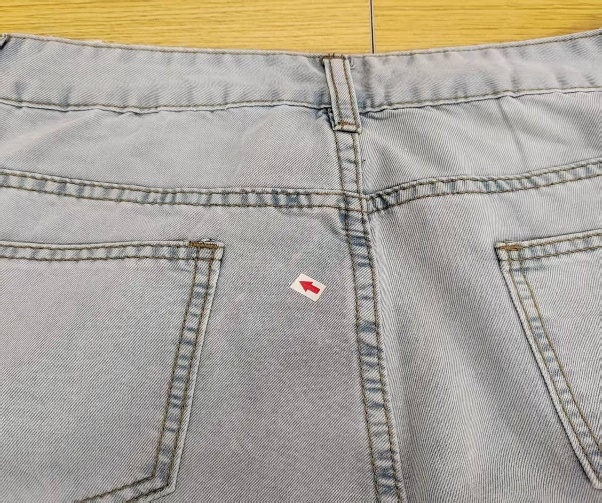 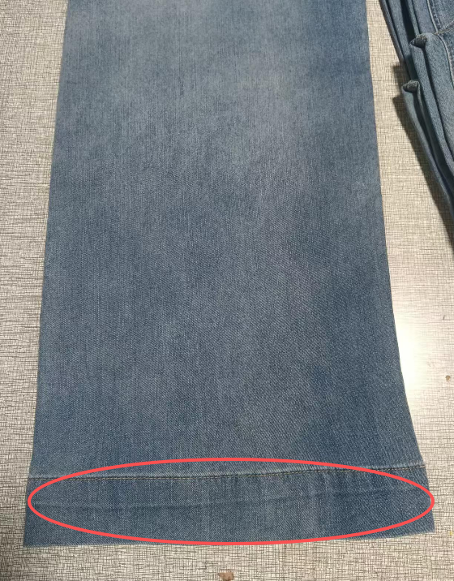 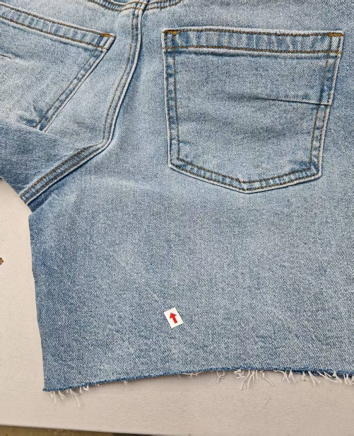 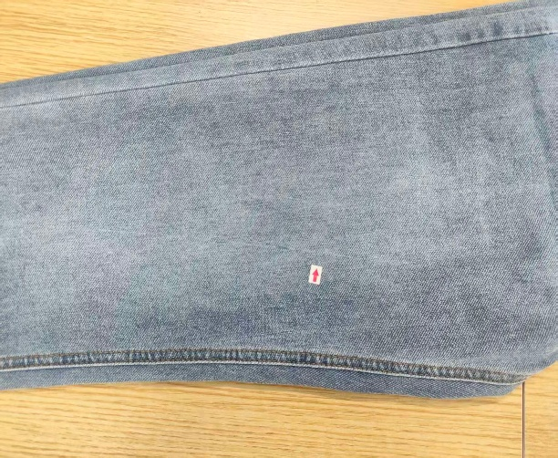

5.2問題原因及解決方案

| 發生階段 | 洗水痕問題類型 | 可能來源/原因 | 特征說明 | 解決方法 | 預防措施 |
| --- | --- | --- | --- | --- | --- |
| A)洗水階段 | 不均洗水痕 （條狀/塊狀痕） | 1. 洗水機內布料裝載過多，翻動不均，局部受洗不充分； 2. 洗水助劑（如漂白劑、石洗劑）添加不均，局部濃度過高； 3. 洗水時水溫、轉速波動，導致受洗強度不一致； 4. 布料在洗水機內纏繞，局部無法接觸洗水劑； | 褲身出現明顯的條狀、塊狀洗水痕，痕跡處顏色偏淺或偏深，與周圍底色分界清晰，分佈不規則，多出現在褲腿、腰頭等部位，洗水後痕跡固定不消失 | 1. 輕微不均痕：重新進行均洗，調整洗水參數，均勻添加助劑，確保布料翻動充分； 2. 嚴重痕跡：拆開重洗，必要時加入調色助劑，彌補色差； 3. 專業人士對洗水痕進行化妝，無法修復的，按次品處理 | 1. 嚴格控制洗水機裝載量，不超過機器容量的70%，確保布料翻動充分均勻； 2. 洗水助劑按比例稀釋後，均勻噴灑或加入，避免局部濃度過高； 3. 洗水過程中穩定水溫、轉速，定期檢查設備運行狀態； 4. 洗水時加入防纏繞劑，避免布料纏繞 |
| B)洗水階段 | 石洗/砂洗不均洗水痕（局部磨白痕） | 1. 石洗時石頭大小不均、數量不足，局部磨損過度或不足； 2. 砂洗時砂粒噴灑不均，局部砂洗強度過大； 3. 布料與石頭、砂粒接觸不均，纏繞部位磨損集中； 4. 洗水時間把控不當，局部受磨時間過長 | 褲身局部出現過度磨白痕、砂痕，與周圍顏色差異明顯，磨白處布料纖維受損，觸摸粗糙，部分區域有細小毛邊，痕跡無規則，多集中在褲膝、褲脚等易磨部位 | 1. 輕微磨白不均：用補色助劑局部補色，再進行輕洗定型； 2. 嚴重磨白痕：局部修補或報廢，無法修復的按次品處理； 3. 砂痕過重：用柔軟劑處理，減輕粗糙感，再進行均洗； | 1. 石洗時選用大小均勻的石頭，按比例搭配數量，確保磨損均勻； 2. 砂洗時調整砂粒噴灑壓力和範圍，確保噴灑均勻； 3. 洗水過程中定期檢查布料磨損情況，及時調整洗水時間和轉速； 4. 避免布料與石頭、砂粒長時間纏繞 5.對於炒雪花工藝的要注意石頭與化學試劑的均勻攪拌，並控制褲子入機的件數； |
| C)洗水階段 | 化學洗水痕 （色斑/腐蝕痕） | 1. 漂白劑、脫色劑等化學助劑濃度過高，腐蝕布料纖維； 2. 化學助劑停留時間過長，局部掉色過度； 3. 助劑混合使用不當，發生反應，導致色斑； 4. 洗水後中和不徹底，殘留助劑持續作用； | 褲身出現不規則的色斑、泛白痕，腐蝕痕處布料發硬、發脆，嚴重時出現細小破洞，色斑顏色多為黃色、白色，邊緣不清晰，無法通過清洗去除 | 1. 輕微色斑：用中和劑處理，再進行輕洗，必要時局部補色；2. 腐蝕痕：輕微的用柔軟劑修復，嚴重的無法修復，報廢處理； 3. 殘留助劑導致的痕跡：重新用清水反復清洗，確保中和徹底； | 1. 嚴格按標準控制化學助劑濃度，稀釋後使用，避免濃度過高； 2. 控制助劑停留時間，到時立即進行中和、清洗； 3. 不同類型的化學助劑分開使用，避免混合反應； 4. 洗水後進行多次清水沖洗，確保助劑無殘留 |
| D)洗水階段 | 水漬痕 （乾燥後水印） | 1. 洗水後脫水不徹底，布料帶水不均，乾燥時水分蒸發不一致； 2. 乾燥時布料堆積，局部通風不暢，水分無法及時蒸發； 3. 乾燥溫度過高、過快，局部水分驟然蒸發，留下水痕； 4. 洗水後未及時乾燥，布料受潮發霉，留下潮痕 | 乾燥後褲身出現明顯的水漬印、潮痕，呈不規則的斑點或條狀，水痕處顏色比周圍略深，觸摸無濕潤感，無法通過熨燙消除，嚴重時伴有霉斑 | 1. 輕微水漬痕：重新噴霧濕潤，均勻乾燥，確保水分蒸發一致； 2. 潮痕、霉斑：用中性洗滌劑清洗，再進行徹底乾燥，必要時用除霉劑處理； 3. 嚴重水痕無法修復的，重新洗水、脫水、乾燥 | 1. 洗水後確保脫水徹底，脫水時間、轉速符合標準，避免布料帶水不均； 2. 乾燥時將布料均勻鋪放或懸掛，確保通風暢通，避免堆積； 3. 控制乾燥溫度（60-80℃），均勻升溫，避免驟冷驟熱； 4. 洗水後及時送入乾燥設備，避免布料長時間受潮 |
