**6、布次（牛仔裤）**

6.1疵點圖片

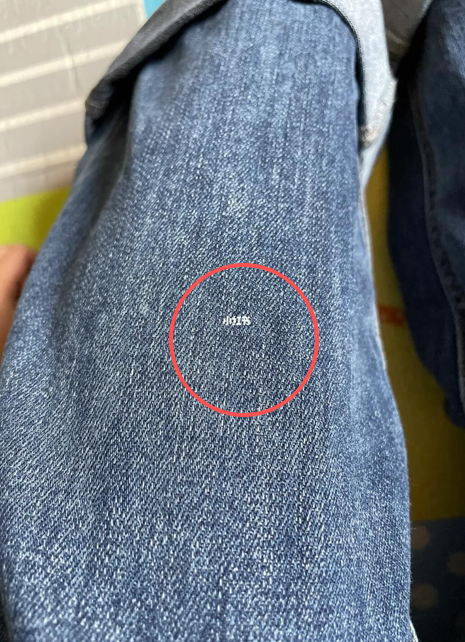 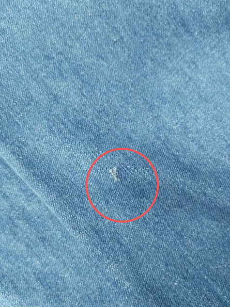 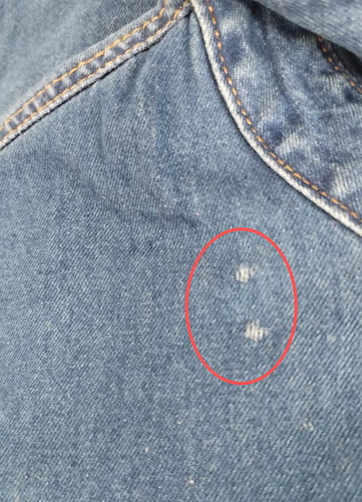 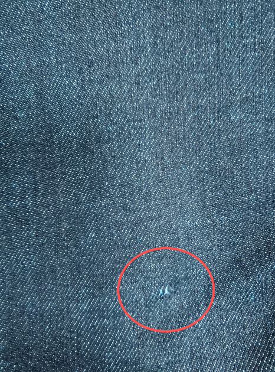 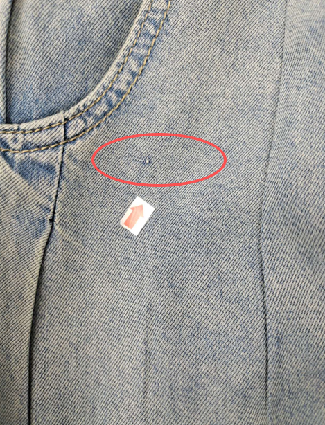 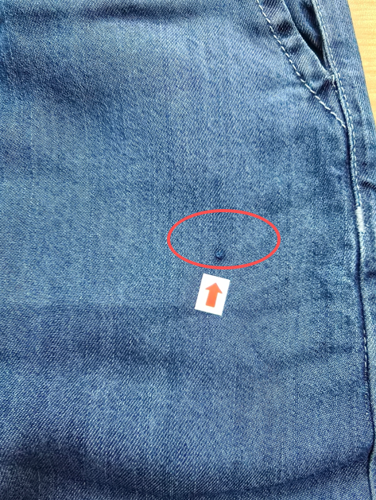 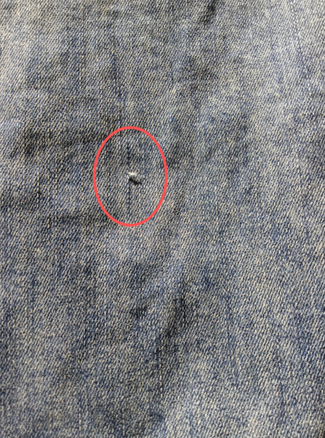 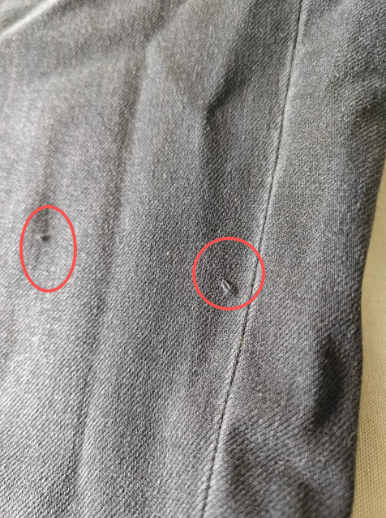 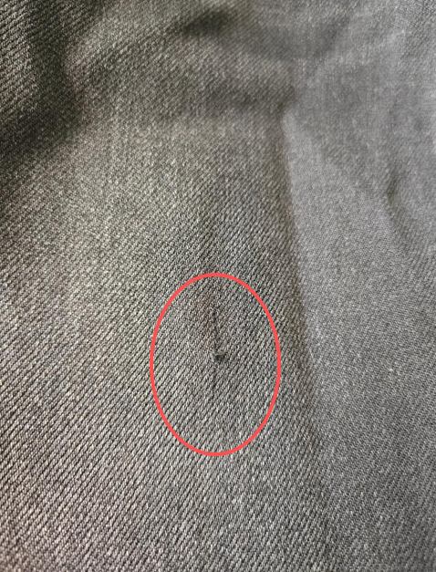 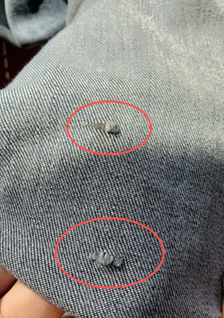 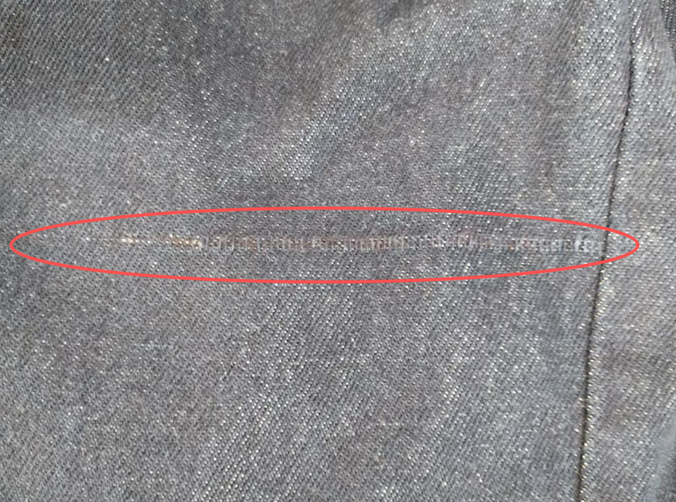 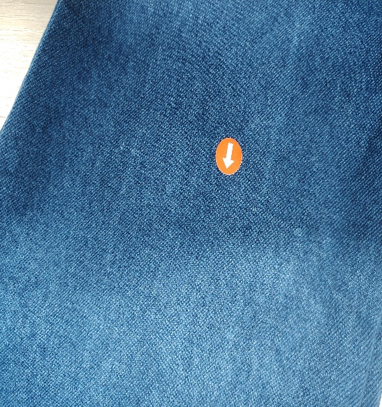 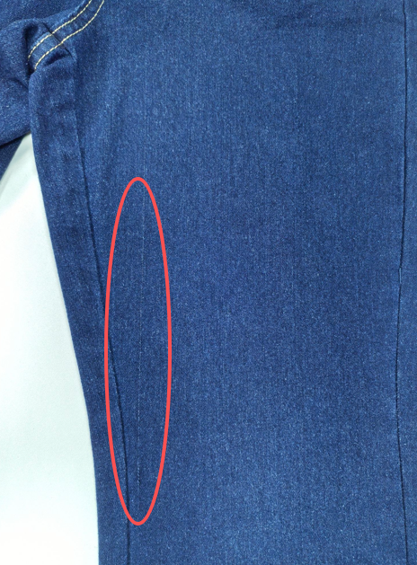 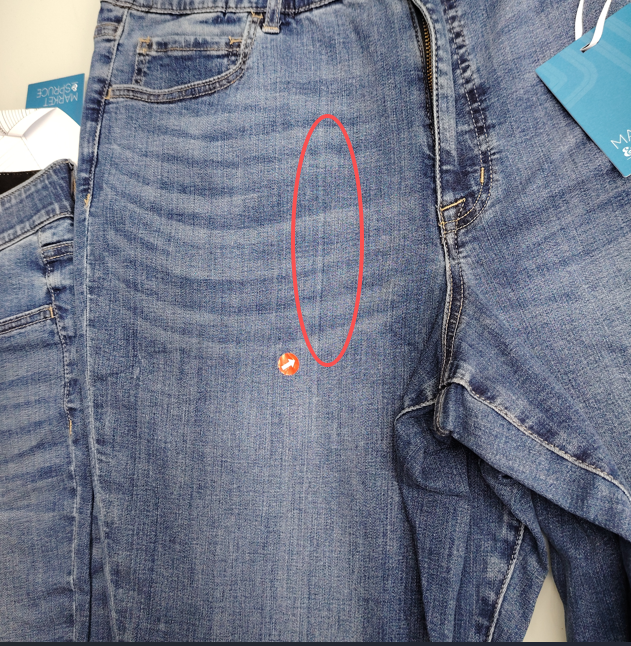 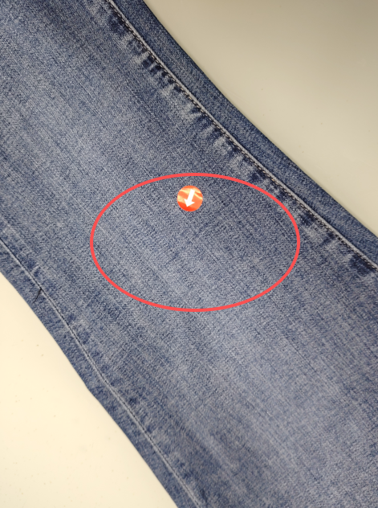 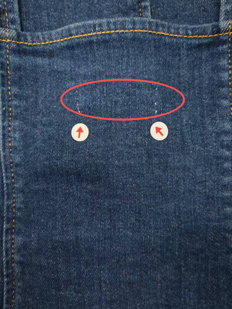 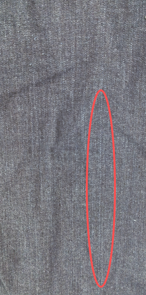 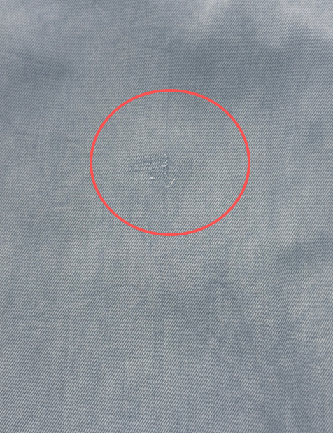 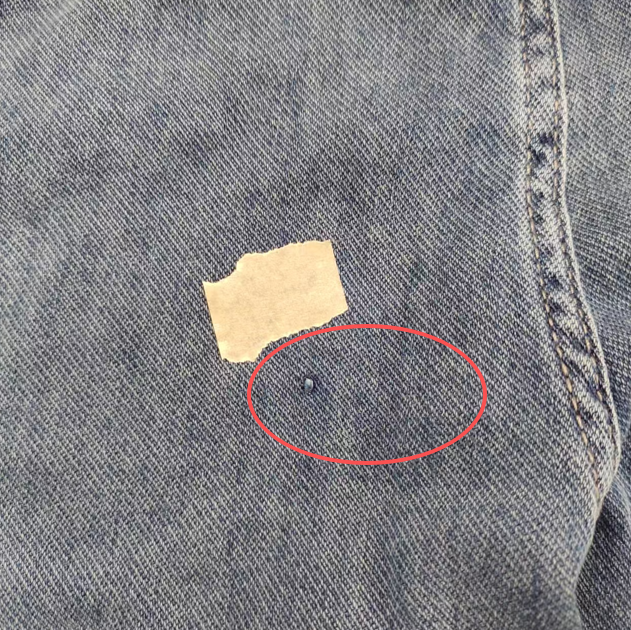 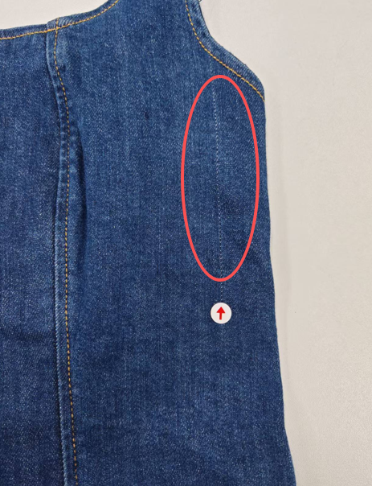 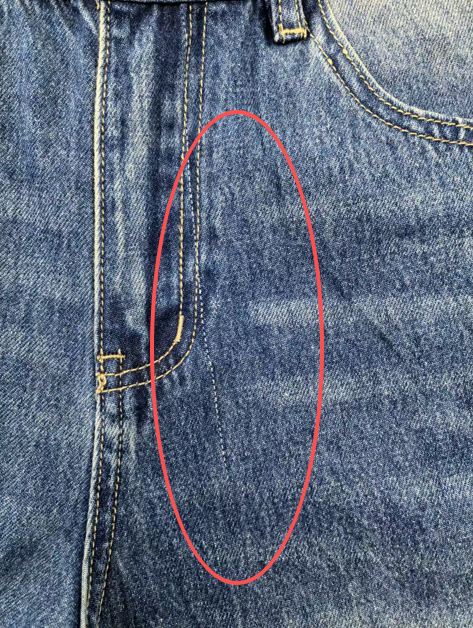 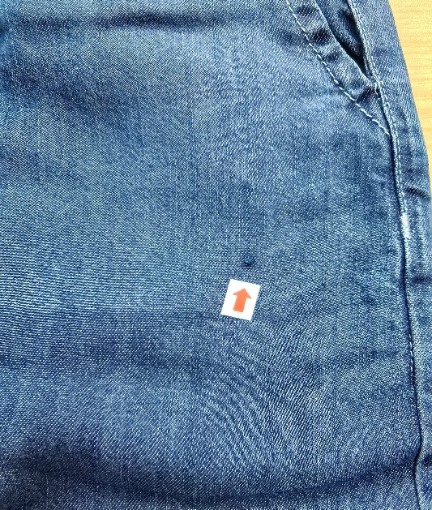 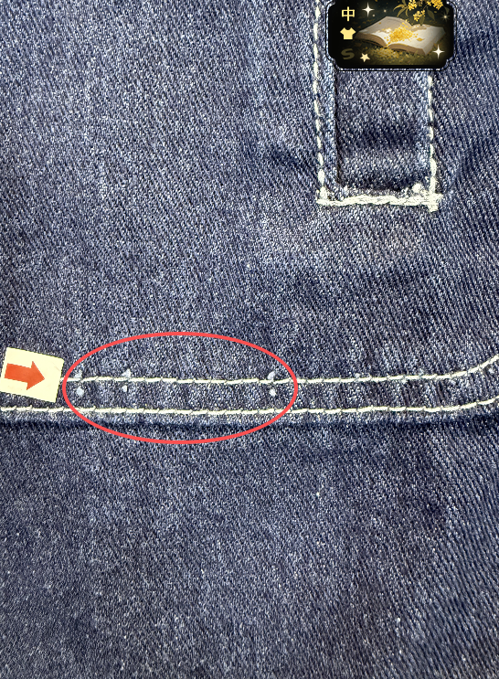 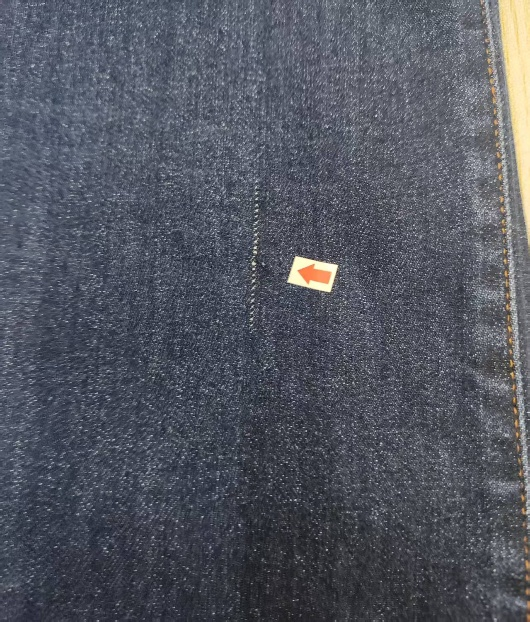

6.2問題原因及解決方案

| 發生階段 | 布次問題類型 | 可能來源/原因 | 特征說明 | 解決方法 | 預防措施 |
| --- | --- | --- | --- | --- | --- |
| A)面料入庫檢驗階段 | 跳紗/漏紗/紗結布次 | 1.面料紡織時紗線斷裂，未及時接頭，出現漏紗或紗結過粗； 2.紗線質量差，強度不足，編織過程中易跳紗； 3.織機運行異常，針距不穩，導致紗線跳脫 | 1．面料表面出現單根或多根紗線跳脫，形成細小空隙或線狀漏洞，跳紗處布料疏鬆，輕拉易擴大，多分佈在面料局部，影響外觀和強度 2.面料表面有明顯的紗結粒 | 1.輕微跳紗：手工用同色紗線補織，修剪多餘線頭，熨燙平整； 2.中度跳紗：局部裁剪剔除疵點部位，拼接合格面料（不影響版型處）； 3.嚴重跳紗：面料報廢，無法用於生產 | 1.入庫檢驗時，逐米檢查面料表面，重點排查跳紗、漏紗問題； 2.挑選高質量紗線供應商，入庫前檢查紗線強度； 3.要求供應商提供織造檢驗報告，不合格面料拒收 4.對於輕微的紗結不能用剪刀修剪，避免出現破洞，而是需用針頭將紗結鉤至佈底. 5.嚴格執行4分制驗佈 |
| B)面料入庫檢驗階段 | 雜質/異纖布次 | 1.紗線生產時摻入雜質（如棉結、毛絮、塑料絲）； 2.面料紡織過程中，環境雜質混入布料； 3.染整時清洗不徹底，殘留雜質附着在面料表面 | 面料表面有明顯異色雜質、棉結、塑料絲等，與牛仔面料顏色差異明顯，雜質突出或嵌入面料，無法通過簡單清洗去除，影響外觀品質 | 1.輕微雜質：用镊子剔除表面雜質，局部熨燙平整； 2.雜質嵌入較深：用鉤針輕輕挑出，補織修復； 3.雜質過多、分佈密集：面料報廢或降級使用（用於非可見部位） | 1.入庫時逐卷檢查，對雜質超標的面料拒收； 2.要求供應商加強紗線篩選和織造環境清潔； 3.面料入庫後，預洗時加入除雜助劑，清除表面浮雜 4.嚴格執行4分制驗佈 |
| C)面料入庫檢驗階段 | 色點/色花布次 | 1.面料染整時，染料分散不均，局部濃度過高形成色點； 2.染液中有雜質，附着在面料上形成異色點； 3.染整溫度、時間不當，導致色花、色暈 | 面料表面出現不規則色點（深於或淺於底色）、色花，色點邊緣清晰或模糊，色花呈塊狀、條狀，與周圍底色分界明顯，無法通過洗水消除 | 1.輕微色點：用去色劑局部點涂，再補色處理，熨燙定型； 2.色花輕微：重新低溫輕洗，加入均色助劑，均勻顏色； 3.嚴重色點、色花：面料報廢，無法用於生產 | 1.入庫時檢查面料顏色均勻度，色點、色花超標拒收； 2.要求供應商嚴格控制染整工藝，提供染整檢驗報告； 3.面料預洗時加入均色助劑，減少色花隱患 4.嚴格執行4分制驗佈 |
| D)裁剪階段 | 裁片毛邊/散紗布次 | 1. 面料本身邊緣疏鬆，紗線易脫落； 2. 裁剪時剪刀不鋒利，拉扯面料導致散紗； 3. 裁剪手法不規范，用力不均，造成毛邊過大 | 裁片邊緣有明顯毛邊、散紗，紗線脫落形成絮狀，毛邊寬度超過0.3cm，輕拉易擴大，影響縫製牢固度和外觀 | 1. 輕微毛邊：用剪刀修剪平整，再用熨斗熨燙定型； 2. 散紗較嚴重：用鎖邊機鎖邊處理，再進行縫製； 3. 毛邊過大、無法修復：裁片報廢，重新裁剪 | 1.裁剪前檢查面料邊緣，疏鬆部位提前鎖邊； 2.更換鋒利剪刀，規范裁剪手法，避免拉扯面料； 3.裁剪後逐片檢查裁片邊緣，毛邊超標及時處理 |
| E)裁剪階段 | 裁片破洞/劃傷布次 | 1. 面料本身有隱藏破洞，入庫未檢出； 2. 裁剪台有尖銳雜物，劃傷面料； 3. 裁剪時剪刀誤傷、用力過猛，裁破面料 | 裁片表面有圓形、不規則破洞或線狀劃傷，破洞邊緣毛糙，劃傷處紗線斷裂，輕拉易擴大，影響產品強度和外觀，可見部位無法隱藏 | 1. 微小破洞（≤0.5cm）：手工用同色紗線補織，修復後熨燙； 2. 破洞、劃傷較大：局部裁剪剔除疵點，拼接合格裁片（非可見部位）； 3. 可見部位破洞：裁片報廢，重新裁剪 | 1.裁剪前清理裁剪台，去除尖銳雜物； 2.裁剪時輕拿輕放，避免剪刀誤傷面料； 3.裁剪後逐片檢查裁片，發現破洞、劃傷及時處理 |
| F)裁剪階段 | 裁片色差布次（面料局部色差） | 1. 面料本身存在局部色差，入庫未檢出；2. 裁剪時不同卷、不同部位面料混裁，顏色偏差； 3. 面料受光不均，局部褪色，導致裁片色差 | 同一裁片或不同裁片間顏色深淺不一，色差明顯，拼接後褲身顏色不協調，無法通過洗水、熨燙消除，嚴重影響外觀 | 1. 輕微色差：用均色助劑局部補色，再熨燙定型； 2. 中度色差：調整裁片排版，將色差裁片用於非可見部位； 3. 嚴重色差：裁片報廢，更換同批次、同顏色面料裁 | 1.入庫時將同批次、同顏色面料分類存放，避免混放； 2.裁剪前檢查面料顏色，避開局部色差部位； 3.同一條牛仔褲用同一卷、同一部位面料裁剪 4.開裁前需做好牛仔百家衣洗水，選定面料接受確保布匹同色裁 |
| G)縫製/整理階段 | 縫合處面料起毛/磨損針花布次 | 1. 縫製時壓腳、送布牙過緊，磨損面料表面； 2. 縫線摩擦面料，導致局部起毛； 3. 整理時操作不規范，用力拉扯、摩擦面料 4.車縫車針損傷面料 | 縫合處面料表面起毛、發白，磨損部位紗線疏鬆，輕拉易脫落，外觀粗糙，嚴重時出現細小破洞，影響縫合牢固度和外觀 | 1. 輕微起毛：用去毛器去除表面絨毛，熨燙平整； 2. 磨損較輕：局部補色，加固縫線； 3. 磨損嚴重、出現破洞：拆線後更換裁片，重新縫製 | 1.調整縫紉機壓腳、送布牙壓力，避免磨損面料； 2.選用與面料匹配的縫線，減少摩擦； 3.整理時輕拿輕放，避免用力拉扯、摩擦面料 4.對於輕微的紗結不能用剪刀修剪，避免出現破洞，而是需用針頭將紗結鉤至佈底 |
| H)縫製/整理階段 | 熨燙損傷布次（面料發亮/變形） | 1. 熨燙溫度過高，燙傷面料纖維； 2. 熨斗直接接觸面料，局部受熱過度； 3. 熨燙時用力過大，拉伸面料導致變形 | 面料局部發亮、發硬，纖維受損，嚴重時出現焦痕，熨燙拉伸後出現永久性變形，與周圍面料質感差異明顯，無法修復 | 1. 輕微發亮：用柔軟劑處理，低溫熨燙還原； 2. 中度損傷：局部補色，遮蓋發亮部位； 3. 嚴重燙傷、變形：裁片或成品報廢 | 1. 根據面料成分，設定合適熨燙溫度（150-180℃），張貼操作標準； 2. 熨燙時墊上隔布，避免熨斗直接接觸面料； 3. 熨燙時受力均勻，避免拉伸面料 |
