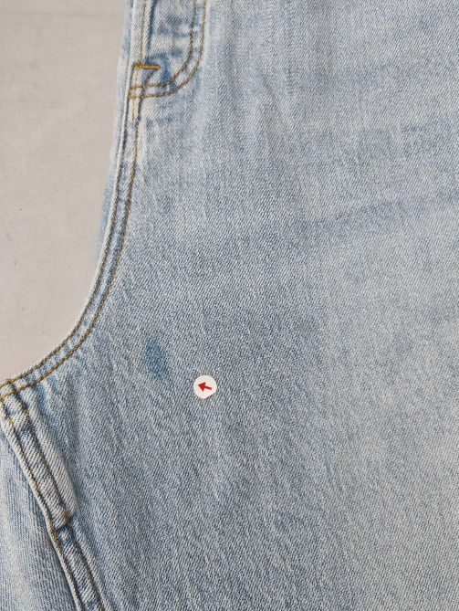
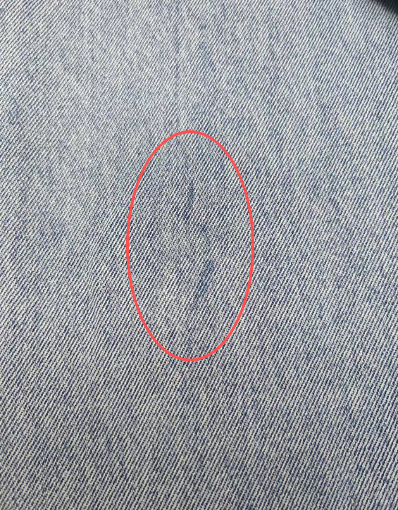
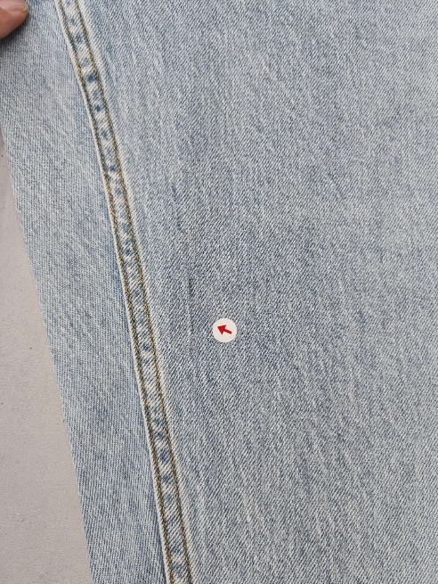
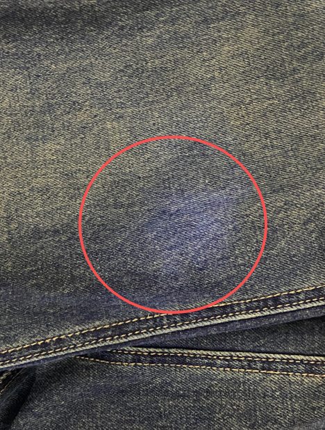
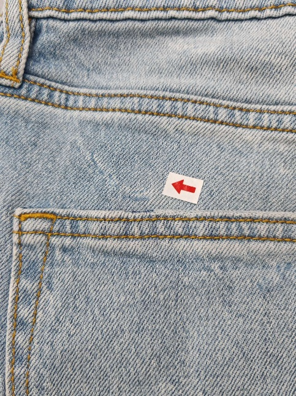

**9、化妝痕（牛仔裤）**

9.1疵點圖片

    

9.2問題原因及解決方案

| 發生階段 | 化妝痕問題類型 | 可能來源/原因 | 特征說明 | 解決方法 | 預防措施 |
| --- | --- | --- | --- | --- | --- |
| A)洗水階段（核心誘發階段） | 洗水不均+化妝不自然疊加痕 | 1. 洗水機裝載過多、翻動不均，局部受洗不充分，形成洗水痕； 2. 縫製階段遺留的化妝不自然痕跡，洗水時與洗水痕疊加； 3. 洗水助劑與厚重化妝品發生反應，加深痕跡； 4. 水溫波動，導致化妝痕與洗水痕融合，更為明顯； 5.車縫完成後未剪大線就送洗水造成線痕； | 褲身出現深淺色差的洗水痕，疊加厚重/脫妝的化妝印跡，呈塊狀、暈狀，顏色混雜，分界模糊但痕跡明顯，洗水後固定，無法通過熨燙消除 | 1. 輕微疊加痕：重新均洗，加入去彩助劑和均色助劑，同步去除化妝痕、調整洗水色差； 2. 中度疊加：用专用化妝去除劑處理後，再返洗重漂； 3. 重度疊加：按次品處理報廢； | 1. 洗水前嚴格檢查，杜絕帶化妝不自然痕的半成品入缸； 2. 控制洗水機裝載量、水溫和轉速，確保均洗充分； 3. 洗水助劑稀釋後均勻添加，避免與化妝品發生反應； |
| B)整燙/檢驗階段（痕跡加劇） | 熨燙高溫加劇洗水化妝痕 | 1. 洗水後洗水化妝痕未檢出；  2. 熨燙人員化妝不自然； | 洗水化妝痕顏色加深、邊緣擴大，質地更硬，與面料結合更緊密，因高溫固化導致痕跡突兀，與周圍面料質感差異明顯，肉眼可清晰分辨，形成永久性瑕疵 | 1. 輕微加劇：用低溫蒸汽熨燙，配合去彩助劑局部處理，再定型； 2. 中度加劇：局部返洗，處理後重新熨燙； 3. 重度加劇：無法修復，按次品處理或局部裁剪 | 1. 熨燙前全面檢查，發現洗水化妝痕及時處理後再熨燙； 2. 由專業洗水化妝人員對洗水痕進行化妝； 3. 熨燙台墊潔淨隔布，防止反沾 |
