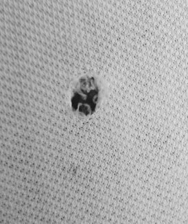
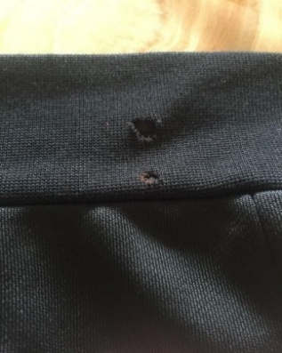
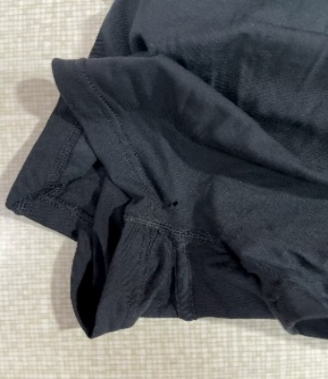
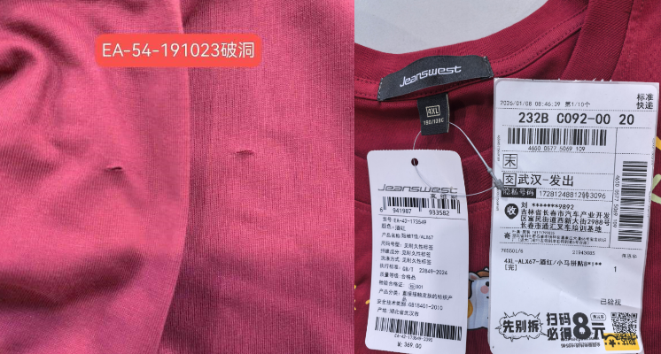
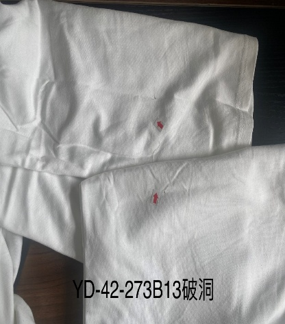

**查貨AI疵點分析模塊思路（初稿）**

**1、破洞（針織圓領）**

**1.1疵點圖片**

     N……

**1.2問題原因及解決方案**

| 發生階段 | 破洞問題類型 | 可能來源/原因 | 特征說明 | 解決方法 | 預防措施 |
| --- | --- | --- | --- | --- | --- |
| A)面料生產與檢驗 | 1 . 織造破洞 2.紗線斷裂 | 1.纱线强度与质量‌: 1.1织物牵拉张力不匀或不足，导致线圈受力失衡，或含有粗结、细节，导致编织时局部断裂. 1.2.捻接工艺不良（如接头处强力低于原纱80%、搭接长度异常）形成薄弱点‌. 1.3纤维与坯布特性‌. 坯布密度过高或纤维弹性差，降低织物抗拉伸能力. 2.織造機件故障： 2.1机针型号不当导致针头与纱线直径不匹配，或针板存在毛刺直接刺伤纱线. 2.2导纱器安装位置过近，纱线被挤压在导纱器与针之间引发张力突变. 2.3织针针舌损坏、针槽变形或浮线三角调整不当，造成线圈断裂或脱圈失败. 2.4織針、沉降片損壞或撞擊，直接鉤斷紗線. 3.飛花或雜質織入：紗線中的異物在織造時導致局部結構脆弱. | 1.破洞邊緣通常有單根或多根紗線斷裂 ， 斷頭清晰可見. 2.破洞可能呈現規則形狀（如與織針損壞對應），也可能不規則. | 生產過程優化方案： 1原材料階段 1.1紗線升級 改用高強度混紡紗線（如棉+滌綸） 引入紗線預處理技術（上蠟、柔軟處理）. 1.2嚴格控制紗線含水率（8-10%為宜）. 2．布料檢驗 2.1做好面料的相關測試，實施布料100%驗布機檢查. 2.2在裁床檢驗時發現，標記並避開局部裁剪. | 原材料控制： 1、測試驗證 1.1增加模擬穿著測試. 1.2建立加速老化試驗流程. 2.紗線品質選擇. 2.1檢查紗線的均勻度和結頭數量,選用高品質、強度好的紗線, 避免使用過於脆弱或易斷的纖維. 2.2採用空氣捻接替代打結. 3.加強面料來料檢驗 ： 特別是通過燈光驗布機進行全檢，標出所有疵點，開裁前嚴格按4分制執行驗佈工作. 4.與供應商訂立明確標準 ： 規定破洞等嚴重疵點的允收水平. |
| B1)縫製階段： 領圈拼接/包邊/與衣身拼接 | 1.針孔破洞：機針穿刺過度. 2.拉扯破洞：牽拉力度不當. 3.銳器劃破：工具/機台接觸. 4.織物脫散破洞：邊緣未鎖邊. | 1.機針因素：機針磨損、彎曲、鋒利度不足，穿刺時勾扯面料纖維. 2.操作因素：牽拉面料力度過大，或送料不均導致局部拉扯，或車縫操作員推拉布料造成跳針後強行車縫. 3.工具因素：剪刀、頂針等銳器接觸領圈，或機台內有雜物劃擦或針板孔磨損導致布料被鉤破. 4.工藝因素：領圈邊緣未提前鎖邊，縫製時織物脫散. 5.面料因素：領圈面料克重過輕、纖維鬆散，抗穿刺性差. 6.拆線重縫：在同一位置多次車縫與拆線，嚴重破壞面料結構. | 1.針孔破洞：呈細小圓形破口，周圍有纖維勾絲痕跡，多沿線跡分佈. 2.拉扯破洞：破口不規則，邊緣纖維拉伸變形，多見於領圈弧度部位. 3.劃破破洞：呈線狀或不規則裂紋，破口邊緣整齊，有明顯劃擦痕. 4.脫散破洞：領圈邊緣織物纖維鬆散脫落，破口逐漸擴大. | 1.輕度破洞：用與面料匹配的線材做隱形修補，針腳細密贴合面料. 2.重度破洞：拆開破洞部位線跡，更換完整領圈面料，重新按標準工藝縫製. 3.脫散處理：對脫散邊緣先鎖邊固定，再進行修補或更換. | 1.機針管控：定期更換機針，選用與面料匹配的針型（細針適用輕薄面料），首選圓頭車針. 2.操作規範：保持均勻牽拉力，避免暴力拉扯，調整機台送料速度與壓腳壓力. 3.工具防護：銳器工具單獨存放，操作時避免直接接觸領圈表面，定期清理機台雜物. 4.工藝優化：領圈縫製前先做邊緣鎖邊處理，防止織物脫散. 5.面料檢驗：特別是通過燈光驗布機進行全檢，標出所有疵點，開裁前嚴格按4分制執行驗佈工作·前檢查領圈面料質地，纖維過於鬆散的提前做加固處理. |
| B2)縫製階段： 肩縫/側縫/袖縫縫製 （平車/雙針車） | 1.線跡過緊拉破. 2.機針勾扯破洞. 3.接縫重疊處磨破. | 1.線跡因素：面線/底線張力調整過緊，縫製後收縮拉扯面料破損. 2.機台因素：機針彎曲、針頭有毛刺，或送料牙磨損不均，或針板孔磨損導致布料被鉤破. 3.操作因素：在同一位置多次車縫與拆線，嚴重破壞面料結構導致破損. 4.管控因素：機台參數調整不當，操作員未按工藝標準車縫 5.拆線重縫：.. 6.特種縫紉機（如打棗機、鳳眼機）壓力過大. 7.車縫操作員推拉布料造成跳針後強行車縫. | 1.線跡拉破：破洞沿線跡分佈，呈細長裂紋，周圍面料有收縮皺褶. 2.勾扯破洞：破口周圍有明顯纖維勾絲，破洞形狀不規則，多見於接縫兩側. 3.重疊磨破：接縫重疊處面料磨損發白，逐漸形成破洞，破口邊緣毛糙. | 1.輕度破洞：放鬆線跡張力，用隱形針腳修補破洞，修剪多餘線頭. 2.重度破洞：更換破損區域面料，調整機台線跡參數，按標準對位重新縫製. | 1.參數調整：根據面料厚度調整合適的面線/底線張力，定期校準機台參數. 2.機台保養：每日檢查機針狀態，磨損、彎曲的即時更換，定期打磨送布牙. 3.操作標準：嚴格按工藝要求車縫，避免接縫處多次重疊車縫，控制車縫速度. 4.輔料選用：選用與面料質地匹配的柔軟墊布，修剪墊布邊緣至圓滑. 5.過程檢查：建立首扎檢驗制度，檢查接縫處是否有破損隱患，及時處理，避免大貨批量生產發現. |
| B3)縫製階段： 袖口/下擺折邊縫製（平車/折邊機） | 1.折邊拉扯破洞. 2.銳器劃破（折邊工具）. 3.折邊邊緣脫散破洞; | 1.操作因素：折邊時牽拉面料力度不均，或折邊機送料速度過快，導致局部拉扯破損. 2.工具因素：折邊用刮板、剪刀等工具邊緣銳利，劃擦袖口/下擺面料. 3.工藝因素：折邊前未做邊緣加固，針織面料邊緣脫散後形成破洞. 4.面料因素：袖口/下擺面料彈性不足，折邊時受力易破損 | 1.拉扯破洞：破口位於折邊線附近，呈不規則形，邊緣纖維拉伸變長. 2.劃破破洞：呈線狀破口，邊緣整齊，破洞方向與工具劃擦方向一致. 3.脫散破洞：折邊邊緣纖維逐漸脫落，破口從邊緣向內延伸，呈鋸齒狀 | 1.輕度破洞：調整機台參數後，用隱形修補法修補破洞，對脫散邊緣做鎖邊處理. 2.重度破洞：更換破損的袖口/下擺面料，按標準工藝先加固邊緣再折邊. 3.後處理：修補後蒸汽熨燙定型，確保折邊平整，破洞修補處不突兀 | 1.操作管控：折邊時保持均勻送料，避免暴力拉扯，調整合適的折邊機送料速度. 2.工具防護：打磨折邊工具邊緣至圓滑，操作時避免工具直接接觸面料表面. 3.工藝優化：折邊前對袖口/下擺邊緣做鎖邊或密拷處理，增強面料抗脫散性. 4.面料篩選：投產前測試面料彈性與強度，不符合要求的更換合適面料 |
| C)染整階段 | 化學腐蝕破洞 | 染整工艺异常‌： 1.双氧水或漂白劑（如次氯酸鈉）局部濃度過高、水质铁离子超标或PH值控制失误，引发化学腐蚀.‌‌ 2.稳定剂选择错误导致双氧水分解失控. 3.酸/鹼中和不徹底，殘留腐蝕纖維 4.金屬離子催化氧化（如銅、鐵） | 破洞邊緣發黃或脆化，輕觸即擴大，常出現在折疊處或縫份 | 無法修復，整批隔離評估 | 1.嚴格控制漂白濃度與時間 2.染後充分水洗與中和，嚴格控制酸堿度（pH 6–7） 3.使用去金屬螯合劑 |
| D)洗水階段 | 化學性/物理性破損 | 1.洗水（酵素洗）工藝過度或控制不當：化學品過度腐蝕纖維. 2.烘乾機溫度過高或時間過長：化纖（如滌綸）局部熔融形成破洞. 3.整燙高溫燙焦：熨斗頭直接接觸面料時間過長，導致纖維熔斷. 4.尖銳的掛鉤或輸送帶部件：在後整流程中鉤破成衣. | 1.破洞邊緣可能呈現灼燒熔融狀（化纖）, 或纖維脆化粉末狀（過度化學腐蝕）. 2.多位於成衣突出部位（如肩部）或與設備接觸點. | 1.洗水工藝控制. 3.控制洗水時間和機械作用力. 4.添加柔軟劑減少纖維摩擦. | 1.嚴格的產前工藝測試：對大貨面料進行完整的洗水、烘乾、整燙測試，確定安全參數. 2.設備維護與檢查：確保烘乾機溫控精準、整燙設備清潔、輸送線路無尖銳處. 3.流程規範：後整操作員需經過培訓，避免成衣與尖銳物接觸. |
| E)整燙/包裝階段 | 高溫燙焦 | 1.熨斗溫度過高（＞150°C）燙焦纖維. 2.冬季乾燥環境靜電放電灼穿薄面料. | 破洞極小但穿透，邊緣碳化發黑（燙焦） | 1.整燙改良. 1.1敏感部位墊燙布保護. 1.2控制熨燙溫度和時間. | 1.過程檢驗: 在關鍵工序設置檢驗點, 2.成品檢驗: 2.1)100%成品檢驗或高比例抽檢 2.2)建立明確的破洞判定標準 2.3)記錄破洞類型以進行根本原因分析 3.包裝保護: 採用防穿刺包裝材料防止摩擦,與尖銳物品隔離 |
