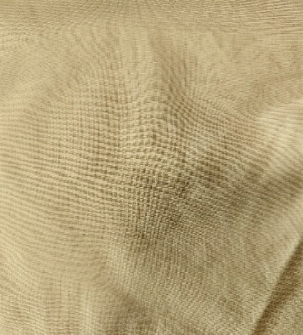
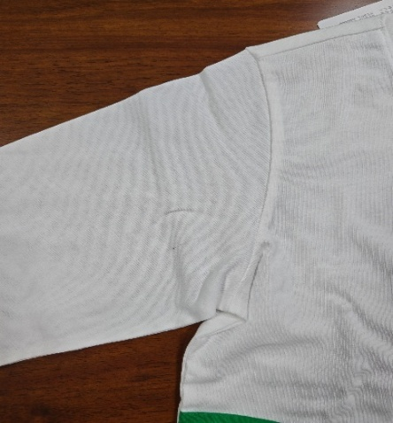

**7、色紗問題（針織圓領）**

**7.1疵點圖片**

    **N……**

**7.2問題原因及解決方案**

| 發生階段 | 色紗問題類型 | 可能來源/原因 | 特征說明 | 解決方法 | 預防措施 |
| --- | --- | --- | --- | --- | --- |
| 織布階段 | 异色纤维 2.纱线混入 | 1.针织机针舌、针钩磨损，导致纱线跳针，异色纱线跳出面料表面. 2.纱线结头过大、飞花附着在纱线上，导致编织时跳纱，异色结头 / 飞花显现. 3.全流程中纱线受到污染，出现局部色点 | 1.面料表面出现异色纱线跳出编织纹路，呈点状、小圈状凸起，跳纱部位纱线松散，易勾丝，单个疵点面积小但数量可多可少. 2.颜色、光泽可能完全不同. | 1.用镊子挑出跳纱的异色纱线，将周边纱线整理平整，用同色纱线轻微锁边，防止脱散. 2.更换针织机磨损的针舌、针钩，清理机台飞花后重新编织 | 1.定期检查、更换针织机易损部件（针舌、针钩、沉降片），做好设备保养. 2.纱线使用前进行清纱，去除结头、飞花、杂质，采用无结头纱线. 3.全流程做好防尘、防污染措施，车间保持清洁. 4.加强车间除尘.同区域安排同色系生产. |
