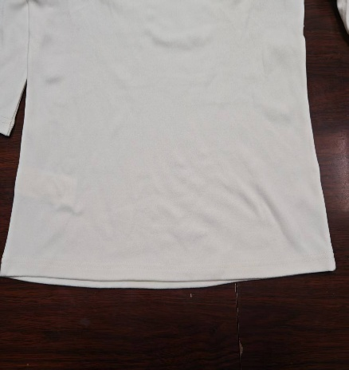
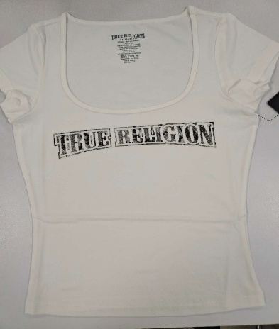
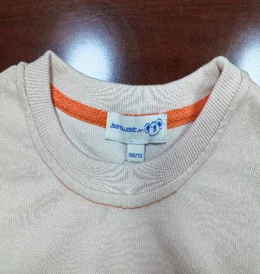
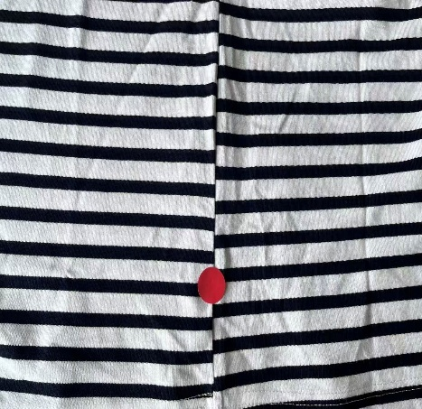
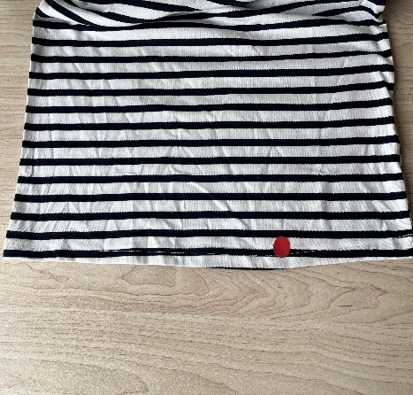

**8、不對稱問題（針織圓領）**

**8.1疵點圖片**

     N……

**8.2問題原因及解決方案**

| 發生階段 | 左右長短不對稱問題類型 | 可能來源/原因 | 特征說明 | 解決方法 | 預防措施 |
| --- | --- | --- | --- | --- | --- |
| A1)縫製階段：領口拼接/包邊/鎖邊 | 1.領口整圈左右長短不對稱. 2.領口包邊帶左右長短不一致 | 1.裁片因素：領口裁片左右版型不對稱（裁剪偏差），未經核對直接投入縫製. 2.拼接因素：拼接領口時，左右對位標記未對齊，操作員牽拉力度不均（一側拉緊、一側放鬆）. 3.包邊/鎖邊因素：包邊帶預剪長度左右不一致，送帶速度不均，一側包邊帶拉伸過度，鎖邊時左右走布速度不同步. 4.機台因素：包邊機/鎖邊機送料牙磨損不均，導致左右面料走布長度偏差. 5. 操作因素：對位時目測偏差，未使用對位工具（如對位尺、標記筆） | 1.領口整圈偏差：將衣服平鋪對折後，領口左右兩側弧度、長度無法重合（肉眼可見），嚴重時領口歪斜、翹邊. 2.包邊帶偏差：領口包邊帶左右外露寬度不一致，一側包邊過緊（拉伸導致長度縮短）、一側過鬆（堆積導致長度偏長）. | 1.輕度偏差：拆開偏差部位線跡，重新對齊對位標記，調整牽拉力度（保持左右均勻），低速重新拼接/包邊/鎖邊，縫製後再次平鋪對折核對. 2.中度偏差：拆開線跡後，修剪領口多餘面料（偏差偏長一側），或拉伸調整偏短一側面料（針織面料具彈性），對齊標記後重新縫製，包邊帶偏差需更換長度合適的包邊帶重新包邊. | 1.裁片核對：領口裁片投入縫製前，必須逐片平鋪對折核對，確保左右版型、長度一致，偏差超標的裁片禁止入線. 2.對位標準：領口拼接、包邊前，用標記筆標註清晰對位點，強制使用對位紙樣模版尺核對，禁止目測對位. 3.操作規範：統一操作員培訓對位、牽拉標準手法（左右牽拉力均勻，避免單側用力），包邊/鎖邊時設定統一送帶速度和牽拉力. 4.機台保養：機修定期檢查包邊機/鎖邊機送料牙磨損情況，磨損不均時及時打磨或更換，確保左右走布同步. 5.首件確認：大貨首件領口縫製完成後，平鋪對折檢查左右長短，無偏差後方可批量生產 |
| A2) 縫製階段：肩縫/側縫縫製 | 1.左右肩縫長短不對稱. 2.左右側縫長短不對稱. 3.肩縫/側縫對位偏差導致整衣左右長短偏差 | 1.裁片因素：前後片、袖片肩縫/側縫長度本身不對稱（裁剪偏差），或裁片標記點模糊、缺失. 2 對位因素：肩縫對位時（前片肩點與後片肩點）、側縫對位時（前片側縫與後片側縫）未精准對齊，目測偏差或標記點錯位. 3.牽拉因素：縫製時操作員單側牽拉力度過大（如拉緊一側裁片導致長度縮短），或送料牙走布不均（一側走布快、一側慢）. 4.機台因素：雙針車兩根機針高度不一致，或壓腳壓力不均，導致左右線跡牽拉力不同，間接造成長度偏差. 5.工藝因素：左右側縫同向或異向車縫，導致面料拉長不對稱 | 1.肩縫偏差：衣服平鋪對折後，左右肩縫無法重合長度偏差，穿著時一側肩膀處面料緊繃、一側鬆弛，嚴重時衣身向偏差側傾斜. 2.側縫偏差：左右側縫長度不一致，平鋪時衣擺左右高度不同，穿著時下擺一側上翹、一側下垂，肉眼明顯可見. 3.整衣偏差：因肩縫/側縫偏差疊加，導致整件衣服左右長短不一致，衣身對折後前後片、袖片均無法對齊. 4.細節特征：偏差部位縫份寬度可能不一致，線跡有緊鬆差異，面料牽拉處有拉伸紋路. | 1.縫份偏差糾正：拆開偏差部位線跡，按標準縫份重新對齊裁片，確保左右縫份一致，低速縫製，避免牽拉. 2.對位偏差糾正：重新標註清晰對位點（肩點、側縫中點、下擺點），用對位尺核對後逐點對齊，再整段縫製，縫製後平鋪檢查. 3.長度偏差糾正：輕度偏差（≤0.5cm）可通過蒸汽燙平、拉伸面料調整.中度偏差（0.5-1cm）拆線後修剪偏長一側多餘面料，重新縫製.重度偏差（>1cm）或裁片本身偏差的，更換合格裁片重新生產. 4.機台調整：檢查並調整雙針車機針高度、壓腳壓力，確保左右對稱、壓力均勻 | 1.裁片預檢：肩縫/側縫裁片投入生產前，核對左右裁片長度、標記點清晰度，偏差超標的裁片退回裁剪車間重新換片處理. 2. 對位標準：強制要求操作員按標記點對位，每個對位點必須精准重合，使用對位夾固定後再縫製，禁止目測對位. 3.操作管控：培訓操作員縫製時保持左右牽拉力均勻，避免單側用力拉拽裁片，設定標準縫製速度（低速對位、中速縫製）. 4.機台管控：每日生產前機修檢查平車/雙針車機針高度、壓腳壓力、送料牙狀態，確保運轉正常、參數對稱. 5.過程檢驗：設立關鍵工序查驗，檢查肩縫/側縫左右長短，及時發現偏差並整改 |
| A3) 縫製階段：袖長/袖口/下擺折邊縫製 | 1.左右袖口長短不對稱. 2.左右袖口折邊高度不一致（間接導致長度偏差）. 3.左右袖長長短不對稱 4.左右下擺長短不對稱. 5.下擺折邊左右高度偏差 | 1.裁片因素：左右袖片、衣身下擺裁片長度本身不對稱，或袖口/下擺弧度裁剪偏差. 2.折邊因素：折邊時左右折邊高度設定不一致（如一側折邊2cm、一側1.5cm），折邊時牽拉力度不均（一側拉伸過度）. 3.機台因素：折邊機送料不均，左右走布速度不同步，或壓腳壓力不均導致折邊長度偏差. 4.操作因素：目測設定折邊高度，未使用折邊紙樣模版，袖口對位時（袖山與袖口）偏差，下擺折邊時未平鋪對齊. 5.面料因素：針織面料彈性不均，單側面料拉伸後回彈不足，導致折邊後長度偏差 | 1.袖口偏差：衣服平鋪對折後，左右袖長、弧度無法重合，折邊高度不一致時，袖口一側緊窄、一側鬆闊，穿著時袖口舒適程度不同. 2.下擺偏差：左右下擺高度不同，平鋪時一側下擺上翹、一側下垂，折邊長度偏差時，下擺外露折邊寬度不均，線跡不平整. | 1.折邊高度偏差：拆開線跡，用折邊紙樣模版設定統一折邊高度（通常1.5-2cm），重新平鋪折邊，保持左右牽拉力均勻，低速縫製，縫後核對長度. 2.長度偏差糾正：輕度偏差（≤0.5cm）可通過蒸汽拉伸調整，中度偏差（0.5-1cm）拆線後修剪偏長一側多餘面料，重新折邊縫製. 3.重度偏差（>1cm）：若因裁片偏差導致，更換合格袖片/衣身裁片重新生產.若因面料彈性問題導致無法修復，按廢品處理. | 1.裁片核對：袖片、衣身下擺裁片投入縫製前，逐片平鋪對折檢查長度、弧度，偏差超標的退回裁剪車間. 2.折邊標準：統一折邊高度（用標記筆標註），強制使用折邊紙樣輔助模版，禁止目測設定，袖口折邊前先對齊袖山與袖口標記點. 3.操作管控：培訓操作員折邊時平鋪面料，保持左右牽拉力均勻，避免單側拉伸，折邊機設定統一送料速度和壓腳壓力. 4.面料管控：針織面料入廠時檢測彈性均勻性，彈性偏差大的面料需做好預縮和充裕的鬆布時間.達到先進先出原則. 5.過程檢驗：設立關鍵工序查驗，檢查肩縫/側縫左右長短，及時發現偏差並整改 |
| A4)成衣全件縫製（多部位縫製、半成品檢驗） | 1.多部位偏差疊加（領口+肩縫+側縫偏差導致整衣左右長短不對稱）. 2.半成品對位偏差累計導致的整衣不對稱. | 1.累計偏差：各單個部位（領口、肩縫、側縫等）輕微偏差未及時糾正，疊加後導致整衣左右長短偏差. 2.檢驗缺失：半成品檢驗環節缺失，未對各部位左右對稱性進行檢查，導致偏差流入下工序. 4.管理因素：生產流程管控鬆散，未建立首件確認、過程抽檢制度，操 5.工具因素：未配備統一的對位、檢測工具（如對位尺、測量軟尺），檢測標準不統一 | 整衣偏差：將衣服平鋪對折後，左右衣身、袖子、領口、下擺均無法重合，整體向一側傾斜，長度偏差穿著時衣身不貼身、歪斜明顯. | 2.重新縫製：按標準對位、牽拉要求，重新逐部位縫製，每完成一個部位即平鋪對折檢查，確保無偏差後再進入下一個部位. 3.廢品處理：若多部位偏差疊加導致面料嚴重變形，或整改成本過高，按廢品處理. 4.重新檢驗：整改完成後，用測量軟尺逐部位測量長度，確保左右整衣對稱平整 | 1.建立全流程檢驗體系：實行「首件確認+過程抽檢+半成品全檢+成品終檢」制度，每個環節均檢查左右對稱性，留存檢測記錄. 2.工具配備：為每個操作工位配備對位、檢測工具，定期校準工具精度. 3.培訓強化：定期開展對稱性操作、檢測標準培訓，提升操作員、檢驗員的責任心和技能水平 |
| B)整燙階段 | 熨燙拉伸或冷卻不均定型導致的變形 | 1.整燙時拉扯不均：操作員在蒸汽熨燙或壓燙時，左右施加的力道或方向不同. 2.燙台模具左右不對稱或不水平或熨台吸風單側過強. 3.懸掛晾乾或烘乾不均：濕態時自重導致一側被拉長，冷卻前移動衣物導致定型失衡 | 成衣經過後整後才出現長短問題.面料可能呈現單側被過度拉伸的痕跡，但裁片原尺寸一致 | 1.使用蒸汽噴槍對較長一側進行局部加熱，使其收縮，同時輕拉較短一側進行調整. 2.試用對稱模具定型復原重新進行對稱性整燙. | 1.使用合適的平衡吸風熨台或整燙模具：如用於圓領衫的半身燙衣板，同時抽風冷卻時間≥10秒再取下，確保左右形態固定. 2.標準化整燙流程：規定熨燙方向和手法，制定「禁止手拉」整燙，避免隨意拉扯. 3.平攤晾乾：對於易變形面料，建議使用網帶式烘乾機或平攤晾乾，避免濕態懸掛. |
| C)洗水／後整理階段 | 洗後收縮不一致 | 1. 左右裁片來自不同布卷，預縮率不同 2. 面料組織密度或殘餘應力不均 3. 未進行洗前預縮處理 | 洗滌後原本對稱部位出現長短差（常見於棉質針織） | 難以修復，通常降級或報廢 | 1.同一件衣服使用同布卷裁片 2.面料入庫後靜置24–48小時再裁 3.洗前做模擬洗水測試（含尺寸穩定性） |
